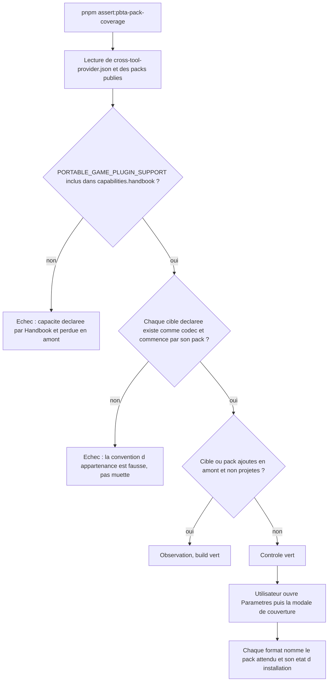

# Instruction: Prouver capacités et appartenance contre les métadonnées publiées

## Architecture projection

> Tree of the final files. ✅ create · ✏️ modify · ❌ delete

```txt
.
├── tools
│   ├── pbtaProviderContract.mts        ✅ lecture fs du fournisseur et des packs publiés
│   └── pbtaPackCoverage.harness.mts    ✏️ assertions contre ces métadonnées
├── src
│   ├── features
│   │   └── pbta
│   │       └── coverage.ts             ✏️ capacités dédoublonnées, convention de préfixe assumée
│   └── settings
│       └── pbtaCoverageModal.ts        ✏️ nomme le pack attendu pour chaque format
└── CLAUDE.md                           ✏️ réserve « ne lit pas les pack-contract.json » retirée
```

## User Journey



## Wireframe

```txt
┌─ PbtA playbook coverage ───────────────────────────────┐
│ Every playbook format this build carries is readable   │
│ and its pack is installed.                             │
│                                                        │
│ Game-specific formats                                  │
│ ┌────────────────────────────────────────────────────┐ │
│ │ masks-playbook                                     │ │
│ │ Readable. Expects the "masks" pack, installed.     │ │
│ ├────────────────────────────────────────────────────┤ │
│ │ the-sprawl-playbook                                │ │
│ │ Readable. Expects the "the-sprawl" pack, missing.  │ │
│ └────────────────────────────────────────────────────┘ │
│                                                        │
│ Formats read as a portable playbook                    │
│ Expected, not a problem: ...                           │
│ ┌────────────────────────────────────────────────────┐ │
│ │ salvage-run-playbook   No distinguishing field.    │ │
│ └────────────────────────────────────────────────────┘ │
│                                                        │
│ Installed PbtA packs                                   │
│ masks, monsterhearts                                   │
└────────────────────────────────────────────────────────┘
```

## Tasks to do

### `1)` Créer le lecteur des métadonnées publiées, côté outils

> Le glob `packManifest` n'est énumérable que par `fs` : cette lecture appartient au contrôle, pas au bundle.

1. Créer `tools/pbtaProviderContract.mts`.
2. Résoudre la racine du paquet par `createRequire(...).resolve("schema-pbta/cross-tool-provider.json")` puis `dirname` : ne pas copier le motif adrenaline `dirname(dirname(manifestPath))`, qui rend `corpus/` ici, puisque les `exports` de `schema-pbta` remappent `./corpus/*` vers `corpus/contract/*`.
3. Valider l'enveloppe du fournisseur : `providerVersion === 1` et `contractVersion === 5`, sinon lever en nommant le champ — une enveloppe inconnue ne se devine pas.
4. Énumérer `packs/*/pack-contract.json` sous cette racine, valider chacun (`manifestVersion === 1`, `pack.id` non vide, `documents[].target` non vide, `fixture` présente) et renvoyer par pack : `id`, cibles déclarées, chemin de chaque `fixture`, `requirements.handbook`.
5. Appliquer le garde-fou d'échappement (`startsWith(root + sep)`) sur la racine du paquet, pour tout chemin lu, fixtures comprises.

### `2)` Dédoublonner les capacités et prouver l'inclusion amont

> `coverage.ts` recopie une liste que `src/games/capabilities.ts` détient déjà, et c'est celle-là que les manifestes de packs installés doivent satisfaire.

1. Supprimer la constante locale `PBTA_CAPABILITIES` de `src/features/pbta/coverage.ts` et lire `PORTABLE_GAME_PLUGIN_SUPPORT` (`blocks` + `styles`) de `src/games/capabilities.ts`.
2. Dans le contrôle, exiger l'inclusion `PORTABLE_GAME_PLUGIN_SUPPORT` dans `capabilities.handbook` : une capacité que Handbook déclare et que le fournisseur ne reconnaît plus est une régression, donc un échec nommant la capacité.
3. Traiter l'excédent inverse — une capacité que le fournisseur annonce et que Handbook n'implémente pas — comme une observation : c'est un ajout amont, et l'égalité stricte repeindrait le build en rouge à chaque release sans rien de cassé.
4. Exiger que chaque `requirements.handbook` de pack soit inclus dans `capabilities.handbook` du même tarball : les deux fichiers viennent d'une seule version épinglée, donc un écart y est une incohérence certaine, pas un décalage de cadence.

### `3)` Rendre la convention d'appartenance fausse au build plutôt que muette à l'exécution

> Les identifiants de packs du runtime viennent des manifestes installés, pas du producteur : la règle de préfixe reste, mais elle cesse d'être une croyance.

1. Laisser `missingPacks` calculé sur le préfixe dans `coverage.ts`, et remplacer le commentaire qui l'affirme (« the same rule the provider validates ») par ce qui le prouve désormais.
2. Dans le contrôle, pour chaque pack publié et chaque cible qu'il déclare, exiger que la cible soit générique ou vaille exactement `pack.id + "-playbook"` : c'est la forme que `missingPacks` suppose et que la modale doit pouvoir inverser. Un écart rend la règle fausse au build, au lieu de laisser le rapport mentir à l'exécution.
3. Exiger que chaque cible déclarée existe dans `PBTA_DOCUMENT_CODECS` et que sa `fixture` figure dans le corpus publié : codecs, contrats de packs et corpus sortent du même tarball, donc un écart entre eux est une incohérence de la version épinglée, jamais un décalage de cadence entre dépôts.
4. Exiger que toute cible projetée par Handbook soit déclarée par un pack publié : sa disparition amont est une régression de ce que Handbook déclare, donc un échec dur.
5. Un pack ou une cible ajoutés en amont et non projetés restent une observation : ils rejoignent `unresolved`, sans faire échouer le contrôle.
6. Ne pas toucher `PBTA_ALIAS_TARGETS` : `packs/salvage-run/pack-contract.json` déclare `salvage-run-playbook` comme cible de plein droit, ce que Handbook lit volontairement comme un playbook portable.

### `4)` Nommer le pack attendu dans la modale

> L'utilisateur lit « son pack de jeu n'est pas installé » sans savoir lequel installer.

1. Dans `pbtaCoverageModal.ts`, faire porter à la description de chaque format spécifique le nom du pack attendu, obtenu en retirant le suffixe `-playbook` de la cible — l'inverse exact de la forme que la tâche 3 prouve.
2. Dire « pack attendu », pas « pack déclaré » : le nom vient de la convention prouvée au build, pas d'une métadonnée embarquée.
3. Garder la casse de phrase, hors libellés déjà exemptés par les `eslint-disable` existants, et ne rien changer à `pbtaCoverageSummary`.

### `5)` Retirer la réserve devenue fausse dans `CLAUDE.md`

> La documentation affirme que ces deux chemins ne sont pas publiés ; v5.5.0 les publie.

1. Remplacer le paragraphe ⚠ « Ce contrôle ne lit pas les `pack-contract.json` de `schema-pbta` » par ce que le contrôle lit désormais, et depuis quelle version.
2. Énoncer la règle consommateur : ajout amont = observation, régression de ce que Handbook déclare = échec.
3. Conserver le raisonnement sur l'alias `salvage-run-playbook`, en précisant qu'il n'est pas déductible des métadonnées publiées, qui le déclarent au contraire comme une cible ordinaire.

## Test acceptance criteria

| Task | Acceptance criteria |
| --- | --- |
| 1 | Le lecteur énumère six packs et résout les sept fixtures déclarées sous `corpus/contract/valid/` ; une enveloppe modifiée en local dans `node_modules` fait échouer le chargement en nommant le champ. |
| 2 | `src/features/pbta/coverage.ts` ne contient plus de liste de capacités PbtA en propre ; en retirant en local `style:pbta` de `capabilities.handbook`, le contrôle échoue en nommant la capacité perdue ; en ajoutant en local une capacité amont inconnue de Handbook, il reste vert et l'annonce comme observation. |
| 3 | En renommant en local une cible publiée pour qu'elle ne vaille plus `pack.id` suivi de `-playbook`, le contrôle échoue ; en retirant une cible projetée d'un `pack-contract.json` local, il échoue ; en ajoutant un septième pack dont la cible n'est pas projetée, il reste vert et la cible apparaît comme observation. |
| 3 | Le rapport rendu pour les six packs installés est identique à celui d'avant le changement. |
| 4 | La modale nomme, pour chaque format spécifique, le pack attendu, et la mention d'installation reste exacte pour un coffre sans ce pack ; `pnpm assert:settings-ui` passe. |
| 5 | `CLAUDE.md` ne mentionne plus l'exclusion de `packs/` et de `cross-tool-provider.json` du tarball, et la règle d'asymétrie y figure. |
| 1-5 | `pnpm check`, `./node_modules/.bin/eslint src --ext .ts`, `pnpm lint` et `pnpm build` sortent en 0. |
