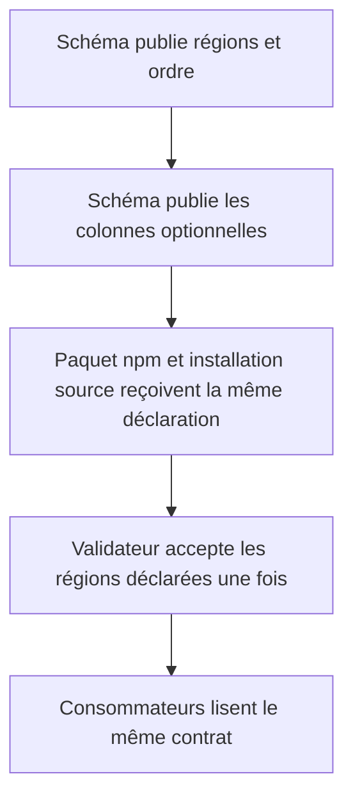
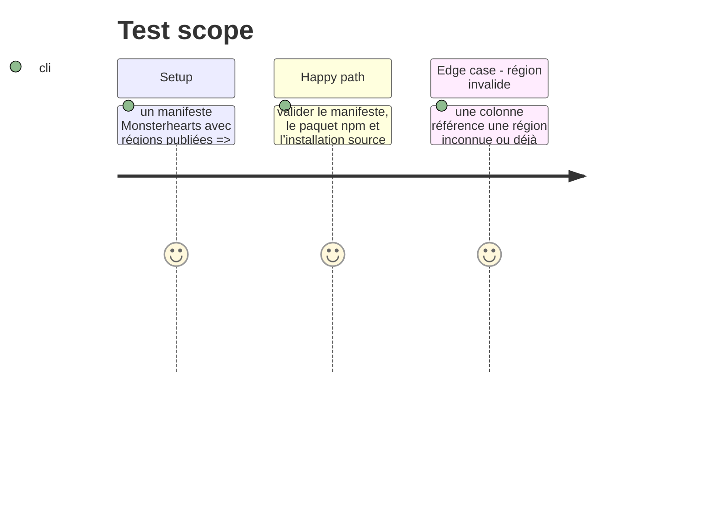

# Instruction: Publier et valider le contrat de disposition

## Architecture projection

> Tree of the final files. ✅ create · ✏️ modify · ❌ delete

```txt
../schema-pbta/
├── src/pack-manifest.ts ✏️ typer la liste canonique de régions et les colonnes optionnelles
├── src/presentation/layouts.ts ✅ exporter la disposition typée depuis une seule source de données
├── packs/monsterhearts/pack-contract.json ✏️ publier les régions Monsterhearts et leur disposition
├── handbook/monsterhearts/pack.json ✏️ référencer la même déclaration installable sans la recopier
├── tools/validate-pack-manifest.ts ✏️ refuser références inconnues, doublons et colonnes invalides
├── tools/validate-presentation-contract.ts ✏️ vérifier la cohérence du contrat publié
├── corpus/presentation/valid/… ✅ témoin de disposition valide
├── corpus/presentation/invalid/… ✅ témoins de régions inconnues et dupliquées
└── README.md ✏️ documenter la capacité et son absence de markup TOML
```

## User Journey



## Test Scope



## Tasks to do

### `1)` Définir le vocabulaire de disposition

> Ajouter au contrat de pack une déclaration optionnelle, sans modifier les codecs TOML.

1. Publier l’ordre complet des régions que le document peut rendre.
2. Ajouter une disposition nommée qui contient des colonnes ordonnées de ces identifiants.
3. Préserver le comportement des packs qui ne déclarent aucune disposition.
4. Désigner une seule donnée source, puis générer ou référencer sa projection npm et sa projection installable par Handbook afin d’interdire deux listes divergentes.

### `2)` Rendre le contrat inviolable

> Le validateur doit interdire toute interprétation ambiguë.

1. Refuser une colonne vide, une région inconnue et une région présente plusieurs fois.
2. Vérifier que les régions non assignées sont permises et restent déterministes.
3. Ajouter les témoins acceptés et refusés au corpus de présentation.

### `3)` Publier le premier consommable Monsterhearts

> Faire de Monsterhearts le témoin concret de la capacité, sans insérer de directive dans son playbook TOML.

1. Déclarer les régions Monsterhearts existantes et leur ordre canonique.
2. Déclarer ses deux colonnes de consultation dans le contrat de pack.
3. Exporter la donnée typée pour Handbook et Lantern depuis cette source unique, documenter la compatibilité et préparer la version du schéma.

## Test acceptance criteria

| Task | Acceptance criteria |
| ---- | ------------------- |
| 1 | Un consommateur npm et une installation source obtiennent le même ordre de régions et la même disposition, sans lire le TOML. |
| 2 | Un manifeste qui répète ou invente une région échoue ; une région non assignée reste valide. |
| 3 | Monsterhearts publie une disposition valide fondée uniquement sur ses régions existantes. |
