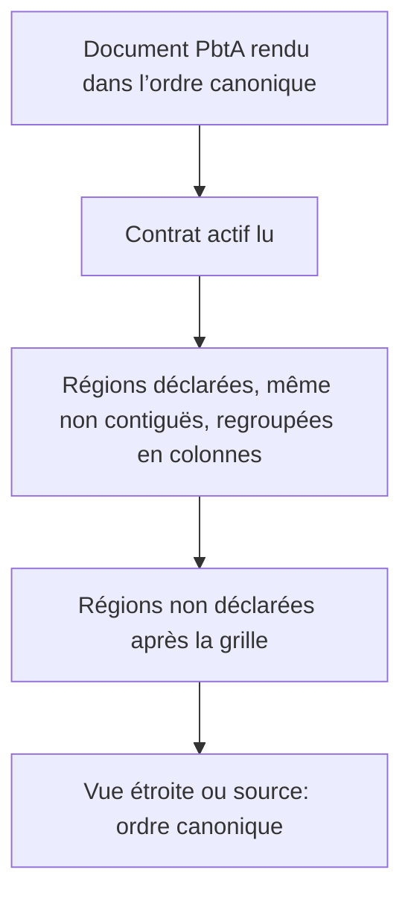
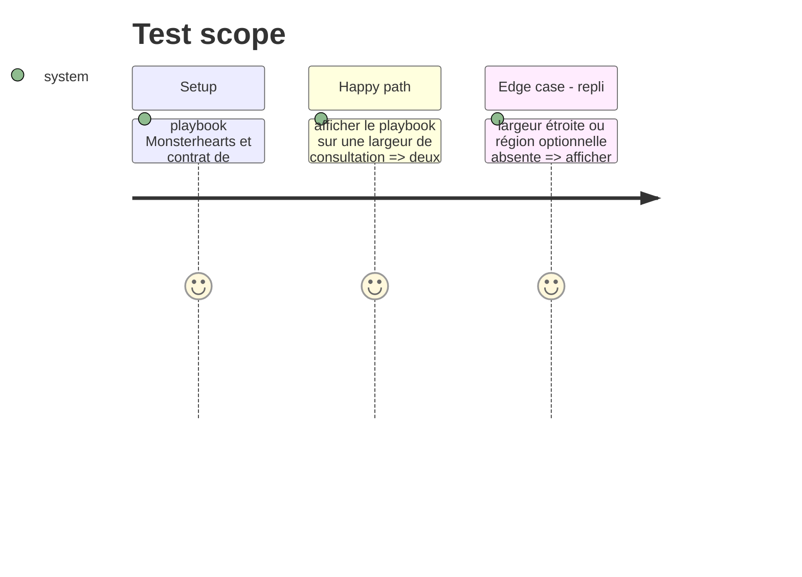

# Instruction: Faire consommer le contrat par Handbook

## Architecture projection

> Tree of the final files. ✅ create · ✏️ modify · ❌ delete

```txt
.
├── src/features/layoutRegions/contractLayout.ts ✅ sélectionner les régions DOM par `data-region`, les déplacer dans une grille et y conserver leur ordre de colonne
├── src/features/layoutRegions/sectionMapper.ts ✏️ partager la création de colonnes sans dépendre des marqueurs source
├── src/features/pbta/renderer.ts ✏️ poser les identifiants de régions publiés dans l’ordre canonique
├── src/games/… ✏️ charger la disposition du contrat de pack actif
├── src/BrumesPlugin.ts ✏️ déclencher la projection après le rendu du document
├── src/styles/_layout-regions.scss ✏️ conserver la grille et le repli une colonne pour les régions contractuelles
├── tools/layoutRegions.harness.mts ✏️ prouver regroupement, ordre et absence de perte
├── tools/assert-layout-regions.mjs ✏️ inclure les assertions de contrat et responsive
└── tools/pbtaSpecializedProjection.harness.mts ✏️ exercer le cas Monsterhearts publié
```

## User Journey



## Test Scope



## Wireframe

```txt
┌───────────────────────────────────────────────────┐
│ (1) Identité                                       │
├────────────────────────┬──────────────────────────┤
│ (2) Colonne A          │ (3) Colonne B            │
│     régions déclarées  │     régions déclarées     │
├────────────────────────┴──────────────────────────┤
│ (4) Régions non déclarées, ordre canonique         │
└───────────────────────────────────────────────────┘
```

1. Identité et entête hors de la disposition optionnelle.
2. Première colonne définie par le contrat actif.
3. Seconde colonne définie par le contrat actif.
4. Régions absentes de la disposition, toujours visibles après celle-ci.

## Tasks to do

### `1)` Distinguer les régions contractuelles des marqueurs Markdown

> Les marqueurs existants restent une fonction générique de note, mais aucun playbook n’en dépend.

1. Ajouter un chemin de projection qui reçoit les identifiants de régions déjà rendus.
2. Réutiliser la construction de grille sans lire ou écrire les lignes source du playbook.
3. Sélectionner les enfants de rendu par leur `data-region`, puis déplacer les éléments déclarés, même non contigus, dans une grille placée avant le premier élément sélectionné.
4. Laisser dans le flux les régions absentes du document ou non sélectionnées, sans les créer ni les dupliquer.

### `2)` Préserver l’ordre et les replis

> La disposition large ne doit pas changer le document portable.

1. Conserver les régions non sélectionnées après la grille selon leur ordre publié.
2. Replier la grille à une colonne avec l’ordre canonique lorsque la largeur est insuffisante.
3. Laisser la vue source inchangée et sans directives injectées.

### `3)` Tester le contrat dans le consommateur

> Rendre observable le lien entre contrat, DOM et styles.

1. Ajouter un témoin Monsterhearts avec région optionnelle présente et absente.
2. Vérifier le nombre de colonnes, le placement par identifiant et l’intégrité de l’ordre.
3. Vérifier qu’un autre pack sans disposition conserve son rendu actuel.

## Test acceptance criteria

| Task | Acceptance criteria |
| ---- | ------------------- |
| 1 | Un playbook issu du contrat est mis en colonnes sans marqueur `handbook-layout`, y compris lorsque les régions sélectionnées ne sont pas adjacentes dans le DOM. |
| 2 | Écran étroit et vue source exposent le même ordre canonique, sans région masquée ni dupliquée. |
| 3 | Les tests lient la déclaration Monsterhearts à la grille ; un pack non déclarant n’est pas affecté. |
