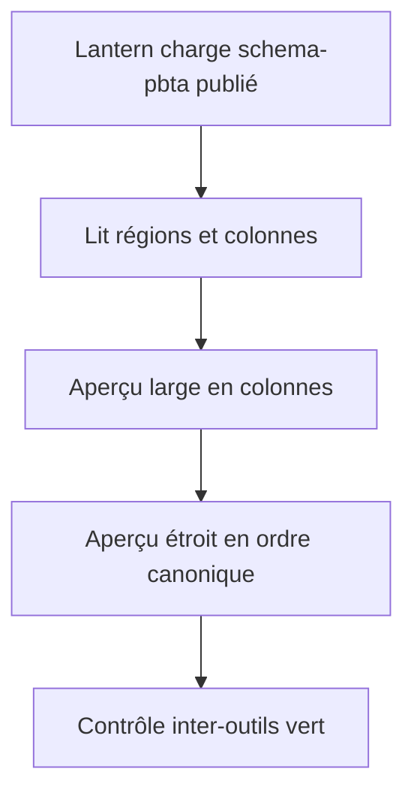
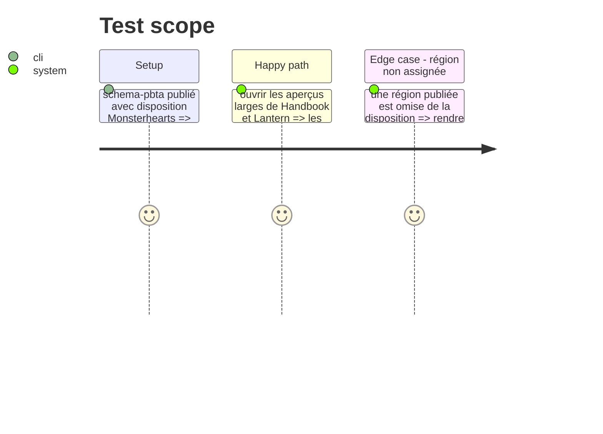

# Instruction: Faire consommer et vérifier le contrat par Lantern

## Architecture projection

> Tree of the final files. ✅ create · ✏️ modify · ❌ delete

```txt
../lantern/
├── src/templates/monsterhearts/playbook/preview/… ✏️ projeter les régions selon le contrat npm
├── src/templates/monsterhearts/playbook/preview/monsterheartsPlaybookTheme.css ✏️ aligner la grille et son repli sur le contrat
├── src/templates/monsterhearts/playbook/…test… ✅ prouver ordre, colonnes et repli
└── package.json ✏️ adopter la version publiée de schema-pbta

../schema-pbta/
├── tools/validate-cross-tool-contract.ts ✏️ exiger les capacités et versions des deux consommateurs
├── tools/validate-cross-tool-provider.ts ✏️ vérifier la disponibilité de la disposition publiée
└── cross-tool-provider.json ✏️ publier la capacité de disposition partagée

.
└── tools/… ✏️ exécuter le contrôle d’intégration Handbook contre la révision de schéma publiée
```

## User Journey



## Test Scope



## Wireframe

```txt
┌───────────────────────────────────────────────────┐
│ (1) Identité                                       │
├────────────────────────┬──────────────────────────┤
│ (2) Colonne A          │ (3) Colonne B            │
├────────────────────────┴──────────────────────────┤
│ (4) Régions non déclarées                          │
└───────────────────────────────────────────────────┘
```

1. En-tête du playbook.
2. Première colonne publiée.
3. Seconde colonne publiée.
4. Suite canonique commune aux deux consommateurs.

## Tasks to do

### `1)` Brancher Lantern sur la présentation publiée

> L’aperçu ne maintient plus son propre ordre de colonnes Monsterhearts.

1. Lire la disposition depuis l’export typé de `schema-pbta`.
2. Poser les régions de l’aperçu dans l’ordre canonique et les répartir à partir de la déclaration.
3. Préserver le comportement à une colonne si le contrat ne fournit pas de disposition.

### `2)` Fermer le contrat entre dépôts

> Rendre impossible une adoption partielle silencieuse.

1. Publier la capacité dans le fournisseur cross-tool et relever les versions minimales des consommateurs si nécessaire.
2. Ajouter les contrôles de version et de capacité côté fournisseur.
3. Exécuter les validations de schéma, Handbook et Lantern contre la même révision publiée.

### `3)` Préparer l’adoption Monsterhearts

> Le plan éditorial Monsterhearts #44 devient un consommateur de la capacité achevée.

1. Référencer ce contrat dans le plan #44 sans dupliquer la logique de colonnes.
2. Conserver les décisions stylistiques spécifiques à Monsterhearts dans le pack et les styles Handbook.

## Test acceptance criteria

| Task | Acceptance criteria |
| ---- | ------------------- |
| 1 | Lantern construit son aperçu Monsterhearts à partir de la disposition publiée, sans ordre de colonnes codé localement. |
| 2 | Les contrôles inter-outils échouent si un consommateur ne déclare pas ou ne supporte pas la capacité requise. |
| 3 | Le travail #44 peut se concentrer sur l’éditorial Monsterhearts et n’introduit aucun marqueur de colonnes dans le TOML. |
