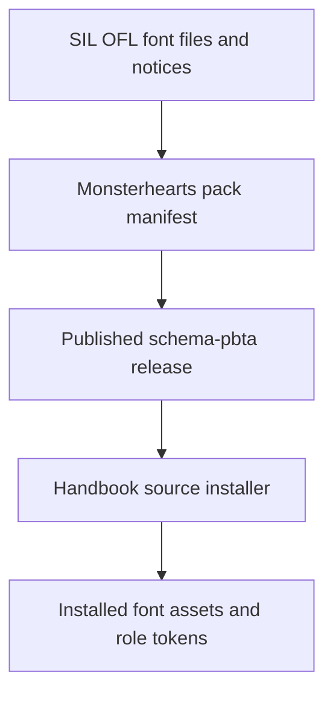
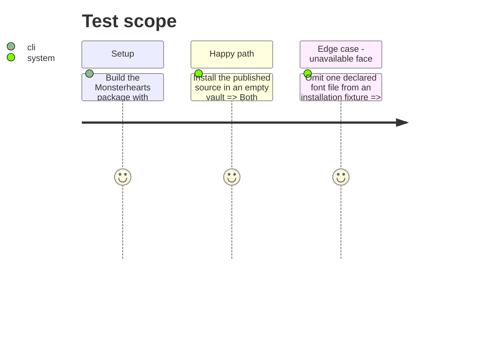

# Instruction: Publish Monsterhearts typography in schema-pbta

## Architecture projection

> Tree of the final files. ✅ create · ✏️ modify · ❌ delete

```txt
../schema-pbta/
└── handbook/monsterhearts/
    ├── pack.json                         ✏️ declares text and title font-role tokens plus each distributable face
    ├── assets/fonts/                     ✅ carries IM Fell English and Averia Serif Libre webfont files
    ├── LICENSES/                          ✅ carries their SIL Open Font License notices
    └── README.md                          ✏️ records roles, sources, and redistribution notices
```

No Handbook file changes in this phase.

## User Journey



## Test Scope



## Tasks to do

### `1)` Make the typography contract distributable

> Replace an implicit system-font dependency with package-owned, licensed assets.

1. Add redistributable webfont faces for IM Fell English and Averia Serif Libre and include their SIL OFL licence files beside the Monsterhearts asset payload.
2. Declare every face through `assets.fonts`, with correct relative paths, weights, and styles.
3. Associate IM Fell English with the text role and Averia Serif Libre with the title/header role through published style tokens, each retaining readable generic fallbacks.
4. Extend schema-pbta package and installation checks to reject a missing declared font, missing licence notice, or token family without a matching declared asset.

### `2)` Release the producer before adoption

> Publish an immutable schema-pbta release containing the font contract.

1. Run the producer’s schema, pack, corpus, and Handbook-install validation suites.
2. Tag and publish the schema-pbta source revision and raise the Monsterhearts pack’s minimum Handbook version only if the consumer change requires it.
3. Record the immutable source reference for Handbook’s cross-tool installation verification; do not confuse it with Handbook’s contract/corpus tarball pin.

## Test acceptance criteria

| Task | Acceptance criteria |
| --- | --- |
| 1 | A clean Monsterhearts pack installation contains both referenced typeface families and their SIL OFL notices. |
| 1 | Published text and title token stacks name only declared families plus explicit readable fallbacks. |
| 2 | The producer release validates its package, corpus, pack asset paths, and an empty-vault Handbook installation. |
