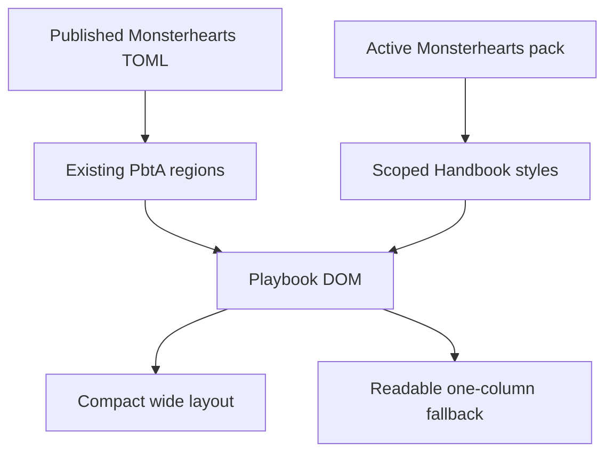
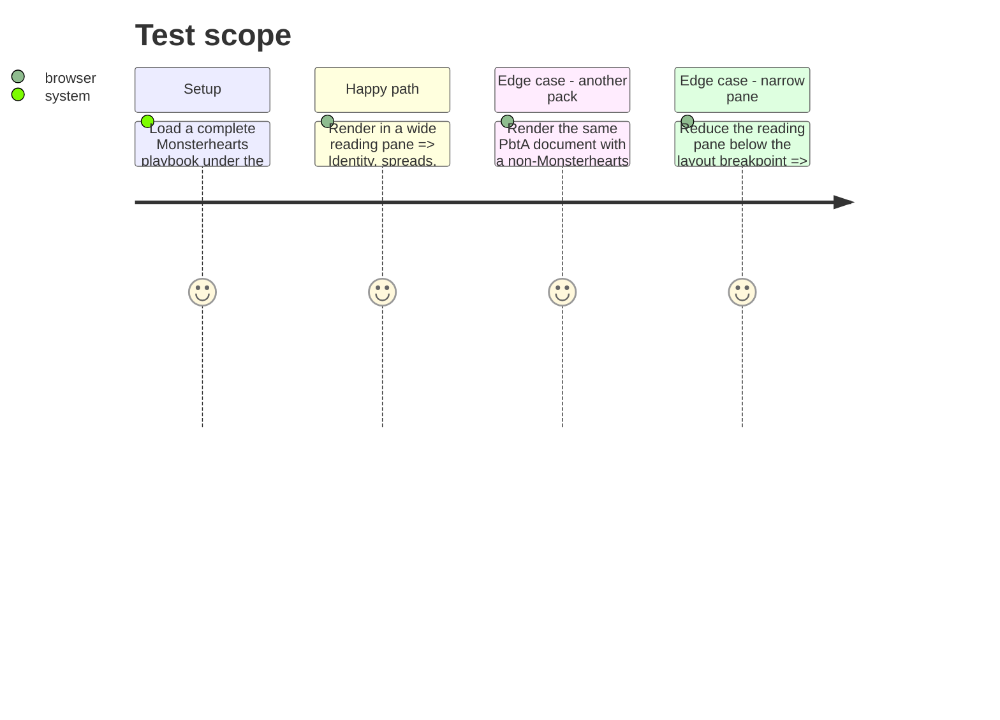

# Instruction: Project the published layout in Handbook

## Architecture projection

> Tree of the final files. ✅ create · ✏️ modify · ❌ delete

```txt
.
└── src/
    ├── features/pbta/renderer.ts          ✏️ emits the already-published Monsterhearts harm value with its mechanics
    └── styles/pbta/
        ├── _blocks.scss                   ✏️ supplies compact Monsterhearts-only grid, rules, and region treatments
        └── index.scss                     ✏️ scopes the editorial projection to the active Monsterhearts pack and responsive fallback
```

No files are created or deleted in this phase.

## User Journey



## Test Scope



## Wireframe

```txt
┌────────────────────────────────────────────────────────────┐
│ (1) Identity and playbook description                       │
├───────────────────────┬────────────────────────────────────┤
│ (2) Stat spreads      │ (3) Strings · ascendants · harm     │
│     compact profiles   │     conditions                      │
├───────────────────────┼────────────────────────────────────┤
│ (4) Moves and choices │ (5) Gear and advances               │
├───────────────────────┴────────────────────────────────────┤
│ (6) Editorial regions in published order                    │
└────────────────────────────────────────────────────────────┘
```

1. Identity: existing name, game, description, and start-spread material.
2. Stat spreads: the existing labelled profile structure in a compact repeated group.
3. Mechanics: published Strings, ascendants, harm, and conditions; no inferred fields.
4. Actions: existing moves and choices.
5. Continuation: existing gear and advancement content.
6. Editorial: canonical prose regions retain their declared sequence.

## Tasks to do

### `1)` Complete the published mechanics projection

> Expose the existing Monsterhearts `harm` field without inventing data.

1. Add harm to the target’s mechanics projection only when the schema-published value is present.
2. Preserve all existing rendered regions, their shape order, and the #43 structured profile/mechanic hooks.

### `2)` Build the scoped editorial layout

> Use the active pack’s roles and existing semantic classes to make the sheet recognisably Monsterhearts.

1. Under `.brumes--monsterhearts` only, use the published text/title tokens, small-cap/uppercase labels, restrained rules, and compact spacing.
2. Arrange existing stats, profile, moves, gear, mechanics, and advancement regions into an intentional grid at usable widths; keep editorial order in normal document flow.
3. Collapse every grid to one column at a measured narrow-pane breakpoint and preserve source-view readability.
4. Do not add game data, alter TOML, or place geometry in the pack manifest.

## Test acceptance criteria

| Task | Acceptance criteria |
| --- | --- |
| 1 | A declared harm value appears with Monsterhearts mechanics; an absent value creates no empty group. |
| 2 | Only an active Monsterhearts pack receives the editorial grid, typography roles, compact spreads, and ruled groups. |
| 2 | Reading and source views remain usable, and the narrow breakpoint has one non-overflowing column. |
