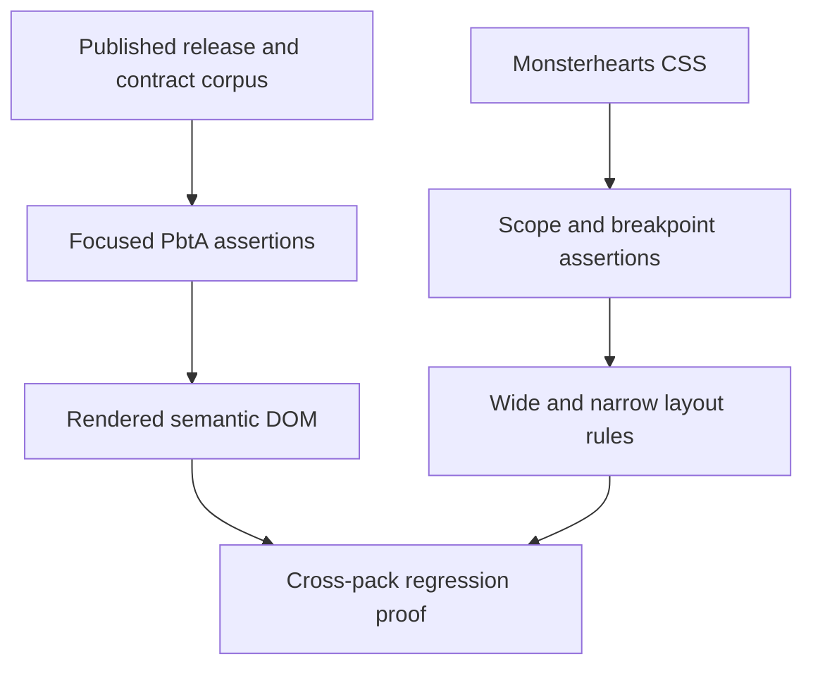
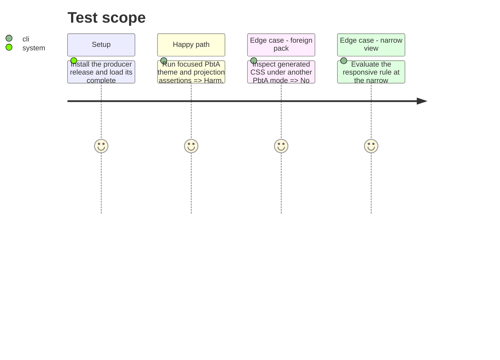

# Instruction: Prove scope, responsive layout, and installed assets

## Architecture projection

> Tree of the final files. ✅ create · ✏️ modify · ❌ delete

```txt
.
└── tools/
    ├── assert-pbta-theme.mjs                  ✏️ verifies Monsterhearts-only selectors, font-role variables, rules, and responsive grid fallback
    ├── assert-pbta-specialized-projection.mjs ✏️ continues to launch the rendered specialized corpus proof
    └── pbtaSpecializedProjection.harness.mts  ✏️ proves published harm is visible only when present
```

No files are created or deleted in this phase.

## User Journey



## Test Scope



## Tasks to do

### `1)` Make the visual contract mechanically checkable

> Turn the pack-specific design boundary into regression assertions.

1. Assert every new selector is rooted at `.brumes--monsterhearts`, uses published role/token variables, and contains no duplicated palette or font payload.
2. Assert the compact grid and its single-column media fallback, including source-view-safe selectors.
3. Extend the specialized DOM harness to verify harm is visible when declared and omitted otherwise, alongside the #43 structures.

### `2)` Verify end-to-end compatibility

> Prove the producer/consumer handoff and normal Handbook gates.

1. Run the schema-pbta source’s cross-tool install check against the tagged producer revision and released Handbook revision.
2. Run `pnpm assert:pbta-contract`, `pnpm assert:pbta-specialized-projection`, `pnpm assert:pbta-theme`, `pnpm check`, and the relevant source-install assertion.
3. Inspect wide and narrow Obsidian reading/source view with the published Monsterhearts pack; retain screenshots or deterministic measurements as review evidence.

## Test acceptance criteria

| Task | Acceptance criteria |
| --- | --- |
| 1 | The assertion fails for an unscoped Monsterhearts selector, missing responsive fallback, missing font-role variable, or omitted declared harm. |
| 1 | Existing non-Monsterhearts PbtA theme assertions remain unchanged and pass. |
| 2 | Producer installation, focused PbtA checks, and repository type/build/lint gates pass against the released cross-tool pair. |
| 2 | Wide and narrow source/reading views show the same published content in a readable, non-overflowing composition. |
