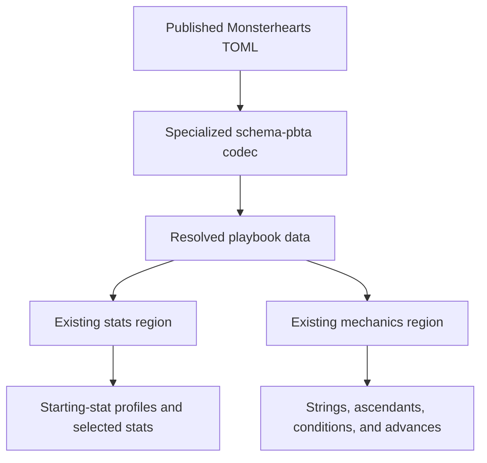
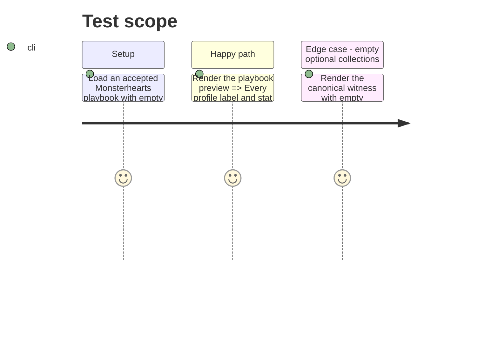

# Instruction: Project published PbtA structures into existing regions

## Architecture projection

> Tree of the final files. ✅ create · ✏️ modify · ❌ delete

```txt
.
├── src/features/pbta/
│   └── renderer.ts                         ✏️ renders stat-profile cards and typed Monsterhearts mechanical structures in the existing stats and mechanics zones
└── src/styles/pbta/
    └── _blocks.scss                        ✏️ lays out the new semantic groups with the existing PbtA visual tokens
```

No files are created or deleted in this phase.

## User Journey



## Test Scope



## Wireframe

```txt
┌─────────────────────────────────────────────────────┐
│ (1) Playbook identity                                │
├─────────────────────────────────────────────────────┤
│ (2) Starting statistics                              │
│     selected values                                  │
│     ┌─────────────────────────────────────────────┐ │
│     │ (3) Published starting-stat profile          │ │
│     │     profile label · named stat values         │ │
│     └─────────────────────────────────────────────┘ │
├─────────────────────────────────────────────────────┤
│ (4) Existing playbook regions                       │
├─────────────────────────────────────────────────────┤
│ (5) Monsterhearts mechanics                          │
│     strings · ascendants · conditions · advances     │
└─────────────────────────────────────────────────────┘
```

1. Identity: existing game, playbook name, description, and starting-spread callout.
2. Statistics: existing selected stat values; it may be empty when no profile has been selected.
3. Profile: one repeated structured group per published `statProfiles` item, retaining the source label and every named value.
4. Existing playbook regions: editorial, moves, choices, creation, gear, and advancement remain in their published shape order.
5. Mechanics: structured published Monsterhearts values, after the pre-existing common regions.

## Tasks to do

### `1)` Render profile choices without assigning one

> Make a published profile visible even when the selected `stats` record is empty.

1. Add a renderer helper that accepts only the portable profile structure and emits its label plus named stat rows.
2. Emit every `statProfiles` entry in the existing stats-zone builder after any selected stat rows.
3. Keep the stats zone present whenever profiles exist, even if `stats` has no keys; do not choose, merge, or otherwise interpret a profile.
4. Use semantic DOM classes and the existing PbtA tokens to distinguish the repeated profile group from individual labelled fields.

### `2)` Give Monsterhearts mechanics typed projections

> Replace raw object coercion with groups that expose the schema-published members.

1. Include `ascendants` in the Monsterhearts mechanic projection in its published sequence with strings, conditions, and advances.
2. Render strings as their named numeric members; render each ascendant as name and value; render each condition as name and optional description; and render each advance as label and optional checked state.
3. Omit absent or empty optional collections without an empty group, while retaining present zero and false values.
4. Leave other specialized targets and the common PbtA region order unchanged.

## Test acceptance criteria

| Task | Acceptance criteria |
| --- | --- |
| 1 | A valid playbook with `stats = {}` and two `statProfiles` visibly contains both labels and every named profile stat. |
| 1 | Rendering profiles does not populate, select, or hide the empty selected-stats state. |
| 2 | A populated Monsterhearts witness visibly exposes strings, each ascendant pair, condition name/description, and advance label/check state without `[object Object]`. |
| 2 | Missing or empty optional Monsterhearts collections add no blank mechanical group, while populated scalar values including `0` remain visible. |
