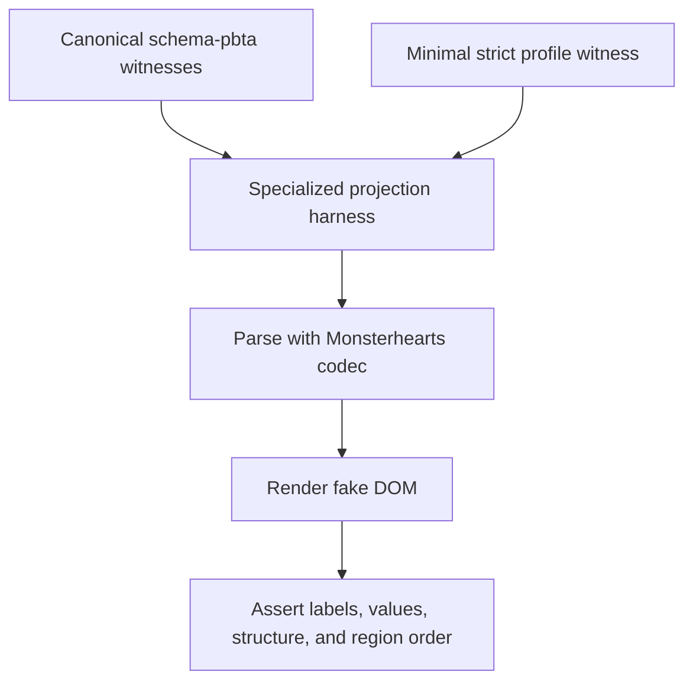
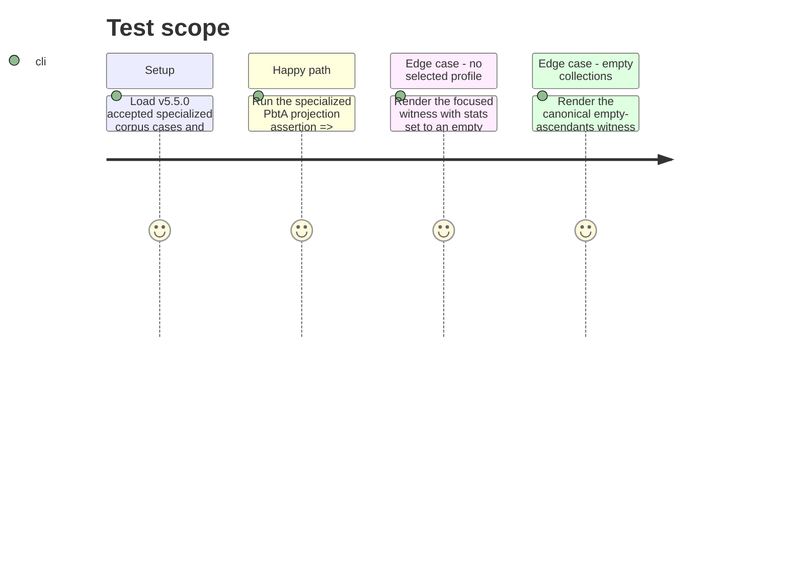

# Instruction: Prove profile and Monsterhearts mechanic rendering

## Architecture projection

> Tree of the final files. ✅ create · ✏️ modify · ❌ delete

```txt
.
└── tools/
    └── pbtaSpecializedProjection.harness.mts   ✏️ adds strict rendering witnesses and assertions for stat profiles and every Monsterhearts structured mechanic
```

No files are created or deleted in this phase.

## User Journey



## Test Scope



## Tasks to do

### `1)` Extend the focused specialized-rendering proof

> Turn issue #43's regression into a deterministic DOM-level contract check.

1. Extend the existing fake-DOM harness with a minimal valid Monsterhearts source that contains `stats = {}`, two distinct profiles, populated strings, ascendants, conditions, advances, and required editorial regions.
2. Assert each profile label and each named stat value is rendered, and assert profiles occur in the stats region after any selected stat values.
3. Assert each populated Monsterhearts mechanic exposes its published nested values and that rendered output never contains object-coercion text.
4. Retain the canonical empty-collection witness and assert it produces neither blank mechanic groups nor a renderer failure.

### `2)` Run focused and repository gates

> Verify the projection against the installed contract and the project’s normal static checks.

1. Run `pnpm assert:pbta-contract` to verify the pinned package and canonical corpus.
2. Run `pnpm assert:pbta-specialized-projection` to execute the new regression assertions.
3. Run the relevant static repository gates (`pnpm check`, `pnpm lint`, and `pnpm build`) and resolve only regressions attributable to this change.

## Test acceptance criteria

| Task | Acceptance criteria |
| --- | --- |
| 1 | The specialized projection assertion fails if profile labels, their stat values, ascendant pairs, condition details, strings, or advances disappear from the preview. |
| 1 | The test proves that an empty selected stats record does not remove profile output and that no rendered text is JavaScript object coercion. |
| 1 | The canonical empty-collection case continues to render without blank mechanic markup. |
| 2 | `pnpm assert:pbta-contract`, `pnpm assert:pbta-specialized-projection`, `pnpm check`, `pnpm lint`, and `pnpm build` pass. |
