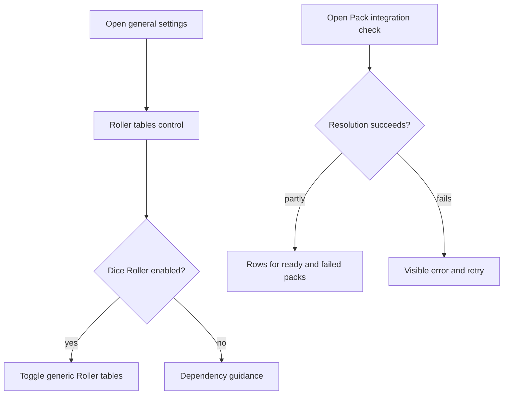
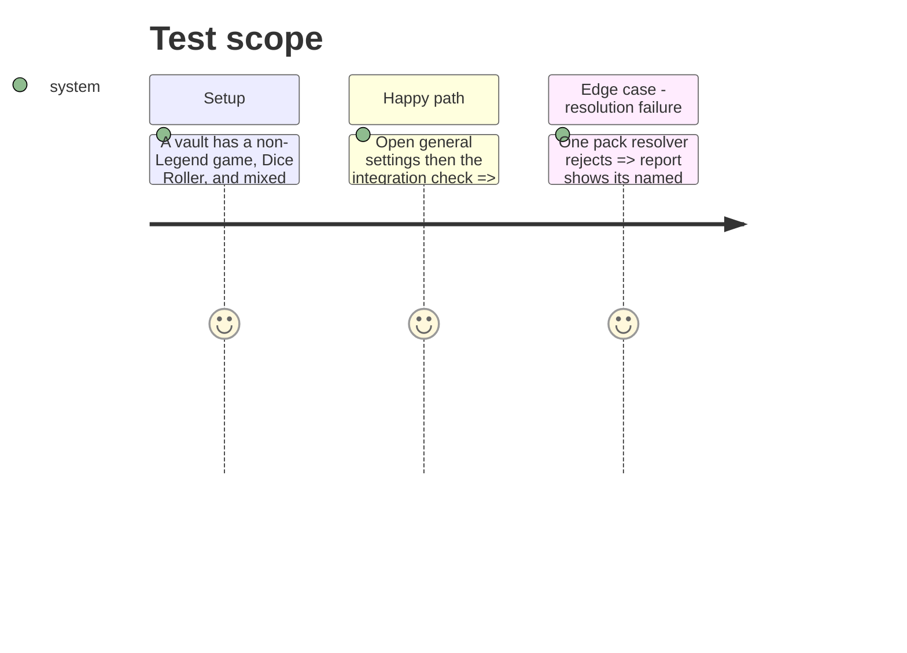

# Instruction: Make generic settings and pack diagnostics resilient

## Architecture projection

> Tree of the final files. ✅ create · ✏️ modify · ❌ delete

```txt
.
├── src/settings/index.ts                    ✏️ render Roller control from general settings
├── src/settings/packIntegrationModal.ts      ✏️ render loading, retry, and report failure states
├── src/features/packs/integration.ts         ✏️ return independent per-pack resolution outcomes
├── tools/packIntegration.harness.mts         ✏️ prove a failed pack does not suppress ready packs
├── tools/packIntegrationModal.harness.mts    ✅ prove failure/retry state transitions
├── tools/assert-pack-integration-modal.mjs   ✅ run the modal-state harness
├── package.json                              ✏️ expose the focused modal-state check
└── tools/assert-settings-ui.mjs              ✏️ lock generic Roller placement into the settings surface
```

## User Journey



## Test Scope



## Wireframe

```txt
┌──────────────────────────────────────────────┐
│ (1) General settings                          │
│ ┌──────────────────────────────────────────┐ │
│ │ (2) Generic Roller control · dependency   │ │
│ └──────────────────────────────────────────┘ │
├──────────────────────────────────────────────┤
│ (3) Pack integration check                   │
│ ┌──────────────────────────────────────────┐ │
│ │ (4) Summary / report failure + retry      │ │
│ ├──────────────────────────────────────────┤ │
│ │ (5) One row per resolved or failed pack   │ │
│ └──────────────────────────────────────────┘ │
└──────────────────────────────────────────────┘
```

1. General settings: cross-game controls.
2. Generic Roller control: dependency state and persisted enablement.
3. Pack integration entry: opens the live diagnostic.
4. Status: loading, actionable failure, or compact summary.
5. Pack rows: independent readiness or resolution failure.

## Tasks to do

### `1)` Relocate the generic Roller control

> Make the setting available in every game mode without loosening its Dice Roller dependency gate.

1. Move the setting’s existing plugin-availability check and persisted-toggle behavior into the general-settings rendering path.
2. Remove it from the Legend in the Mist-only section without changing its save, refresh, or explanatory behavior.
3. Preserve Markdown refresh and disabled explanatory text when Dice Roller is absent.

### `2)` Isolate pack resolution failures

> Keep an individual pack or adapter failure visible without blanking the entire diagnostic.

1. Resolve registrations into successful and failed outcomes rather than letting one rejected promise reject the report.
2. Add a named report finding for a resolution failure and retain successful rows and summary counts.
3. Give the modal explicit loading, partial-report, terminal-error, and retry surfaces; guard late results after close.
4. Cover the modal state transitions with a focused harness, including a rejected initial refresh followed by a successful retry.

## Test acceptance criteria

| Task | Acceptance criteria |
| --- | --- |
| 1 | With any active game, a user can see and change Roller tables only when Dice Roller is enabled. |
| 2 | A failed pack resolution is named, successful packs remain inspectable, and a total failure offers an accessible retry instead of an unhandled rejection; a rejected refresh followed by retry is exercised by the focused harness. |
