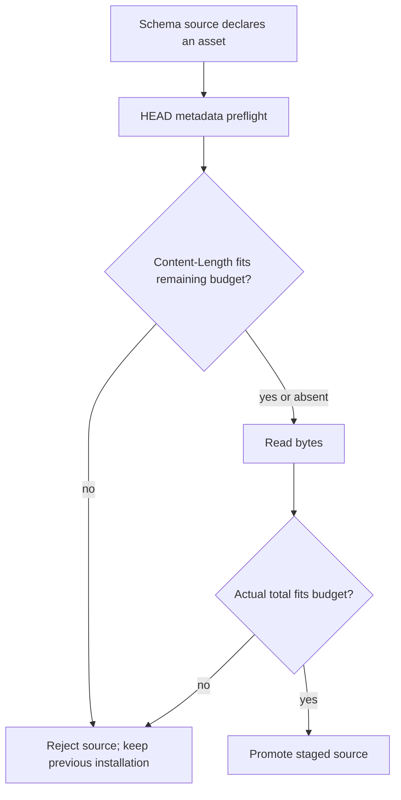
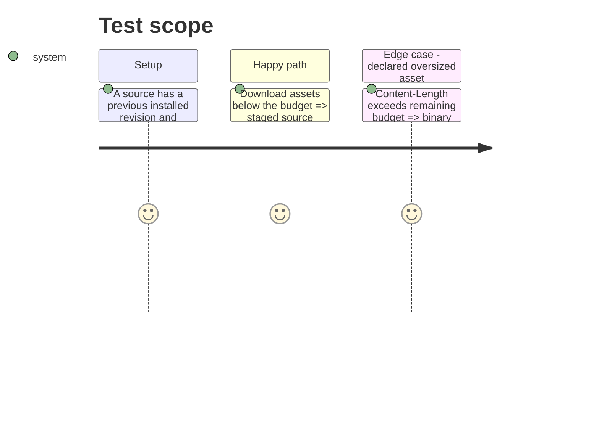

# Instruction: Bound remote source assets before buffering

## Architecture projection

> Tree of the final files. ✅ create · ✏️ modify · ❌ delete

```txt
.
├── src/games/githubSources.ts        ✏️ expose a metadata-only HEAD preflight and deferred binary GET
├── src/games/sourceInstaller.ts      ✏️ reject declared oversized assets before issuing their binary GET
├── tools/githubSources.harness.mts   ✏️ prove HEAD metadata and unsupported-HEAD fallback behavior
└── tools/sourceInstaller.harness.mts ✏️ prove oversized assets are not read or promoted
```

## User Journey



## Test Scope



## Tasks to do

### `1)` Carry binary metadata through the source adapter

> Let installation inspect `Content-Length` before `requestUrl`’s binary body is read.

1. Replace the bare binary reader contract with a typed metadata preflight (`HEAD`) plus deferred binary `GET` interface; normalize an optional content length from the preflight response.
2. Reject invalid or oversized declared lengths before issuing the binary `GET`; retain the post-read total check when `HEAD` is unavailable, headerless, or misleading.
3. Keep repository paths, manifest validation, staging rollback, and immutable revision behavior unchanged.

### `2)` Prove rejection is non-destructive

> Make oversized sources fail before allocation on the header-aware path and leave the prior source installed.

1. Extend source-adapter and installer harnesses with `HEAD` content-length fixtures and a separately counted binary `GET` stub.
2. Assert an oversized declaration performs no binary `GET` or byte-reader invocation.
3. Assert a missing or unsupported `HEAD` retains compatibility and the existing post-read cap still rejects an excessive actual body.

## Test acceptance criteria

| Task | Acceptance criteria |
| --- | --- |
| 1 | A declared remote asset larger than the remaining budget is rejected after metadata preflight and before its binary `GET` is issued. |
| 2 | Every oversized-source failure keeps the previous source tree unchanged; normal and headerless assets remain installable within the existing limit. |
