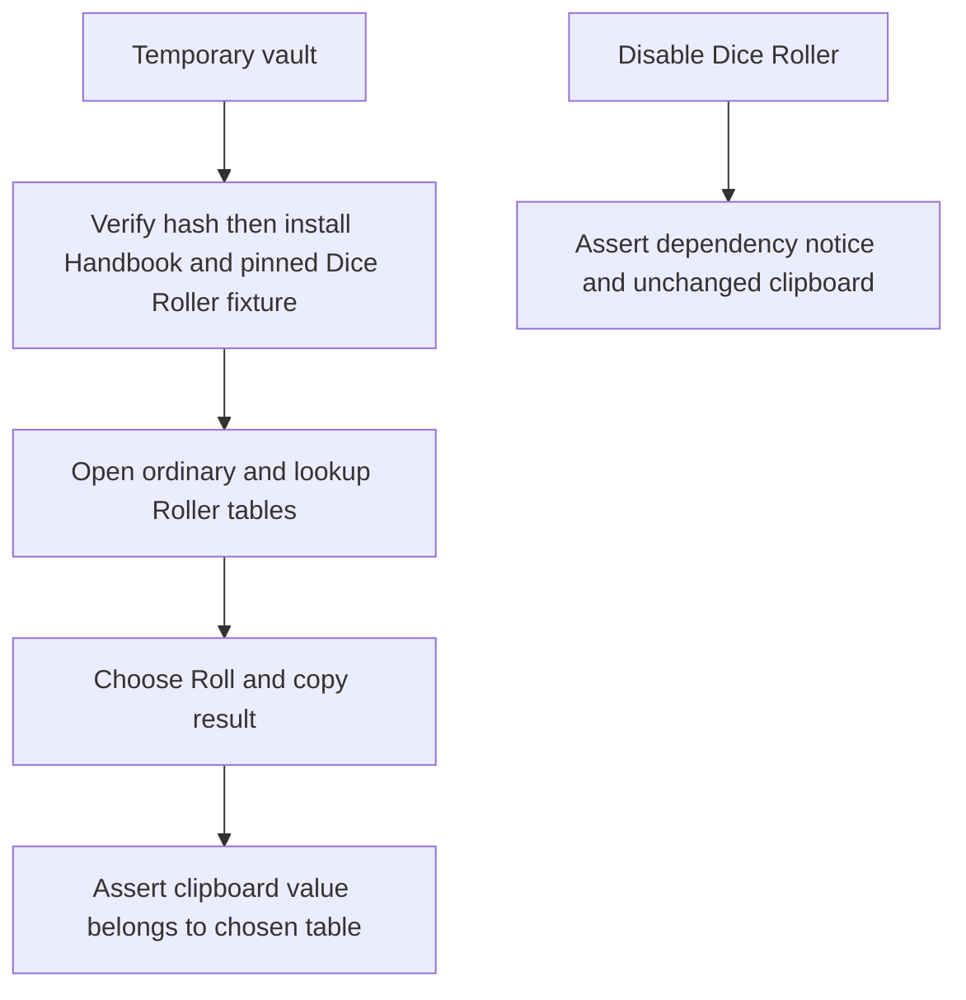
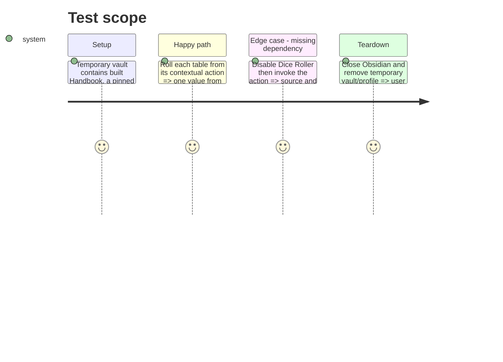

# Instruction: Prove Dice Roller in a real Obsidian journey

## Architecture projection

> Tree of the final files. ✅ create · ✏️ modify · ❌ delete

```txt
.
├── tools/e2e/fixtures/roller.md        ✅ author ordinary and lookup Roller tables
├── tools/e2e/fixtures/dice-roller.lock.json ✅ pin release tag, archive URL, and SHA-256
├── tools/e2e/roller-journey.ps1        ✅ verify, extract, and install the locked release in an isolated Windows vault
├── tools/e2e/roller-cdp.py             ✅ right-click rendered tables and assert menu, clipboard, and dependency absence
├── tools/e2e/README.md                 ✏️ document fixture, isolation, and reports
├── package.json                        ✏️ expose Roller E2E command
└── .github/workflows/ci.yml            ✏️ run the journey after building plugin and installing Obsidian
```

## User Journey



## Test Scope



## Tasks to do

### `1)` Build the isolated optional-plugin fixture

> Reuse the established temporary-vault/CDP safety model for a pinned Dice Roller package.

1. Add ordinary and lookup authored tables plus a small deterministic result assertion strategy that accepts any valid member of the table selected by the context menu.
2. Add a fixture lock containing Dice Roller release `11.4.2`, its archive URL, and SHA-256 `E1F3624996AB532C96B18FF5F6A0A977B1A85BC7BF15724B7ABE842BB16CC2AA`; make the PowerShell runner download that exact archive, verify its hash, then extract it into the temporary vault.
3. Seed the temporary vault’s community-plugin settings with Handbook and Dice Roller enabled, and with Handbook’s generic Roller setting enabled; enable no user plugin or user vault configuration.
4. Capture screenshots and a durable journey report outside the vault; restore or delete all temporary state on every exit.

### `2)` Assert real contextual behavior in CI

> Prove the integration boundary that mocks cannot exercise.

1. Drive Obsidian through CDP to open notes, dispatch a real right-click on each rendered table, choose its contextual Roller action, and read the clipboard with the required browser permission.
2. Disable the dependency, reload the fixture vault, then assert the unavailable path produces neither source mutation nor clipboard mutation and displays dependency feedback.
3. Fail before launch on a hash mismatch, and add the journey to Windows CI with the same Obsidian install prerequisites as the layout-regions journey.

## Test acceptance criteria

| Task | Acceptance criteria |
| --- | --- |
| 1 | The journey verifies the locked Dice Roller `11.4.2` archive before installing it in a disposable vault, enables generic Roller there, and leaves no user-vault data behind. |
| 2 | CI proves real right-click contextual actions copy ordinary and lookup table results from the selected table; after a dependency reload, the unavailable path remains non-mutating. |
