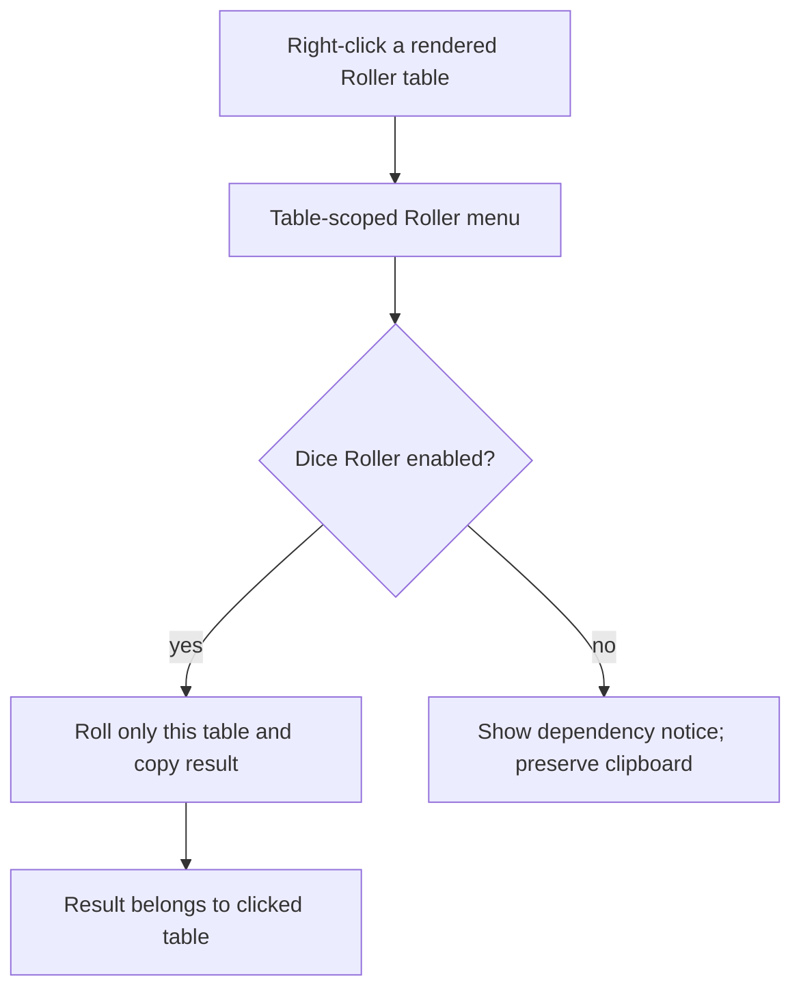

# Instruction: Bind Roller actions to their rendered table and prove them in Obsidian

## Architecture projection

> Tree of the final files. ✅ create · ✏️ modify · ❌ delete

```txt
.
├── src/features/blocks/registry.ts                ✏️ open a menu from the exact rendered Roller table
├── src/features/rollers/contextMenu.ts            ✏️ build and open the table-scoped action without remembered global state
├── src/contextMenu/index.ts                        ✏️ remove the stale Roller contribution from the editor-wide menu
├── tools/assertRoller.harness.mts                  ✏️ prove two table-scoped actions preserve their own data
├── tools/assert-roller.mjs                         ✏️ supply the focused Obsidian Menu fake to the harness
├── tools/e2e/fixtures/roller.md                    ✅ author ordinary and lookup Roller tables
├── tools/e2e/fixtures/dice-roller.lock.json        ✅ pin release tag, archive URL, and SHA-256
├── tools/e2e/roller-journey.ps1                    ✅ verify, extract, and install the locked release in an isolated Windows vault
├── tools/e2e/roller-cdp.py                         ✅ right-click rendered tables and assert menu, clipboard, and dependency absence
├── tools/e2e/README.md                             ✏️ document fixture, isolation, and reports
├── package.json                                    ✏️ expose the Roller E2E command
└── .github/workflows/ci.yml                        ✏️ run the journey after building plugin and installing Obsidian
```

## User Journey



## Test Scope


## Wireframe

```txt
┌─────────────────────────────────────┐
│ (1) Table Roller rendue              │
│     ┌───────────────────────────┐   │
│     │ résultat │ option          │   │
│     └───────────────────────────┘   │
├─────────────────────────────────────┤
│ (2) Menu contextuel de cette table  │
│     └─ (3) Copier un résultat       │
└─────────────────────────────────────┘
```

1. Table Roller: owns the context event and its parsed data.
2. Context menu: opens at the pointer for that table only.
3. Action: rolls and copies without exposing an unrelated editor-wide action.

## Tasks to do

### `1)` Make the contextual action table-scoped

> Eliminate stale remembered Roller state and make the clicked table the only roll source.

1. Replace the global remembered-context contribution with a function that creates and opens a `Menu` from a `MouseEvent`, the plugin, and the table’s parsed `RollerData`.
2. Register that function on `contextmenu` for the rendered `.brumes-roller--table`, prevent the browser menu there, and retain the existing Dice Roller capability check at action time.
3. Remove the Roller item from the editor-wide `editor-menu`, so a right-click elsewhere cannot roll the last table rendered.
4. Extend the focused harness with two different parsed tables and fake menu actions, proving each action receives its own table data and the global menu no longer contributes Roller.

### `2)` Prove the real optional-plugin boundary in CI

> Exercise the direct table menu against the actual Dice Roller plugin, not its mocked API.

1. Add ordinary and lookup fixture tables plus a lock containing Dice Roller `11.4.2`, its release archive URL, and SHA-256 `E1F3624996AB532C96B18FF5F6A0A977B1A85BC7BF15724B7ABE842BB16CC2AA`.
2. Make the PowerShell journey verify the archive hash before extraction, seed only Handbook and Dice Roller plus Handbook’s generic Roller setting in a temporary vault, and always remove its vault/profile.
3. Drive a CDP `Input.dispatchMouseEvent` right-click on each rendered table, choose its visible table menu item, read the actual clipboard through Electron's renderer API, and accept only a member of the selected table.
4. Disable Dice Roller through Obsidian's plugin manager, wait until it is unloaded, and assert the same table-scoped action has dependency feedback but no source or clipboard mutation.
5. Add the journey to the existing Windows CI job after plugin build and Obsidian installation; retain screenshots and a report outside the disposable vault.

## Test acceptance criteria

| Task | Acceptance criteria |
| --- | --- |
| 1 | Right-clicking one rendered Roller table opens an action whose result source is that table; no editor-wide Roller action can use stale table data. |
| 2 | Windows CI verifies the locked Dice Roller archive, real table right-click actions for ordinary and lookup tables, valid clipboard output, and the non-mutating missing-dependency path. |
