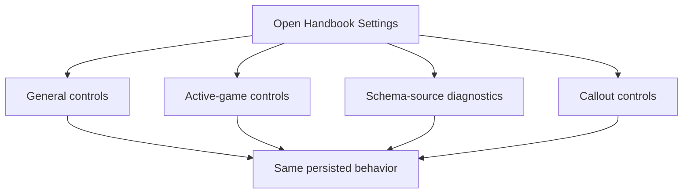
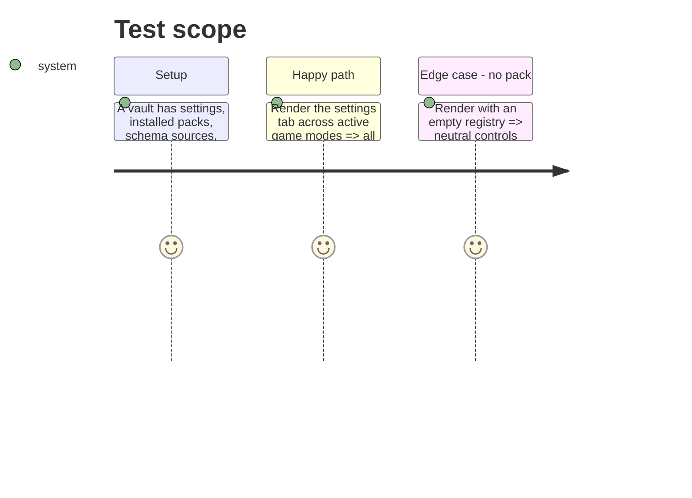

# Instruction: Split Settings composition by domain

## Architecture projection

> Tree of the final files. ✅ create · ✏️ modify · ❌ delete

```txt
.
├── src/settings/index.ts                 ✏️ retain tab lifecycle and compose extracted sections
├── src/settings/generalSettings.ts        ✅ own general preferences and shared async-setting helper
├── src/settings/schemaSourceSettings.ts   ✅ own schema-source, coverage, and integration controls
├── src/settings/gameSettings.ts           ✅ own game-specific settings composition
├── src/settings/calloutSettings.ts        ✅ own callout list and commands
└── tools/assert-settings-ui.mjs           ✏️ preserve every existing Settings entry and visibility condition
```

## User Journey



## Test Scope



## Tasks to do

### `1)` Extract independent settings domains

> Reduce the settings tab to orchestration without changing persistence or presentation contracts.

1. Move general, schema-source, active-game, and callout rendering into narrowly scoped modules with explicit dependencies.
2. Centralize the existing asynchronous save/error boundary so extracted controls preserve notices, logging, and redisplay behavior.
3. Keep DOM fragments and modal construction in their owning domain; do not introduce consumer-local game semantics.

### `2)` Lock the composition surface

> Prevent the refactor from silently removing controls or changing visibility gates.

1. Extend static settings assertions for the extracted composition points and the generic Roller control.
2. Run the complete project check after the refactor.

## Test acceptance criteria

| Task | Acceptance criteria |
| --- | --- |
| 1 | The settings tab composes domain modules while every existing control keeps its saved value, visibility rule, and failure feedback. |
| 2 | A missing pack or inactive game cannot expose game-only controls, and extracted sections cannot disappear without a focused assertion failing. |
