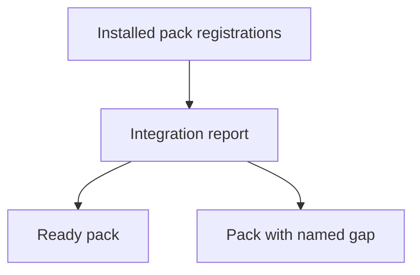
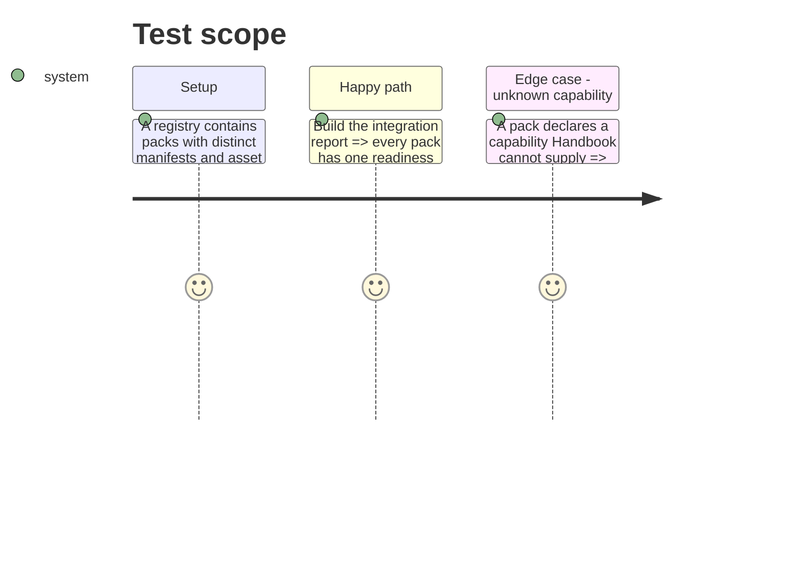

# Instruction: Measure pack readiness

## Architecture projection

> Tree of the final files. ✅ create · ✏️ modify · ❌ delete

```txt
.
├── src/features/packs/integration.ts       ✅ asynchronously derive per-pack integration facts and findings
├── src/games/capabilities.ts               ✏️ expose the supported capability vocabulary to the report
├── src/games/assets.ts                     ✏️ expose resource-resolution state needed by the report
└── tools/packIntegration.harness.mts       ✅ assert status combinations and actionable findings
```

## User Journey



## Test Scope



## Tasks to do

### `1)` Define pack integration facts

> Measure a pack’s declared requirements against what this Handbook build loaded.

1. Define a report row for installation, declared capabilities, available blocks/styles, and declared-resource availability.
2. Resolve each registered pack’s declared resources through the existing asset resolver when the check opens; do not reuse the active-pack-only asset state.
3. Derive deterministic capability findings without game-id branches or vault-note scans.
4. Treat absent manifests, unsupported capabilities, unavailable blocks, and missing resources as separate, named findings.

## Test acceptance criteria

| Task | Acceptance criteria |
| --- | --- |
| 1 | Every registered pack receives an explainable readiness result; an integration gap identifies its pack and cause. |
