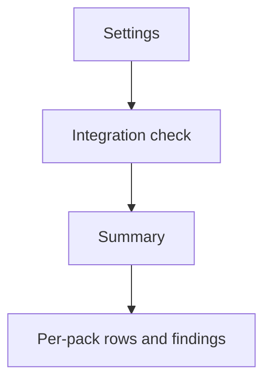
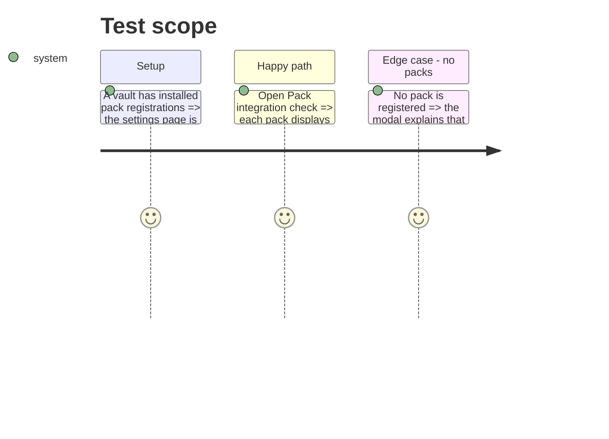

# Instruction: Present and prove the check

## Architecture projection

> Tree of the final files. ✅ create · ✏️ modify · ❌ delete

```txt
.
├── src/settings/packIntegrationModal.ts    ✅ modal with summary and per-pack detail
├── src/settings/index.ts                   ✏️ add the Pack integration check entry
├── tools/assert-pack-integration.mjs       ✅ run the focused harness
└── package.json                            ✏️ expose the assertion command
```

## User Journey



## Test Scope



## Wireframe

```txt
┌─────────────────────────────────────────────┐
│ (1) Integration summary                      │
├─────────────────────────────────────────────┤
│ (2) Pack list                                │
│  ┌────────────────────────────────────────┐ │
│  │ (3) Pack status and findings            │ │
│  └────────────────────────────────────────┘ │
└─────────────────────────────────────────────┘
```

1. Summary: installed, ready, and needing-attention counts.
2. Pack list: one row per registered pack.
3. Pack detail: manifest, capabilities, resources, and exact gaps.

## Tasks to do

### `1)` Add the settings surface

> Make pack integration observable in the interface without changing any pack.

1. Add a settings entry and modal that refreshes the asynchronous report from phase 1 whenever it opens.
2. Show a compact summary plus stable, accessible per-pack status/details.
3. Keep the existing PbtA coverage control as its narrower format-coverage diagnostic.

### `2)` Lock the report to validators

> Ensure the UI cannot silently disagree with the capability and manifest checks.

1. Add focused assertions for ready, missing-resource, unsupported-capability, and empty-registry states.
2. Run the existing manifest/capability assertions alongside the new report harness in CI.

## Test acceptance criteria

| Task | Acceptance criteria |
| --- | --- |
| 1 | A user can identify a pack’s readiness and every actionable integration gap directly in Settings. |
| 2 | A contract or runtime-state change that would make the report misleading fails a focused assertion. |
