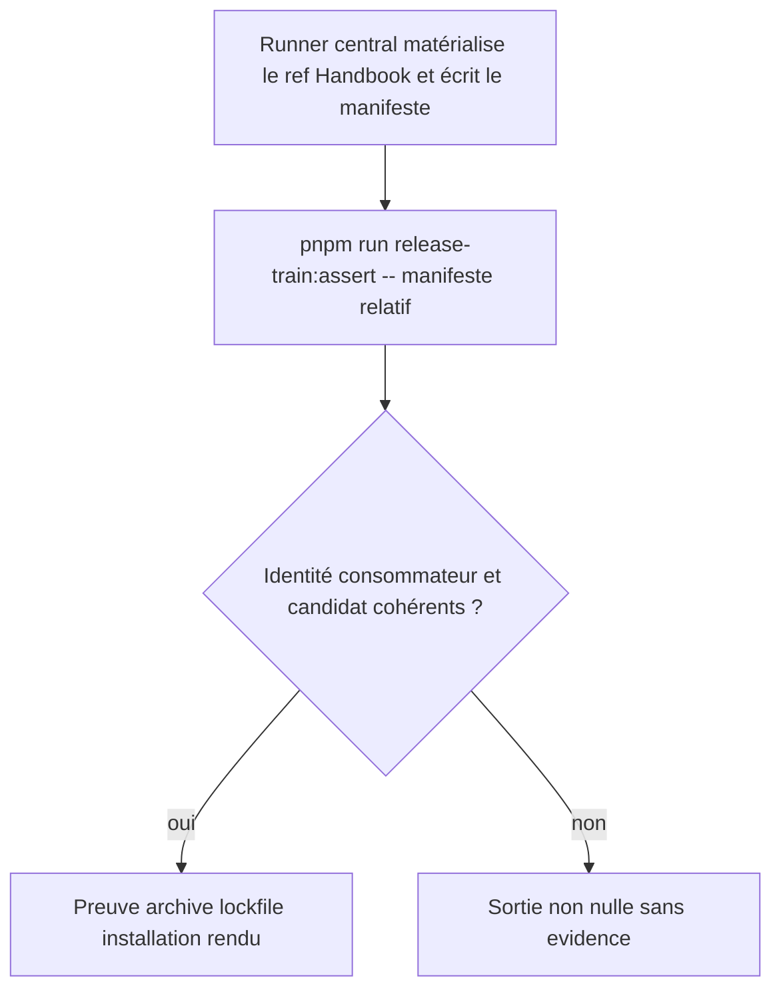
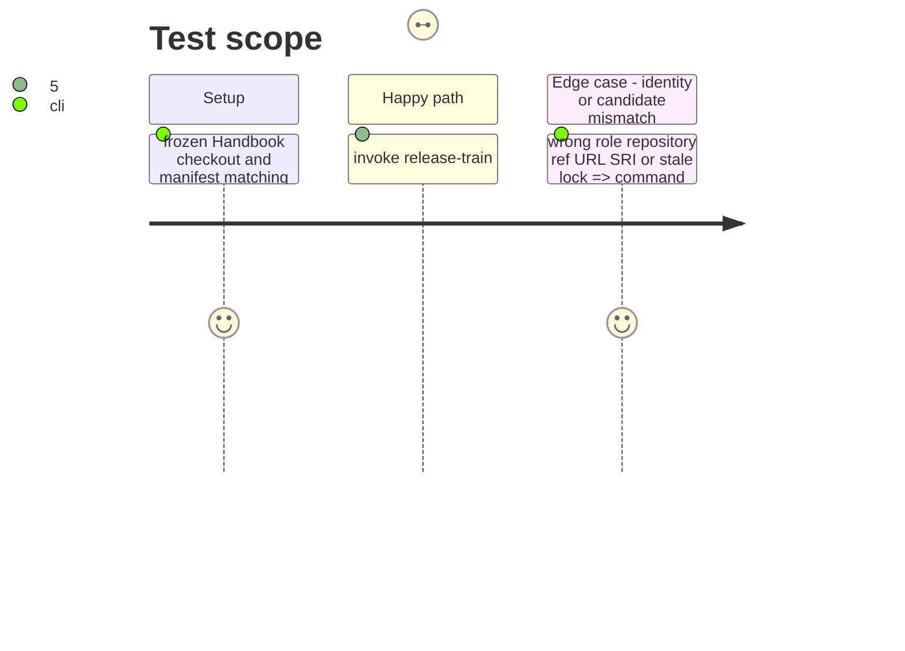

# Instruction: Lire et valider le manifeste candidat

## Architecture projection

> Tree of the final files. ✅ create · ✏️ modify · ❌ delete

```txt
tools/
├── prove-schema-pbta-candidate.mjs ✏️ expose une preuve réutilisable recevant les coordonnées déjà validées
├── release-train-schema-pbta-manifest.mjs ✅ lit un manifeste relatif, vérifie sa forme, l’asset et son identité Handbook
└── release-train-schema-pbta-assert.mjs ✅ commande canonique qui dérive le candidat puis invoque la preuve
package.json ✏️ publie exactement release-train:assert
README.md ✏️ documente le manifeste consommé et l’invocation centrale
```

## User Journey



## Test Scope



## Tasks to do

### `1)` Factor the existing Handbook-owned proof

> Keep the #49 assertions unchanged in scope while making their candidate an explicit function argument.

1. Move candidate-coordinate and lock comparisons behind a reusable internal proof entry point; remove the ambient-variable invocation path rather than preserving a second public contract.
2. Accept release URL, SHA-256, SRI and final tag as explicit data; stream the exact release asset to verify SHA-256, then verify its archive version, package pin, pnpm resolution, installed package and source-installer/render assertions agree.
3. Do not introduce a provider checkout, a consumer-local schema fallback, or a write to the lockfile.

### `2)` Publish the fixed manifest command

> Expose exactly the central command shape and reject every untrusted coordinate before proof execution.

1. Require one safe relative JSON-manifest path after `--`; reject absent, extra, absolute, escaping, unreadable or malformed paths.
2. Validate `candidate.releaseUrl`, `candidate.sha256`, `candidate.integrity`, and `candidate.finalTag`; resolve `consumer.ref` locally and require it to name the checked-out Handbook `HEAD`, alongside the fixed Handbook role and repository.
3. Register exactly `release-train:assert` as the package-level release-train interface; retire the ambient-variable package entry point while retaining only internal reusable modules, and document the input/output boundary.

## Test acceptance criteria

| Task | Acceptance criteria |
| --- | --- |
| 1 | The existing archive/install/render/source-installer proof receives only manifest-derived candidate data and still rejects a divergent asset SHA-256, package or pnpm lock. |
| 2 | `pnpm run release-train:assert -- relative-manifest.json` accepts the matching central manifest and rejects role, repository, ref, URL, SHA-256, SRI, tag or lock mismatches. |
