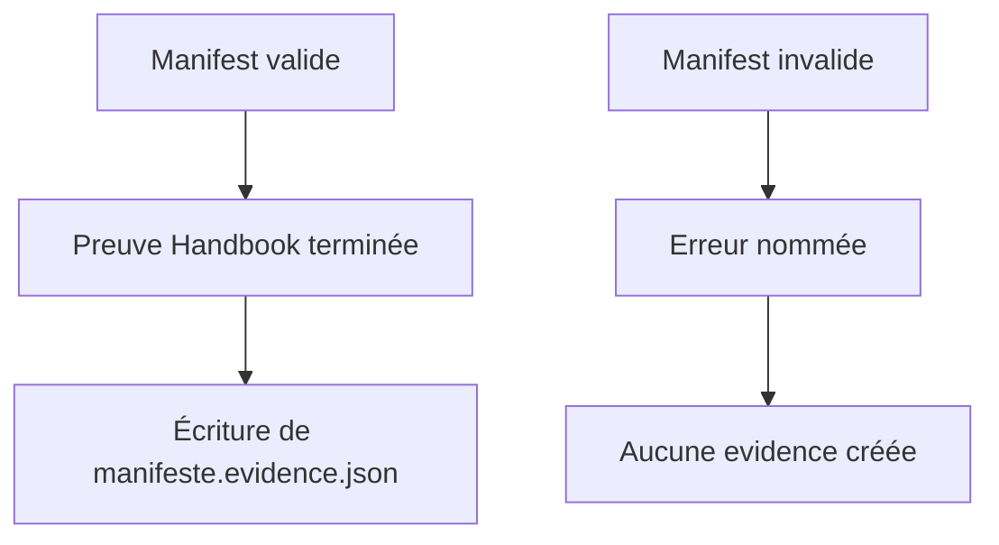
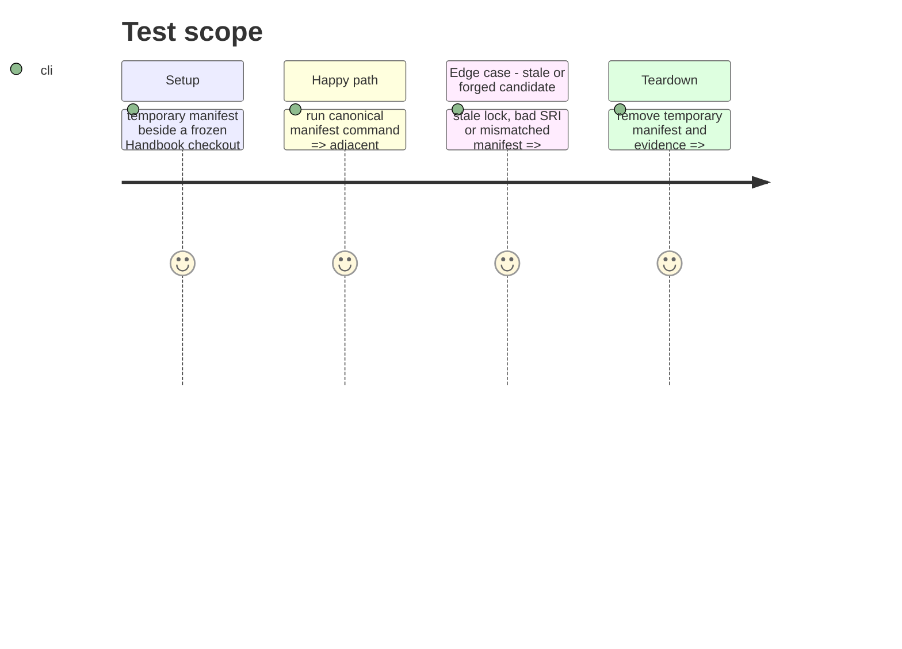

# Instruction: Écrire l’evidence et verrouiller le contrat

## Architecture projection

> Tree of the final files. ✅ create · ✏️ modify · ❌ delete

```txt
tools/
├── release-train-schema-pbta-assert.mjs ✏️ écrit l’evidence atomiquement après succès complet
└── assert-release-train-schema-pbta.mjs ✅ fabrique des manifests temporaires et prouve succès/rejets
package.json ✏️ ajoute l’assertion ciblée au contrôle Handbook
README.md ✏️ décrit le fichier <manifest>.evidence.json et son contenu
```

## User Journey



## Test Scope



## Tasks to do

### `1)` Emit only validated provenance

> Give the central runner one deterministic evidence file without allowing failed input to look successful.

1. Remove any prior evidence for the supplied manifest before validation, then write `${manifest}.evidence.json` only after the manifest-derived candidate proof passes, using an atomic replace in the manifest directory.
2. Emit exactly `status: "passed"`, `artifact.releaseUrl`, `artifact.sha256`, `artifact.integrity`, and `consumer.role`, `consumer.repository`, `consumer.ref` from the validated manifest.
3. Keep failures on stderr/non-zero and ensure they do not create or retain evidence for that manifest.

### `2)` Prove the public release-train boundary

> Test the command as the central runner will invoke it, including evidence absence on rejection.

1. Add a focused harness that creates matching manifests from the active package, lock and release asset data, invokes the package command, and parses its evidence.
2. Cover a validator fixture with a stale lock resolution plus bad-SRI and consumer/candidate mismatch manifests; assert each fails before evidence exists, including when a stale evidence file already existed.
3. Include the focused harness in Handbook checks and run the complete existing suite without changing CI ownership.

## Test acceptance criteria

| Task | Acceptance criteria |
| --- | --- |
| 1 | A successful invocation writes an adjacent evidence JSON with exactly the validated artifact and consumer provenance required by #52. |
| 1 | A failed invocation leaves no evidence file that reports success. |
| 2 | The focused harness proves that stale lock, bad SRI and mismatched manifests cannot produce evidence, while the matching fixture passes through the real package command. |
