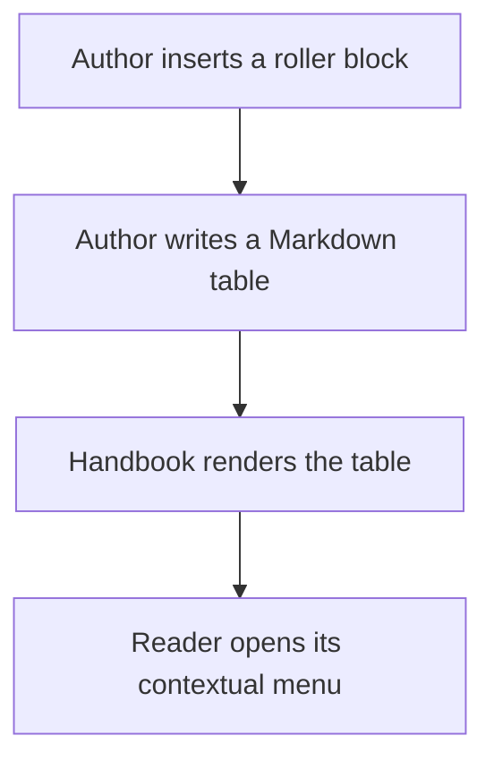
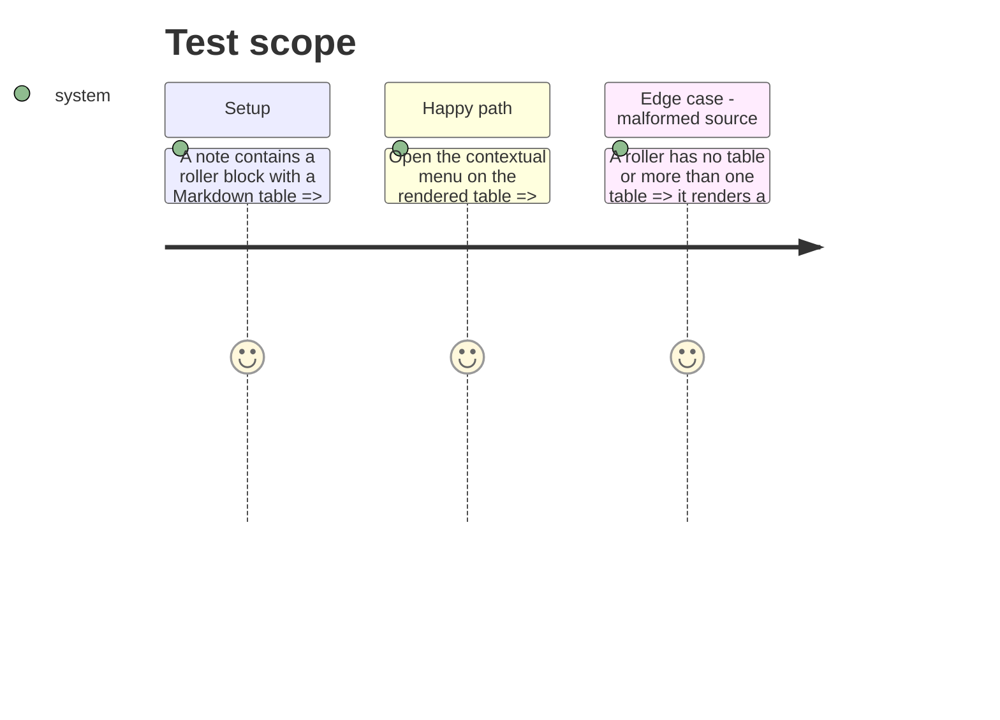

# Instruction: Render generic roller tables

## Architecture projection

> Tree of the final files. ✅ create · ✏️ modify · ❌ delete

```txt
.
├── src/features/rollers/
│   ├── block.ts                    ✅ globally available `roller` block
│   ├── parser.ts                   ✅ parse one ordinary or lookup Markdown table
│   ├── renderer.ts                 ✅ render the parsed table and retain right-click context
│   ├── contextMenu.ts              ✅ identify the exact rendered roller table
│   └── shape.ts                    ✅ declare the roller presentation region
├── src/features/blocks/registry.ts ✏️ register the ungated block
├── src/contextMenu/index.ts        ✏️ contribute the table action
└── tools/assertRoller.harness.mts  ✅ exercise parsing, rendering context, and invalid source handling
```

## User Journey



## Test Scope



## Wireframe

```txt
┌──────────────────────────────────────────────┐
│ (1) Roller block                              │
│ ┌──────────────────────────────────────────┐ │
│ │ (2) Markdown table                        │ │
│ └──────────────────────────────────────────┘ │
└──────────────────────────────────────────────┘
              ┌───────────────────────────────┐
              │ (3) Contextual menu           │
              │ (4) Roller result action      │
              └───────────────────────────────┘
```

1. Roller block: generic container, independent of the active game.
2. Markdown table: the sole table parsed from this roller block.
3. Contextual menu: Obsidian’s right-click surface for this table.
4. Roller result action: the table-specific action added by Handbook.

## Tasks to do

### `1)` Define and parse the generic block

> Turn one Markdown table inside a fenced `roller` block into validated structured rows.

1. Register `roller` as an always available block and add an insertion template with an ordinary example table.
2. Parse headers, rows, cells, and the optional Dice Roller lookup header; reject no table, multiple tables, empty result rows, and malformed lookup ranges.
3. Preserve author text for display and structured values for the rolling adapter.

### `2)` Render and scope contextual state

> Make only a rendered roller table eligible for the result action.

1. Render the parsed table accessibly without coupling it to a game pack or schema.
2. Record right-click context only when the event originates in that roller’s table, following the rendered-block context pattern.
3. Contribute a placeholder menu entry through the existing Brumes submenu while the table-specific context is fresh.

## Test acceptance criteria

| Task | Acceptance criteria |
| ---- | ------------------- |
| 1 | Any game mode can insert and render a roller containing exactly one valid ordinary or lookup table. Invalid source never becomes an invented table. |
| 2 | Right-clicking a roller table exposes its action; right-clicking any other rendered block or stale context does not. |
