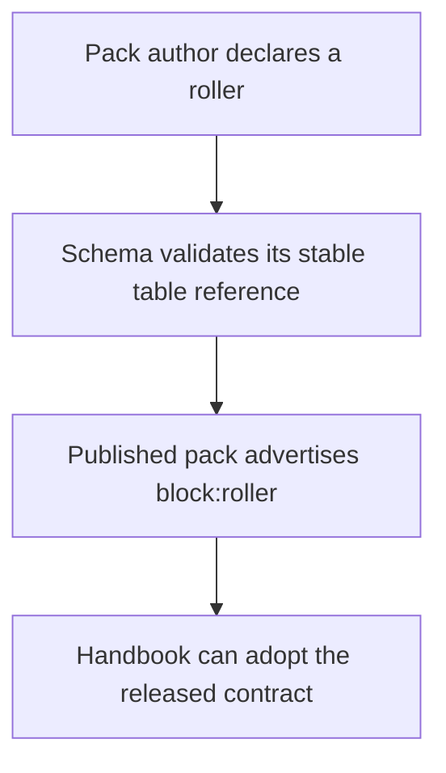
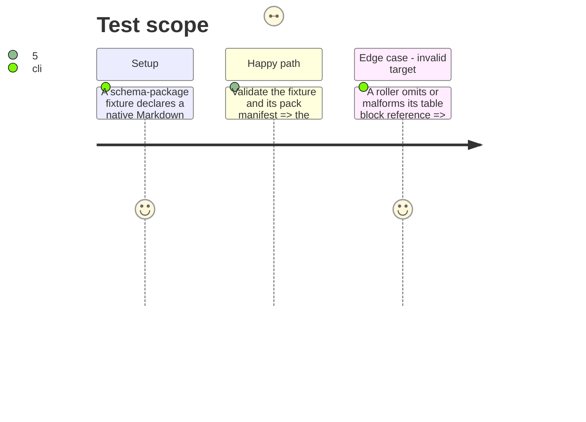

# Instruction: Publish the roller contract

## Architecture projection

> Tree of the final files. ✅ create · ✏️ modify · ❌ delete

```txt
schema-roller
├── src/
│   └── roller.ts                         ✅ generic roller codec, table-target types, and validation
├── schemas/
│   └── roller.schema.json                ✅ generated public schema
├── corpus/
│   └── roller/                           ✅ accepted and rejected contract witnesses
├── packs/<game>/pack-contract.json       ✏️ declare `block:roller` where the pack supports it
├── handbook/<game>/                      ✏️ publish any pack-owned roller table resource and manifest entry
└── cross-tool-provider.json              ✏️ publish `block:roller` as a Handbook capability
```

## User Journey



## Test Scope



## Tasks to do

### `1)` Define the portable roller document

> Establish the schema-owned syntax for a roller identity, label, and one-or-more Dice Roller table references.

1. Create `schema-roller` as the dedicated shared contract package; do not place the generic contract in Handbook or in a game-family-specific schema package.
2. Define and generate the `roller` codec/schema with a non-empty, uniquely identified table list; every entry has a stable vault-relative note reference and required Dice Roller block id.
3. Add valid and invalid corpus witnesses, including lookup-table and ordinary-table references.

### `2)` Publish pack activation and resources

> Let a game pack explicitly opt into the generic roller surface and distribute its own tables.

1. Add `block:roller` to the provider and eligible pack manifests.
2. Publish table resources as pack content, separate from campaign data and from Handbook runtime code.
3. Release an immutable schema-package version before changing Handbook’s dependency pin.

## Test acceptance criteria

| Task | Acceptance criteria |
| ---- | ------------------- |
| 1 | A valid roller has one or more uniquely identified, unambiguous native-table targets; a missing, duplicate, malformed, or escaping target is rejected by the owning contract. |
| 2 | A pack that does not declare `block:roller` cannot activate it, while a published eligible pack can distribute its table resource without consumer-local semantics. |
