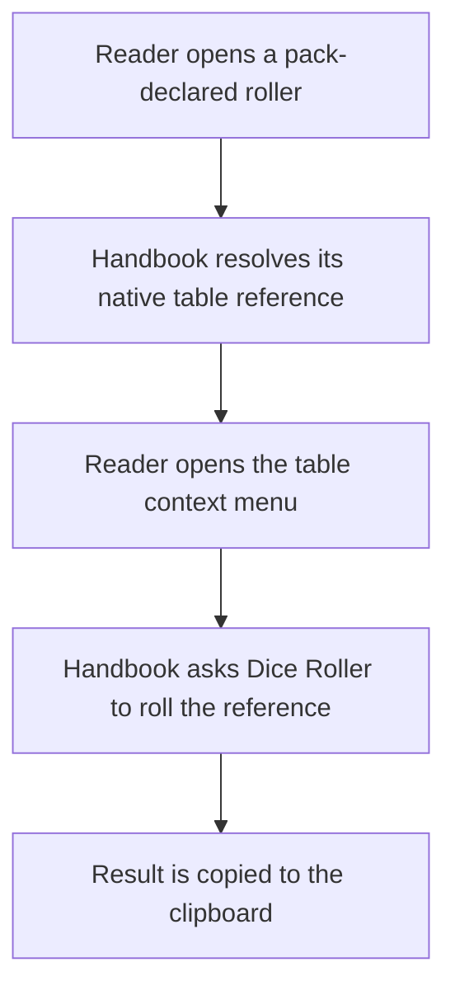
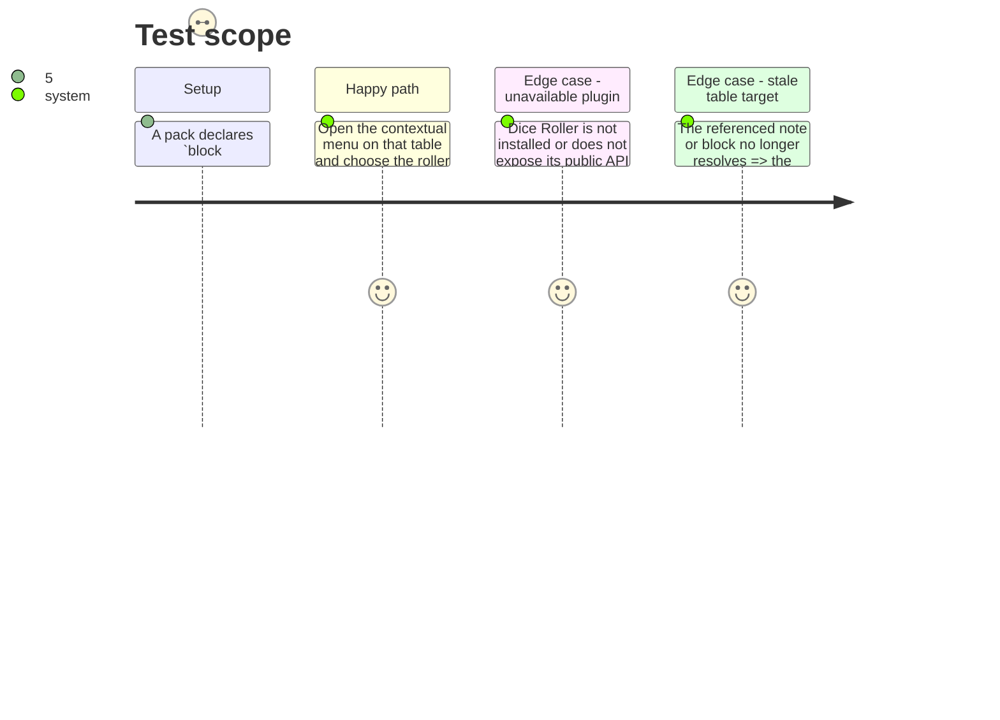

# Instruction: Render and roll in Handbook

## Architecture projection

> Tree of the final files. ✅ create · ✏️ modify · ❌ delete

```txt
.
├── package.json                           ✏️ pin the released shared schema package and add the focused assertion script
├── src/games/capabilities.ts              ✏️ recognize portable `block:roller`
├── src/features/rollers/
│   ├── block.ts                           ✅ register the capability-gated roller block
│   ├── schema.ts                          ✅ parse the published roller document; never duplicate its contract
│   ├── renderer.ts                        ✅ asynchronously resolve and render each exact referenced Markdown table
│   ├── diceRoller.ts                      ✅ narrow adapter to Dice Roller’s public API and result extraction
│   ├── contextMenu.ts                     ✅ offer the copy action only for the remembered roller table
│   └── shape.ts                           ✅ publish the roller’s presentation regions
├── src/features/blocks/types.ts           ✏️ permit a block renderer to resolve asynchronously with its source and plugin context
├── src/features/blocks/registry.ts        ✏️ await the shared roller block, then remember right-click context on its rendered table only
├── src/contextMenu/index.ts               ✏️ contribute the roller action to Obsidian’s existing menu
├── tools/assertRoller.harness.mts         ✅ exercise parsing, availability, targeting, clipboard, and failure paths
└── tools/assert-roller.mjs                ✅ bundle and run the focused assertion
```

## User Journey



## Test Scope



## Wireframe

```txt
┌──────────────────────────────────────────────┐
│ (1) Roller block                              │
│ ┌──────────────────────────────────────────┐ │
│ │ (2) Native table preview                  │ │
│ └──────────────────────────────────────────┘ │
└──────────────────────────────────────────────┘
              ┌───────────────────────────────┐
              │ (3) Contextual menu           │
              │ ───────────────────────────── │
              │ (4) Roller result action      │
              └───────────────────────────────┘
```

1. Roller block: the generic, pack-author-provided context around a table target.
2. Native table preview: the Dice Roller source table identified by the block’s published reference.
3. Contextual menu: Obsidian’s existing right-click surface.
4. Roller result action: the one action scoped to the remembered roller table.

## Tasks to do

### `1)` Adopt the released contract as a portable capability

> Make availability flow from a schema provider and pack manifest, never from a game id.

1. Update the dependency pin and integrity only after the upstream release is available.
2. Add `block:roller` to the portable capability registry and its provider-capability assertions.
3. Register the block through the existing capability-gated registry and expose its insertion template only to eligible packs.

### `2)` Render a referenced native table safely

> Present the pack-declared table within a roller while preserving the exact reference Dice Roller needs.

1. Parse only the upstream roller document and resolve every vault-relative note/block target without guessing alternate paths.
2. Use Obsidian’s metadata-cache block position to extract each exact source table, then render every Markdown slice asynchronously with its original source path.
3. Extend the block registry context only as far as necessary to pass the plugin and source path to this asynchronous renderer; preserve synchronous behavior for all existing blocks.
4. Attach the selected source path, block id, table id, and original roller document to a right-click on each rendered table only; render an explicit non-interactive diagnostic for unavailable or malformed references, never a consumer-local fallback table.

### `3)` Invoke Dice Roller and copy its result

> Delegate randomness to the installed Dice Roller plugin and make the result portable through the clipboard.

1. Isolate lookup of `obsidian-dice-roller` and its documented roller API behind a narrow adapter.
2. Build the exact table formula from the published note/block target, roll it with the current source file, and extract a plain-text result.
3. Add the context-menu action only for a remembered rendered roller table; copy after a successful roll and report dependency, target, roll, or clipboard failures without changing vault files.

## Test acceptance criteria

| Task | Acceptance criteria |
| ---- | ------------------- |
| 1 | `roller` is available only when the active published pack declares `block:roller`; no game id is special-cased. |
| 2 | A roller renders only the Markdown slices identified by its exact native table targets, and an invalid target never becomes an invented fallback table. |
| 3 | The action asks Dice Roller to resolve the referenced table and copies exactly one textual result; all known failure paths preserve the note and clipboard. |
