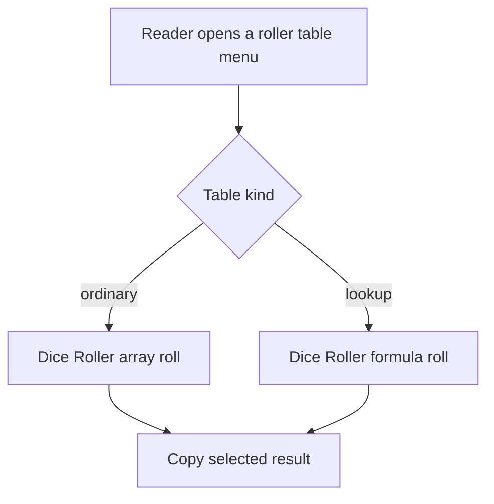
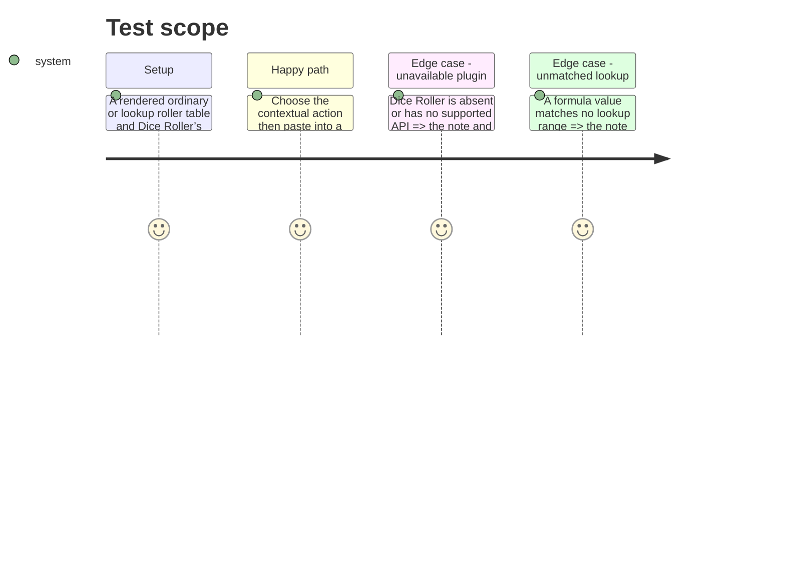

# Instruction: Delegate and copy results

## Architecture projection

> Tree of the final files. ✅ create · ✏️ modify · ❌ delete

```txt
.
├── src/features/rollers/
│   ├── diceRoller.ts               ✅ checked adapter for Dice Roller APIs
│   ├── roll.ts                     ✅ map ordinary and lookup tables to one result
│   └── contextMenu.ts              ✏️ invoke, copy, and report selected-table results
├── tools/assertRoller.harness.mts  ✏️ cover API, lookup, clipboard, and failure paths
├── tools/assert-roller.mjs         ✅ bundle and run the focused assertion
├── tools/e2e/fixtures/roller.md    ✅ ordinary and lookup authoring fixture
├── tools/e2e/roller-journey.ps1    ✅ real Obsidian/Dice Roller journey
├── tools/e2e/README.md             ✏️ document the optional E2E dependency
└── README.md                       ✏️ document generic roller authoring and copied-result workflow
```

## User Journey



## Test Scope



## Wireframe

```txt
┌───────────────────────────────┐
│ (1) Contextual menu           │
│ ───────────────────────────── │
│ (2) Roller result action      │
└───────────────────────────────┘
```

1. Contextual menu: table-scoped surface supplied by phase 1.
2. Roller result action: delegates, copies, and reports a textual result.

## Tasks to do

### `1)` Delegate table randomness to Dice Roller

> Keep all random draws inside the installed Dice Roller plugin.

1. Resolve `obsidian-dice-roller` through a checked adapter and handle absence without a fallback random generator.
2. Send ordinary table rows to its array roller and return exactly one textual row or selected result column.
3. For a lookup table, ask Dice Roller to roll its declared formula, map the numeric result to one declared range, and return the corresponding result cell.

### `2)` Copy and prove the contextual workflow

> Copy one successful roll without altering the source note.

1. Replace the placeholder action with an asynchronous invocation that copies a successful result and reports dependency, roll, lookup, or clipboard failure.
2. Add deterministic harness cases for both table kinds and all failure paths.
3. Add a disposable real-Obsidian journey with Dice Roller and document the authoring grammar, one-table limit, and no-filtering boundary.

## Test acceptance criteria

| Task | Acceptance criteria |
| ---- | ------------------- |
| 1 | Ordinary and lookup tables draw through Dice Roller; no local random fallback exists. |
| 2 | The copied value belongs to the selected table, source notes remain untouched, and every known failure reports clearly without a clipboard write. |
