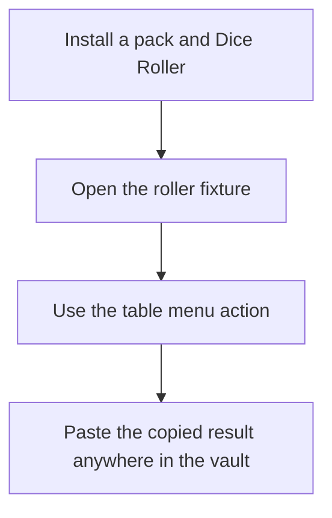
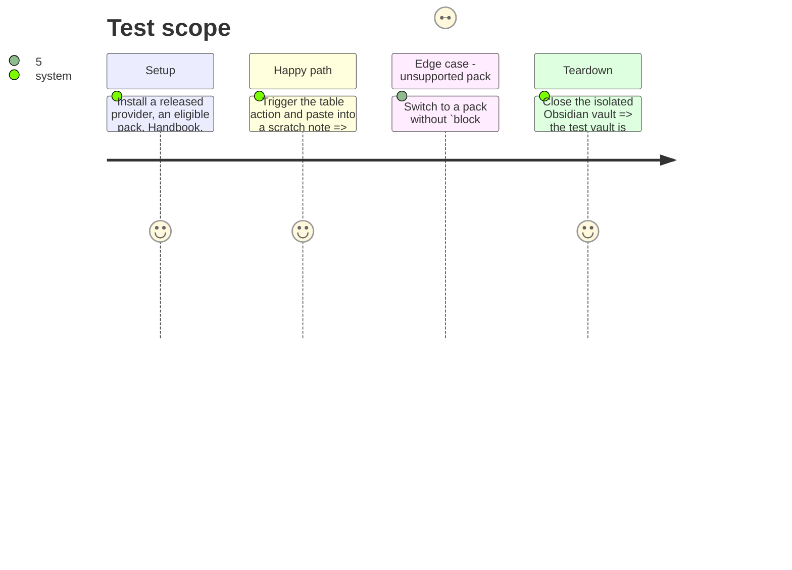

# Instruction: Prove the integration

## Architecture projection

> Tree of the final files. ✅ create · ✏️ modify · ❌ delete

```txt
.
├── tools/assert-provider-capabilities.mjs  ✏️ prove the released provider exposes the adopted roller capability
├── tools/assertRoller.harness.mts          ✏️ cover Dice Roller adapter and context-menu integration regressions
├── tools/e2e/fixtures/roller.md            ✅ native table and roller fixture for a real Obsidian run
├── tools/e2e/roller-journey.ps1            ✅ desktop journey that invokes the contextual action and observes the copied result
├── tools/e2e/README.md                     ✏️ document Dice Roller as the explicit optional E2E dependency
└── README.md                               ✏️ explain authoring a roller and the non-mutating copy workflow
```

## User Journey



## Test Scope



## Tasks to do

### `1)` Extend deterministic contract and unit assertions

> Make schema capability drift and adapter regressions fail without a running Obsidian instance.

1. Assert that the pinned provider advertises the roller capability and that its declared pack requirements agree with Handbook’s portable registry.
2. Cover valid table references, absent Dice Roller API, rejected roll, failed clipboard write, and stale remembered context with mocks.

### `2)` Add an isolated real-Obsidian proof

> Verify the public Dice Roller API and the rendered context menu together, not only through mocks.

1. Create a fixture with a lookup table and a regular table referenced by the same roller, including one target in another note to exercise metadata-cache resolution and selected-table context.
2. Extend the desktop E2E runner to install/enable Dice Roller, invoke the action, and assert that a pasted value came from the fixture.
3. Keep the fixture vault disposable and document the required app and plugin versions.

### `3)` Document the authoring boundary

> Make the native-table requirement and pack-versus-campaign ownership clear to authors.

1. Document the roller syntax, required native table block id, pack capability, and contextual copy workflow.
2. State that authors create separate tables for scenario-specific choices; Handbook does not dynamically filter game semantics.
3. Use Parallaxe only as an illustrative private-pack oracle, without importing Nastya’s campaign data into the shared contract.

## Test acceptance criteria

| Task | Acceptance criteria |
| ---- | ------------------- |
| 1 | A dependency or capability mismatch fails deterministically, and every adapter failure is handled without vault mutation. |
| 2 | A real Obsidian run with Dice Roller copies a value supplied by the referenced table; an unsupported pack exposes no roller controls. |
| 3 | An author can distinguish the generic roller contract, pack-owned tables, and campaign-owned Parallaxe content without relying on an undocumented fallback. |
