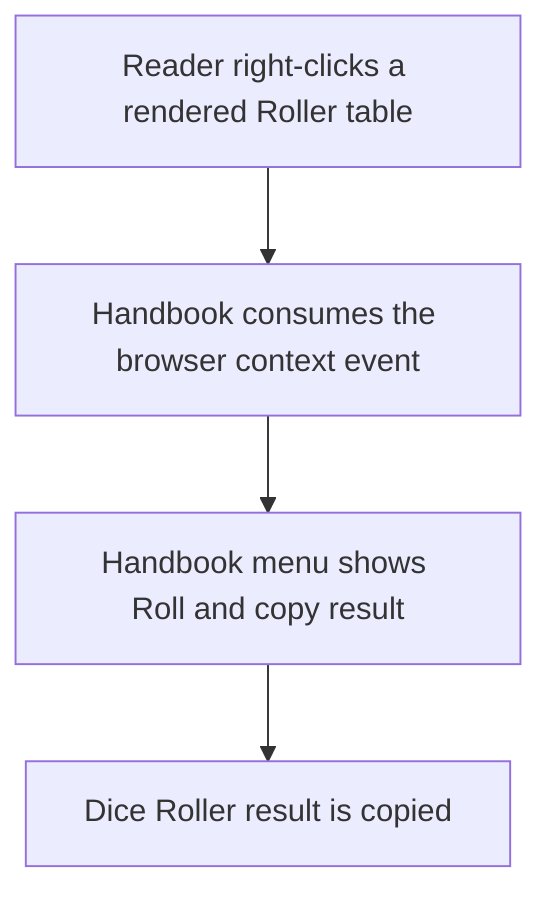
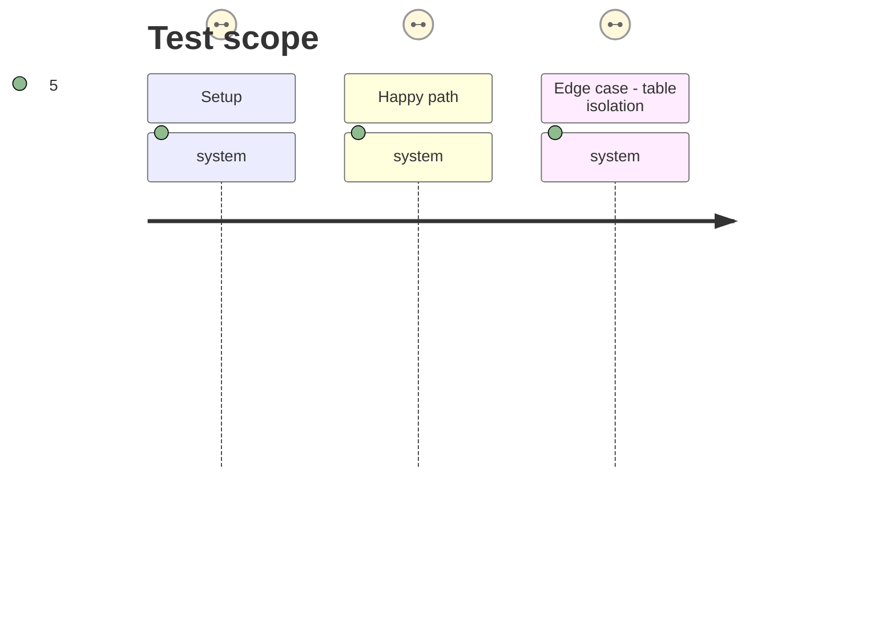

# Instruction: Preserve the Roller context action in reading mode

## Architecture projection

> Tree of the final files. ✅ create · ✏️ modify · ❌ delete

```txt
src/features/rollers/contextMenu.ts              ✏️ consume the rendered-table context event before opening Handbook's menu
tools/assert-roller.mjs                          ✏️ provide the Menu methods needed by the context-menu regression harness
tools/assertRoller.harness.mts                   ✏️ prove native-menu propagation is stopped while the table-specific roll action remains bound
```

## User Journey



## Test Scope



## Tasks to do

### `1)` Consume the reading-mode context event

> Ensure Obsidian cannot replace the Roller table menu with its native menu after Handbook handles the click.

1. Stop default handling and both relevant propagation paths before displaying the scoped `Menu`.
2. Keep the existing Dice Roller availability and clipboard behavior unchanged.

### `2)` Cover context-event handling in the Roller harness

> Turn the reported reading-mode failure into a regression test.

1. Extend the local Obsidian `Menu` double with the methods used by menu opening.
2. Assert that the context event is prevented and propagation is stopped.
3. Retain the existing table-isolation assertions.

## Test acceptance criteria

| Task | Acceptance criteria |
| --- | --- |
| 1 | Right-clicking a rendered Roller table leaves the Handbook roll action visible instead of the native Obsidian menu. |
| 2 | The Roller harness fails if the event is not fully consumed, and still proves each action uses its own table rows. |
