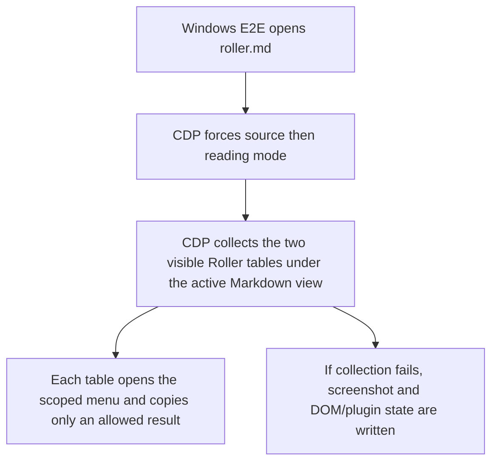
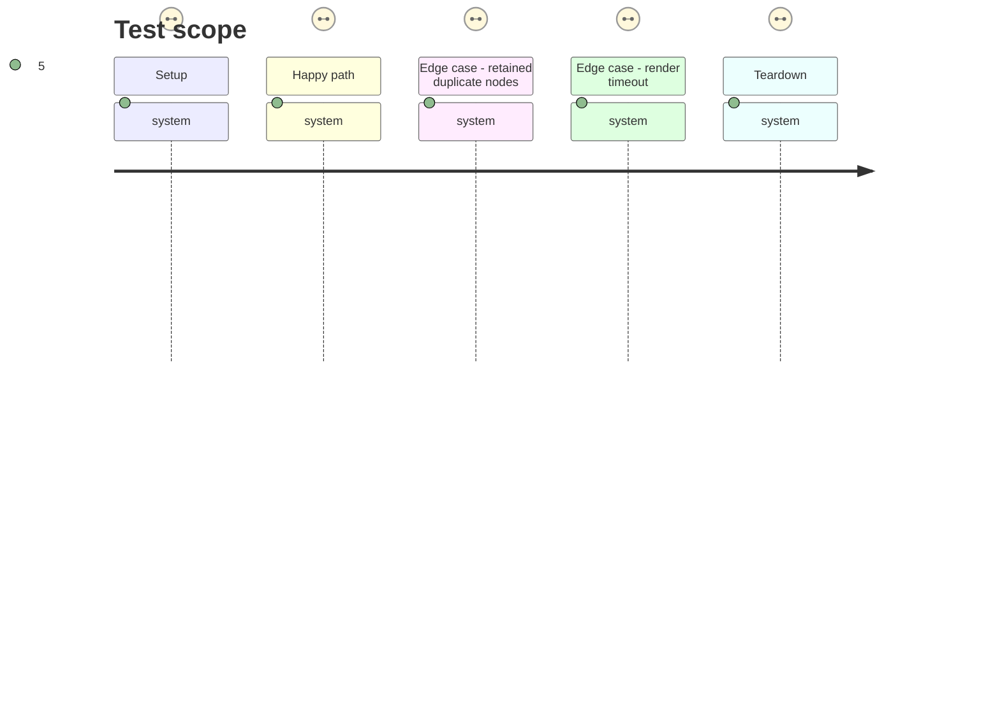

# Instruction: Make Windows Roller rendering assertions visibility-scoped

## Architecture projection

> Tree of the final files. ✅ create · ✏️ modify · ❌ delete

```txt
tools/e2e/roller-cdp.py                          ✏️ enter a fresh reading view, select visible Roller tables, and emit actionable timeout evidence
tools/assertRoller.harness.mts                   ✏️ guard the fresh reading-view transition in the focused assertion suite
```

## User Journey



## Test Scope



## Tasks to do

### `1)` Scope CDP selection to active visible tables

> Replace the invalid global `.brumes-roller--table` equality assertion with a helper that returns tables visible under the active reading view.

1. Force a source-to-reading transition after closing first-run modals.
2. Derive the active Markdown view root from the current leaf, then use one shared non-zero-rectangle table selector below that root for readiness and right-click coordinates.
3. Require two scoped visible tables, while retaining global, scoped, and visible counts in timeout diagnostics.

### `2)` Preserve focused regression coverage

> Keep the lightweight Roller assertion aware of the required fresh reading-view transition.

1. Assert the CDP journey performs the source-to-reading transition.
2. Run the focused assertion, full repository checks, and the Windows Roller journey against the built plugin.

## Test acceptance criteria

| Task | Acceptance criteria |
| --- | --- |
| 1 | On Obsidian 1.13.7, four total matching nodes with two visible authored tables under the active Markdown view no longer cause a timeout. |
| 1 | A failed render reports a screenshot and enough state to distinguish missing plugins, wrong active file, hidden tables, and a modal. |
| 2 | The focused Roller assertion, full check suite, and disposable Windows Roller journey all pass. |
