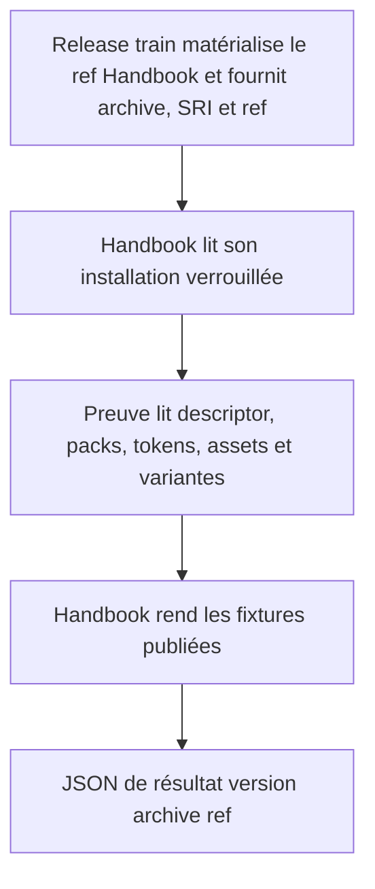
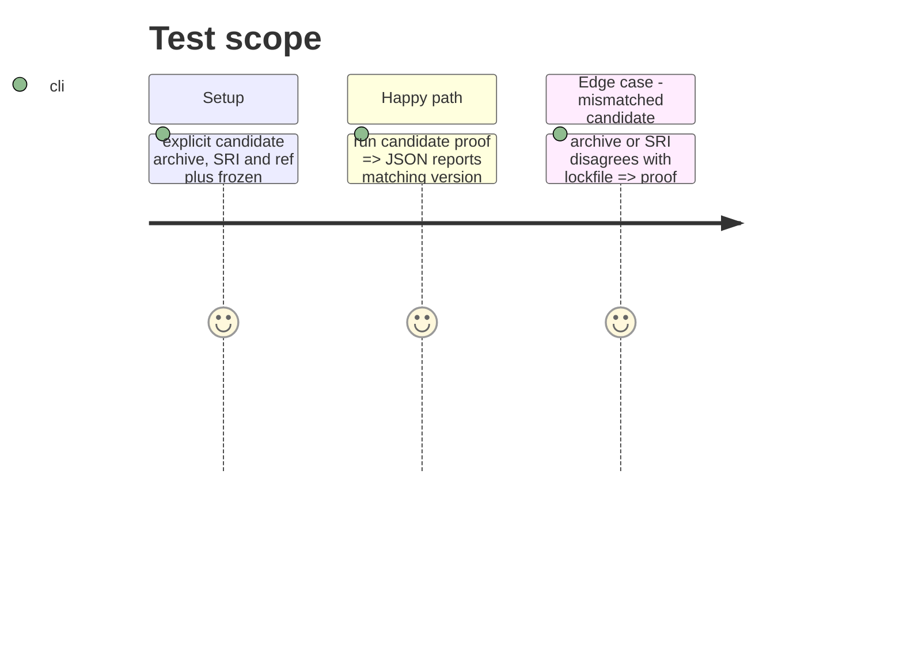

# Instruction: Construire la preuve candidate

## Architecture projection

```txt
tools/
├── prove-schema-pbta-candidate.mjs ✅ preuve CLI, JSON avec version/archive/ref résolus
├── proveSchemaPbtaCandidate.harness.mts ✅ témoins de contrat, packs, assets, variantes et rendu
├── assert-prove-schema-pbta-candidate.mjs ✅ bundle et exécute le harnais
├── pbtaProviderContract.mts ✏️ expose les métadonnées publiées nécessaires sans les dupliquer
└── sourceInstaller.harness.mts ✏️ accepte un candidat explicite lorsque l’installation est la voie de livraison
package.json ✏️ déclare la commande de preuve
```

## User Journey



## Test Scope



## Tasks to do

### `1)` Add the candidate-proof command

> Derive all candidate identity from the manifest and active lockfile, then verify the installed archive.

1. Compare the exact candidate inputs with the frozen active manifest and lockfile; reject implicit branches, unsigned resolutions and any disagreement.
2. Reuse provider, pack, corpus and renderer paths to validate published metadata and presentation assets.
3. Emit one JSON result containing version, archive URL, SRI and resolved ref.

### `2)` Cover the proof boundary

> Make candidate adoption failures observable without importing game semantics into Handbook.

1. Add harness fixtures for descriptor, manifests, tokens/assets and base/drowned-lake variants.
2. Exercise the source-installer separately against the explicit schema repository ref when GitHub-source delivery is requested; do not treat it as tarball installation.
3. Assert mismatched archive, ref or integrity fails with a named reason.

## Test acceptance criteria

| Task | Acceptance criteria |
| --- | --- |
| 1 | A pinned candidate produces JSON whose archive, SRI, version and ref are all resolved from the same installation. |
| 1 | Every published PbtA pack descriptor, token, asset and declared variant passes Handbook installation and render validation. |
| 2 | A candidate mismatch fails before a pack can be promoted; no game semantic fallback is introduced locally. |
