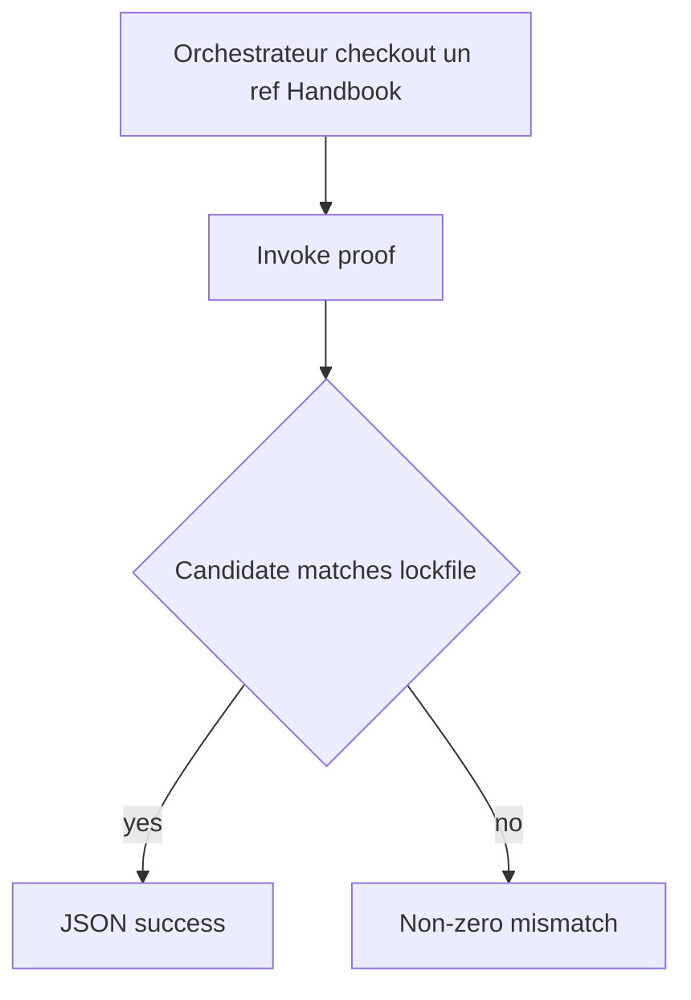
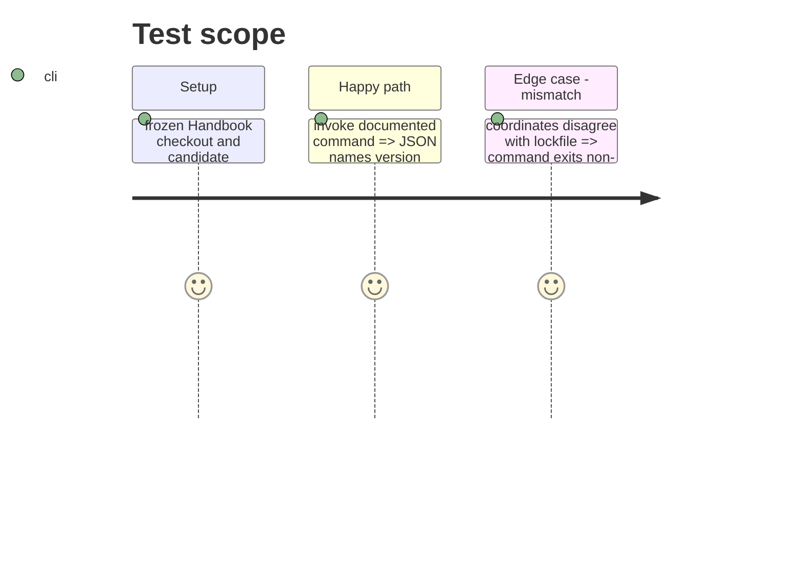

# Instruction: Publier le contrat d’invocation

## Architecture projection

```txt
package.json ✏️ expose la commande de preuve stable
README.md ✏️ documente entrées et sortie machine-readable pour l’orchestrateur
tools/assert-prove-schema-pbta-candidate.mjs ✏️ vérifie le contrat d’invocation
```

## User Journey



## Test Scope



## Tasks to do

### `1)` Publish the consumer proof contract

> Make the proof callable by the central train without adding a train workflow here.

1. Add the package command and document inputs/output.
2. Make every disagreement fail non-zero with its field name.
3. Leave Handbook CI/release workflows unchanged.

### `2)` Verify the invocation boundary

> Prove stable success and deterministic rejection.

1. Assert JSON against the active frozen pin.
2. Assert archive, SRI and ref mismatch paths.
3. Run the proof and full Handbook checks.

## Test acceptance criteria

| Task | Acceptance criteria |
| --- | --- |
| 1 | The central orchestrator can invoke one documented Handbook command and receive candidate JSON. |
| 2 | A mismatch exits non-zero before promotion, without modifying Handbook workflows. |
