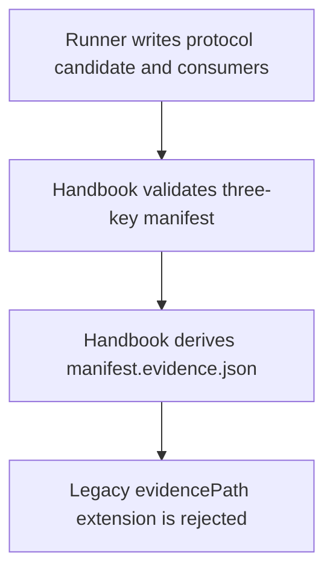
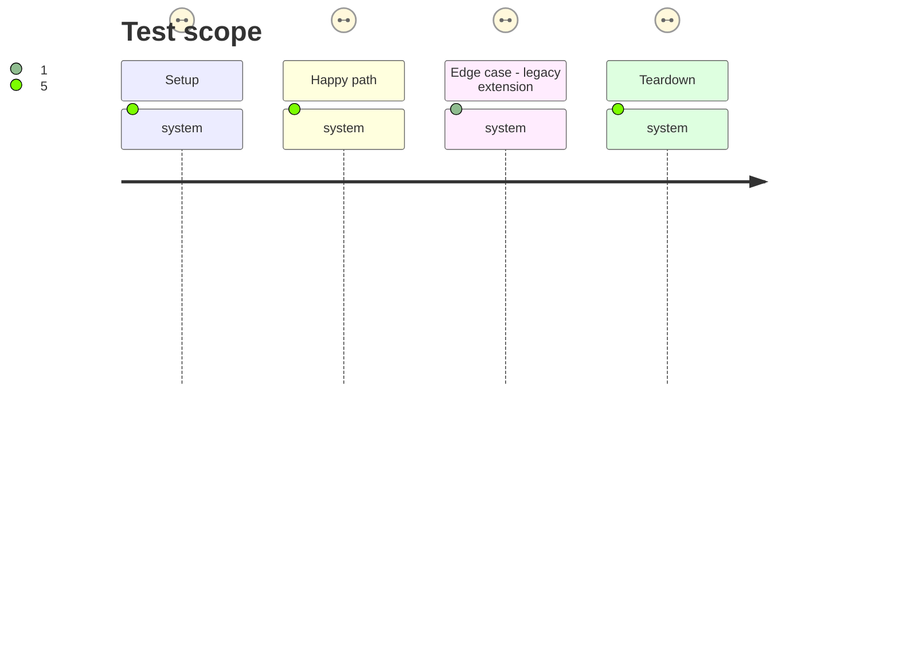

# Instruction: Derive adjacent evidence from the canonical manifest

## Architecture projection

> Tree of the final files. ✅ create · ✏️ modify · ❌ delete

```txt
tools/
├── release-train-protocol.mjs ✏️ accepts exactly the three canonical protocol-1 input keys and derives evidence beside the resolved manifest
└── assert-release-train-protocol-1.mjs ✏️ makes the three-key fixture the parser regression and rejects legacy extensions
```

## User Journey



## Test Scope



## Tasks to do

### `1)` Canonicalize the parser

> Make the protocol parser own the deterministic evidence-path derivation.

1. Restrict root validation to `protocol`, `candidate`, and `consumers`.
2. Return the resolved adjacent evidence path without reading it from JSON.
3. Preserve candidate and consumer validation unchanged.

### `2)` Prove the canonical parser boundary

> Lock the producer contract before the full adoption journey relies on it.

1. Remove `evidencePath` from the parser success fixture.
2. Assert the derived adjacent path.
3. Invert the legacy-field case so an added `evidencePath` is rejected.

## Test acceptance criteria

| Task | Acceptance criteria |
| --- | --- |
| 1 | A valid manifest with exactly three root keys parses and derives `<manifest>.evidence.json`. |
| 1 | A manifest carrying `evidencePath` is rejected as non-canonical. |
| 2 | The parser regression accepts only the three-key fixture and rejects a legacy `evidencePath` extension. |
