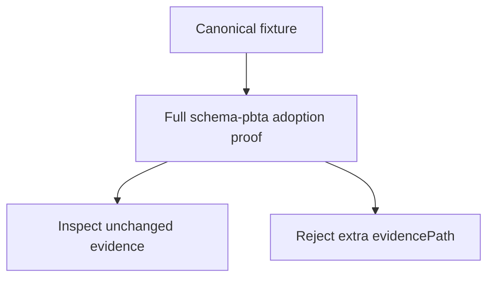
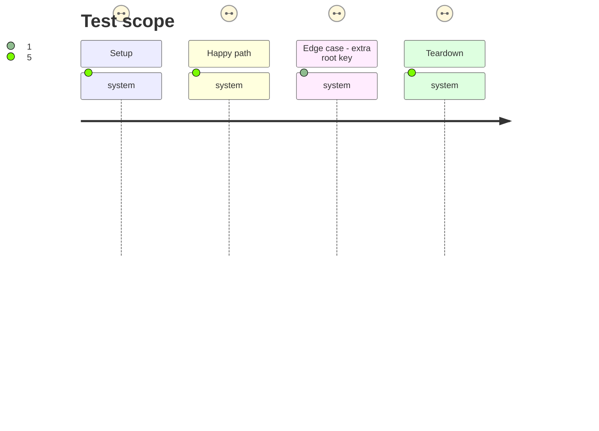

# Instruction: Prove and document the three-key contract

## Architecture projection

> Tree of the final files. ✅ create · ✏️ modify · ❌ delete

```txt
tools/
├── release-train-schema-pbta-assert.mjs ✏️ writes unchanged evidence at the parser-derived adjacent location
└── assert-release-train-schema-pbta.mjs ✏️ proves full candidate adoption from the canonical fixture and preserves evidence checks
README.md ✏️ describes the canonical manifest and adjacent evidence convention
```

## User Journey



## Test Scope



## Tasks to do

### `1)` Derive evidence in the adoption journey

> Make the full proof consume the parser-owned evidence location.

1. Remove the assertion’s dependency on `manifest.evidencePath`.
2. Retain stale-evidence cleanup and atomic writing at the derived adjacent location.

### `2)` Migrate the end-to-end fixture

> Make test fixtures reflect the producer-owned canonical contract.

1. Remove `evidencePath` from the integration success fixture.
2. Assert the derived adjacent evidence path and its unchanged envelope.
3. Retain end-to-end rejection and stale-evidence coverage for an added legacy field.

### `3)` Align operator documentation

> Describe the actual contract without suggesting a runner-supplied field.

1. State the three canonical manifest keys.
2. State that Handbook derives and writes adjacent evidence in the disposable checkout.

## Test acceptance criteria

| Task | Acceptance criteria |
| --- | --- |
| 1 | The adoption assertion writes the unchanged evidence envelope at the parser-derived adjacent location. |
| 2 | The full PbtA candidate assertion succeeds with canonical input, rejects an added legacy field, and removes stale evidence. |
| 3 | README documentation names only canonical input fields and the derived evidence convention. |
