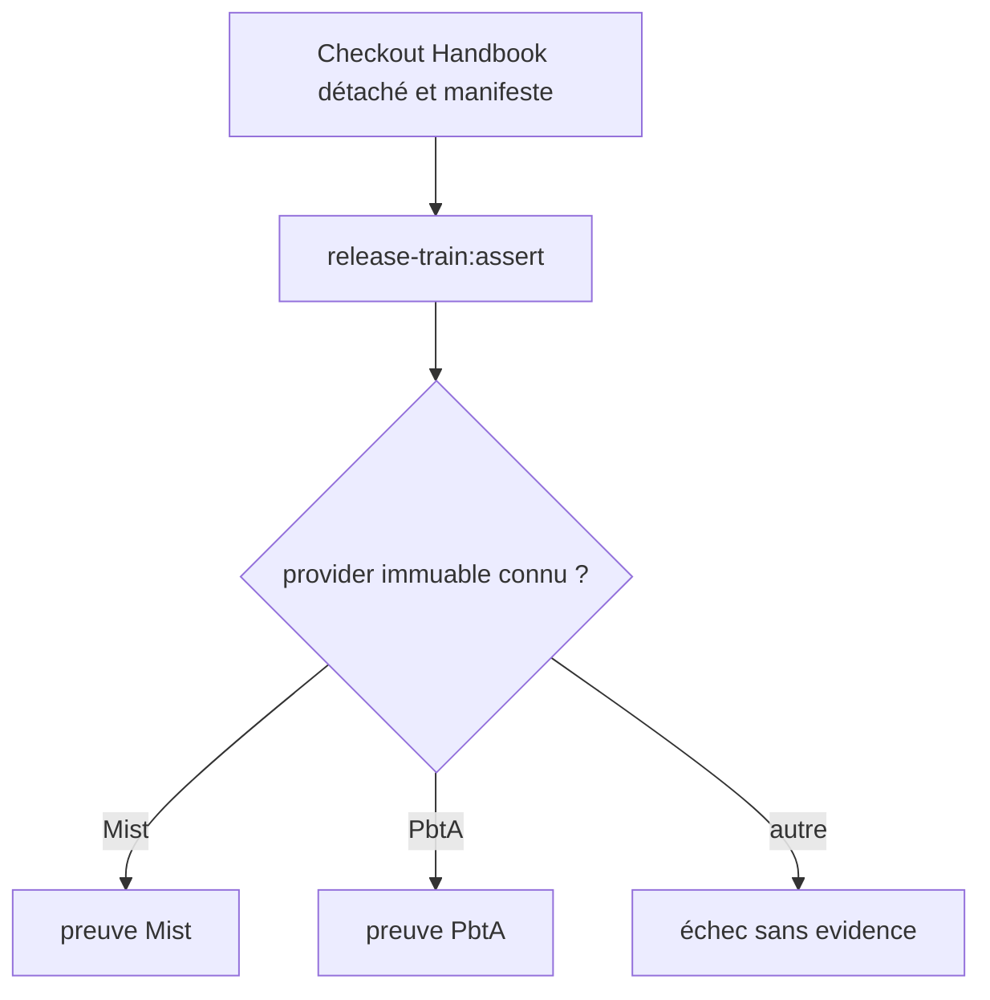
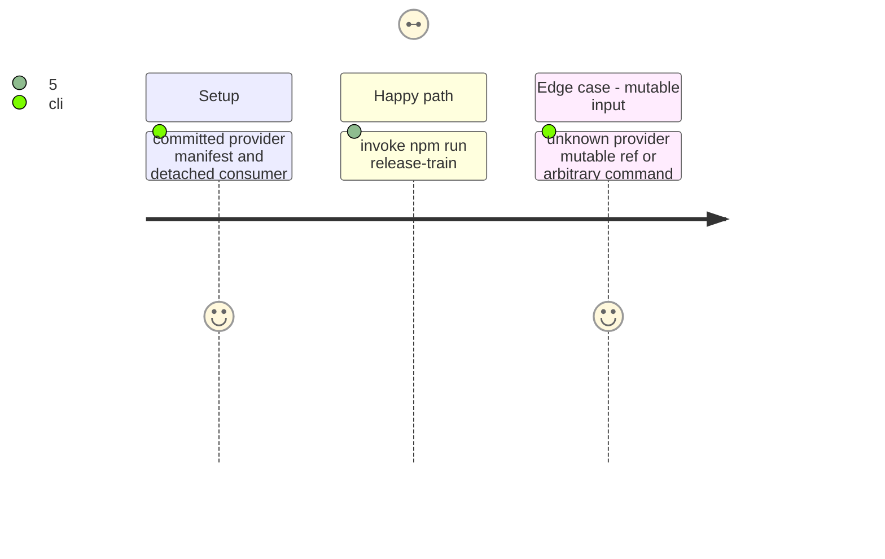

# Instruction: Généraliser le contrat de manifeste

## Architecture projection

```txt
tools/release-train-schema-pbta-assert.mjs ✏️ devient dispatcher sûr des candidats provider
tools/release-train-schema-in-the-mist-assert.mjs ✅ valide le manifeste Mist et produit sa preuve consommateur
tools/assert-release-train-schema-pbta.mjs ✏️ conserve le témoin PbtA via le dispatcher
package.json ✏️ garde une seule commande publique release-train:assert
README.md ✏️ documente les deux manifestes supportés et l’absence de mutation
```

## User Journey



## Test Scope



## Tasks to do

### `1)` Dispatch the fixed command safely

1. Define the shared manifest provider identity and validate it before selecting either proof.
2. Preserve PbtA behavior under the same public command, prove the exact `npm run release-train:assert -- <manifest>` invocation, and reject unknown providers, commands and mutable refs.
3. Keep evidence paths manifest-adjacent and remove stale evidence before validation.

## Test acceptance criteria

| Task | Acceptance criteria |
| --- | --- |
| 1 | The fixed command dispatches only recognized immutable PbtA or Mist manifests and cannot run arbitrary code. |
