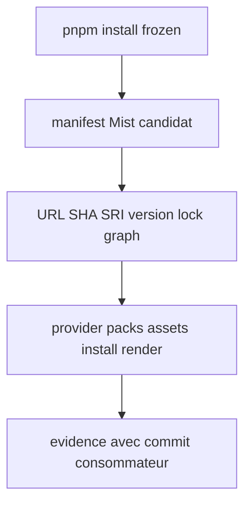
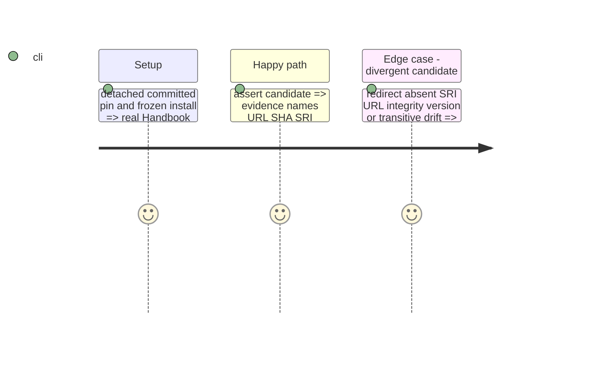

# Instruction: Prouver l’adoption Mist sans mutation

## Architecture projection

```txt
tools/release-train-schema-in-the-mist-assert.mjs ✏️ compare archive SHA/SRI/version/graphe et exécute installation/rendu
tools/assert-release-train-schema-in-the-mist.mjs ✅ vérifie succès, redirections, dérives et checkout immuable
tools/assert-mist-contract.mjs ✏️ expose les contrôles Mist réutilisables
package.json ✏️ ajoute l’assertion ciblée aux vérifications Handbook
README.md ✏️ décrit l’evidence Mist machine-readable
```

## User Journey



## Test Scope



## Tasks to do

### `1)` Validate the exact committed Mist adoption

1. Verify candidate archive bytes, URL, SHA-512 SRI, package version and every direct/transitive lock resolution against the committed graph.
2. Reuse Handbook’s actual Mist provider, pack, asset, source-install and render assertions rather than schema-local fallbacks.
3. Emit the required machine-readable evidence only after all proof paths pass.

### `2)` Cover detached, immutable execution

1. Test the real `npm run release-train:assert -- <manifest>` command from a detached fixture after frozen install.
2. Assert redirect, missing SRI, URL/integrity/version drift and dependency-graph change fail with no evidence.
3. Snapshot manifest, lockfile and Git status before/after every run to prove no repository mutation.

## Test acceptance criteria

| Task | Acceptance criteria |
| --- | --- |
| 1 | A committed Mist candidate produces evidence whose archive, SHA-256, SRI, resolved version, provider/pack/assets and consumer commit agree. |
| 2 | Every rejected input leaves the detached checkout’s manifest, lockfile and worktree unchanged. |
