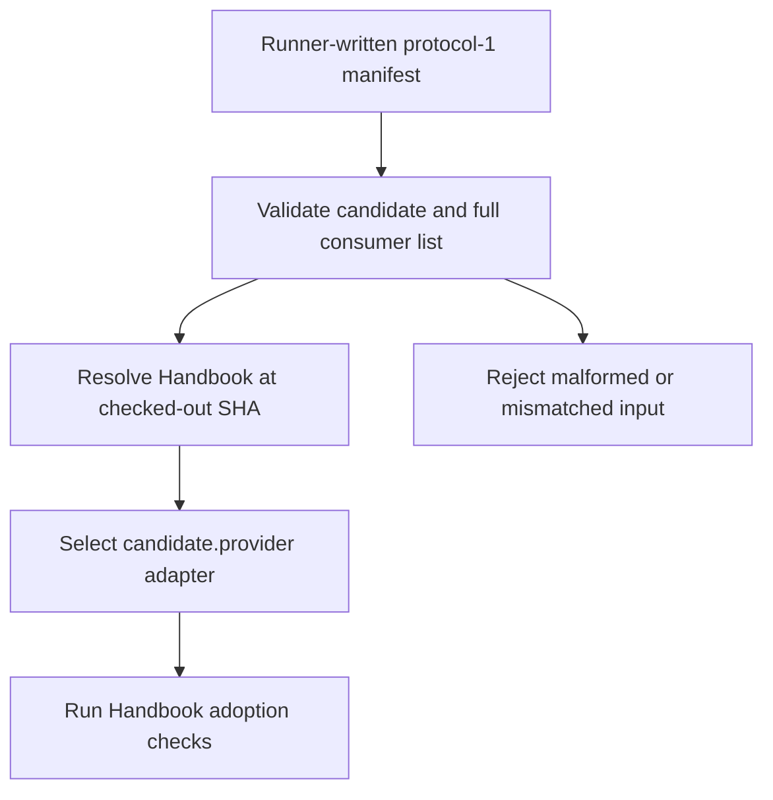
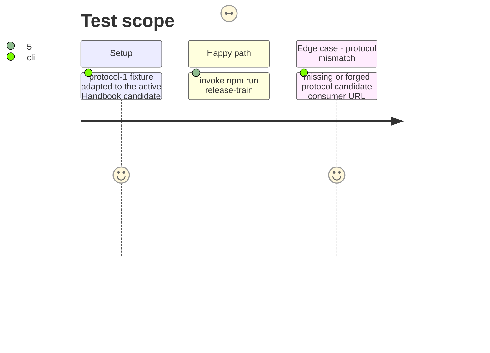

# Instruction: Parse protocol-1 manifests and select Handbook

## Architecture projection

> Tree of the final files. ✅ create · ✏️ modify · ❌ delete

```txt
tools/
├── release-train-protocol.mjs ✅ parses the immutable protocol-1 adapter manifest and resolves Handbook
├── release-train-assert.mjs ✏️ validates one manifest before running the selected Handbook proof
├── release-train-schema-pbta-assert.mjs ✏️ consumes validated candidate and consumer data instead of the legacy shape
├── prove-schema-pbta-candidate.mjs ✏️ reports PbtA proof checks through a provider adapter
├── prove-schema-in-the-mist-candidate.mjs ✏️ retains Mist proof checks as a regression journey
└── assert-release-train-protocol-1.mjs ✅ proves fixture-compatible parsing and early rejection
package.json ✏️ registers the focused protocol assertion
README.md ✏️ documents protocol-1 input, the disposable checkout, and the fixed command
```

## User Journey



## Test Scope



## Tasks to do

### `1)` Implement the immutable protocol boundary

> Mirror the supplied orchestration shape exactly, without interpreting legacy shapes.

1. Add a narrow protocol parser for the `dfbeaa3` adapter manifest: `protocol`, the complete PbtA candidate, Lantern and Handbook identity/ref entries, and runner-provided evidence path; reject unexpected, missing, duplicate, malformed, or mutable fields.
2. Require `candidate.provider === "schema-pbta"`, the exact staging/final-tag, HTTPS archive, SHA-256, SHA-512 SRI, version, and provider-commit relationships specified by the fixture; resolve only the Handbook consumer and require its full ref to equal `HEAD`.
3. Replace legacy candidate/consumer parsing and release-URL substring dispatch with validation-first adapter selection on `candidate.provider`; keep the PbtA proof path and retain Mist proof execution as regression coverage rather than treating Mist as a protocol-1 candidate provider.

### `2)` Preserve the public command safely

> Make the central runner’s invocation the only interface.

1. Keep exactly `npm run release-train:assert -- <manifest>`; require one readable runner manifest and perform no build, install, package, lockfile, or source-pack mutation before validation succeeds.
2. Permit the runner’s manifest and evidence file within its disposable detached checkout, but reject paths escaping that checkout or arbitrary output destinations.
3. Add fixture-compatible command tests for success selection and all named structural rejections before any provider proof can execute.

## Test acceptance criteria

| Task | Acceptance criteria |
| --- | --- |
| 1 | A valid protocol-1 fixture resolves exactly the checked-out Handbook consumer and selects its PbtA adapter solely from `candidate.provider`. |
| 1 | Missing or mismatched protocol, candidate, consumer, URL, SHA-256, SHA-512 SRI, or version rejects before a proof starts; the selected proof owns lock, source-pack, and asset rejection. |
| 2 | The public command accepts only one runner manifest and preserves existing PbtA and Mist proof coverage without legacy URL dispatch. |
