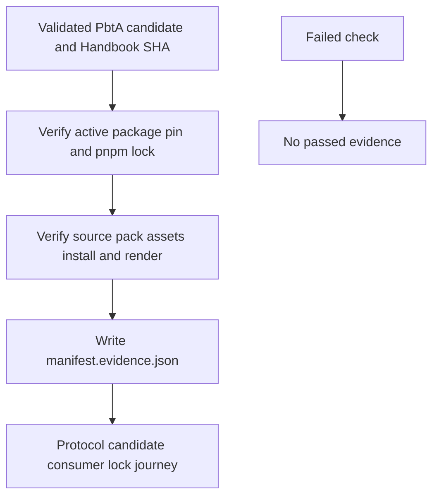
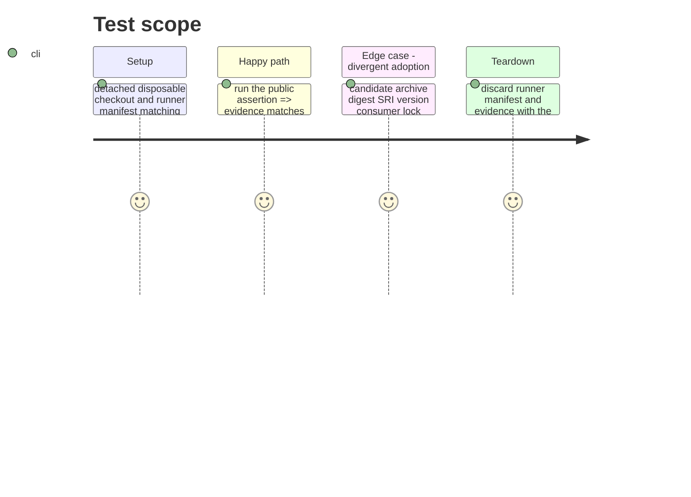

# Instruction: Emit and prove immutable consumer evidence

## Architecture projection

> Tree of the final files. ✅ create · ✏️ modify · ❌ delete

```txt
tools/
├── release-train-assert.mjs ✏️ writes protocol-1 evidence only after a complete Handbook journey passes
├── release-train-protocol.mjs ✏️ carries validated candidate and resolved consumer provenance into evidence
├── release-train-schema-pbta-assert.mjs ✏️ returns lock attestation and opaque journey details
├── prove-schema-pbta-candidate.mjs ✏️ exposes PbtA lock, source-pack, install, and render checks
├── prove-schema-in-the-mist-candidate.mjs ✏️ exposes retained Mist regression checks
├── assert-release-train-protocol-1.mjs ✏️ proves evidence shape, stale-evidence cleanup, and failure behavior
├── assert-release-train-schema-pbta.mjs ✏️ migrates PbtA command coverage to protocol 1
└── assert-release-train-schema-in-the-mist.mjs ✏️ preserves Mist regression coverage
README.md ✏️ documents protocol evidence and disposable-checkout semantics
```

## User Journey



## Test Scope



## Tasks to do

### `1)` Emit the exact protocol evidence envelope

> Central orchestration receives portable provenance; Handbook keeps proof mechanics private.

1. After the PbtA candidate’s package pin, pnpm lock, source-pack manifest, declared assets, install, and render assertions pass, atomically write the runner-designated `<manifest>.evidence.json`.
2. Emit exactly `protocol: 1`, `status: "passed"`, the complete validated candidate, resolved Handbook consumer with `version`, `releaseUrl`, and `integrity`, `pnpm-lock.yaml` attestation, and opaque journey `id`, `status`, and `checks`.
3. Remove stale evidence before validation and ensure every parse, identity, archive, lock, source-pack, asset, install, or render failure leaves no success evidence.

### `2)` Prove disposable detached execution

> Test the real command exactly as `run-release-train.ts` invokes it.

1. Build protocol-1 fixtures from the active PbtA candidate and current detached Handbook SHA; invoke the package command and parse its evidence against the immutable evidence contract.
2. Independently forge candidate URL, SHA-256, SHA-512 SRI, version, consumer identity/ref, lock integrity, source-pack manifest, and declared asset fields; assert no passed evidence remains.
3. Retain PbtA and Mist regression harnesses, snapshot committed package/lock/source-pack and Git state around runs, and verify no protected repository input changes.

## Test acceptance criteria

| Task | Acceptance criteria |
| --- | --- |
| 1 | A passing command writes the exact protocol-1 evidence shape expected by `parseReleaseTrainEvidence`, including the complete candidate, resolved Handbook consumer, lock attestation, and opaque journey. |
| 1 | Any failed input or adoption check leaves no stale or new success evidence. |
| 2 | The real runner-compatible invocation rejects every required divergence, retains PbtA/Mist regression coverage, and leaves committed Handbook inputs unchanged. |
