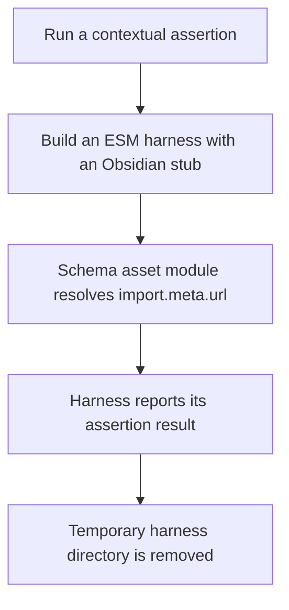
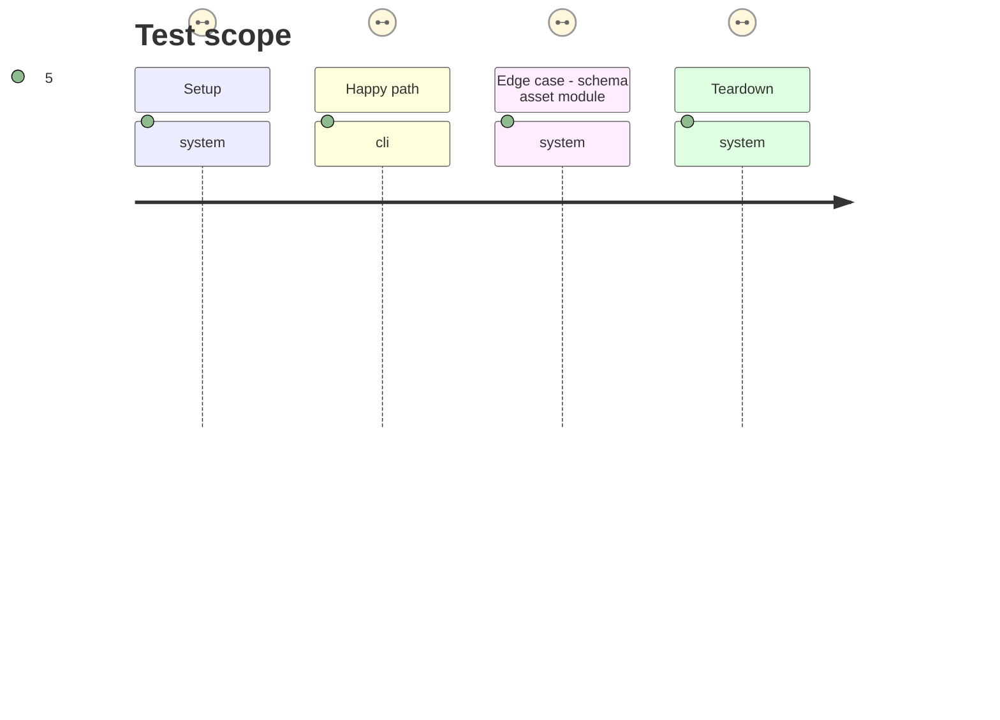

# Instruction: Make contextual harnesses schema-module compatible

## Architecture projection

> Tree of the final files. ✅ create · ✏️ modify · ❌ delete

```txt
tools/
├── assert-contextual-pack-blocks.mjs ✏️ bundles and runs the contextual block harness as ESM, then removes its project-local temporary directory
└── assert-contextual-toml-export.mjs ✏️ bundles and runs the contextual TOML harness with the same ESM and cleanup boundary
```

## User Journey



## Test Scope



## Tasks to do

### `1)` Convert contextual bundle execution to ESM

> Preserve the module context required by published schema asset modules.

1. Write contextual bundles with an `.mjs` output.
2. Configure esbuild for Node ESM while retaining the local Obsidian stub alias.
3. Externalize PostCSS so Node loads its CommonJS implementation without an ESM dynamic-require shim.
4. Keep the existing contextual assertions as the regression: their published schema-pack imports must run without a new synthetic fixture.

### `2)` Make lifecycle cleanup observable and reliable

> Prevent an assertion exit status from bypassing temporary-directory cleanup.

1. Capture the spawned harness status instead of exiting inside the `try` block.
2. Remove the work directory in `finally`.
3. Exit with the captured status only after cleanup completes.

## Test acceptance criteria

| Task | Acceptance criteria |
| --- | --- |
| 1 | Both contextual assertions load the published schema asset module without an `Invalid URL` error. |
| 1 | PostCSS-dependent code executes without an ESM dynamic-require failure. |
| 1 | The existing contextual assertions remain the regression coverage for the published relative-asset module path. |
| 2 | Passing and failing harness runs remove their project-local temporary directories before returning a process status. |
