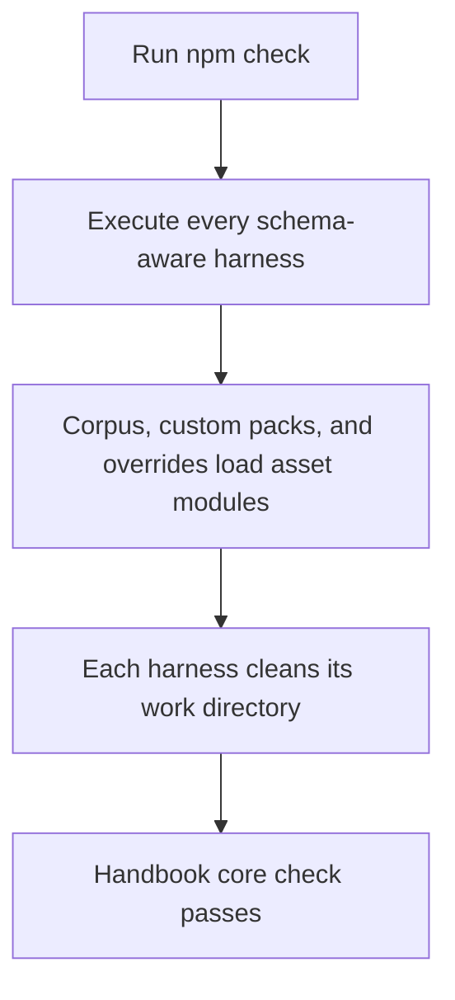
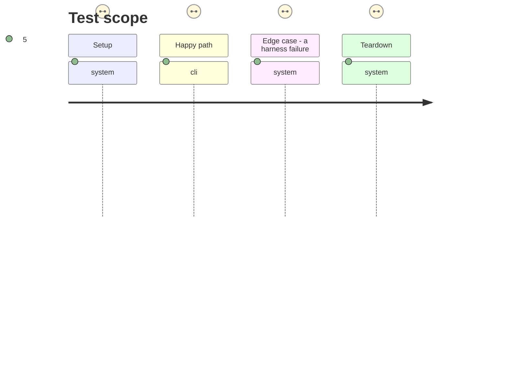

# Instruction: Cover shared harnesses and prove the full check

## Architecture projection

> Tree of the final files. ✅ create · ✏️ modify · ❌ delete

```txt
tools/
├── assert-corpus.mjs ✏️ runs the corpus harness with the schema-compatible ESM lifecycle
├── assert-custom-packs.mjs ✏️ runs custom-pack coverage with the schema-compatible ESM lifecycle
└── assert-override.mjs ✏️ runs override round trips with the schema-compatible ESM lifecycle
```

## User Journey



## Test Scope



## Tasks to do

### `1)` Apply the ESM harness boundary to shared coverage

> Keep every assertion that reaches the schema-aware registry on the same supported module boundary.

1. Convert corpus, custom-pack, and override harness bundles to ESM.
2. Retain each harness’s existing Obsidian stub surface and entry point.
3. Use project-local temporary directories and deferred process exit consistently.

### `2)` Verify the regression across the real check graph

> Prove that contextual assets and adjacent coverage coexist under the locked dependency graph.

1. Run each directly affected assertion independently.
2. Run `npm run check` after the targeted assertions pass.
3. Confirm no temporary harness directories remain after successful execution.

## Test acceptance criteria

| Task | Acceptance criteria |
| --- | --- |
| 1 | Corpus, custom-pack, and override harnesses execute their existing assertions without CommonJS `import.meta.url` failures. |
| 1 | Each wrapper preserves its existing success or failure exit status after cleanup. |
| 2 | `npm run check` completes successfully against the locked schema packages. |
| 2 | The repository contains no leftover `.handbook-*` harness directories after verification. |
