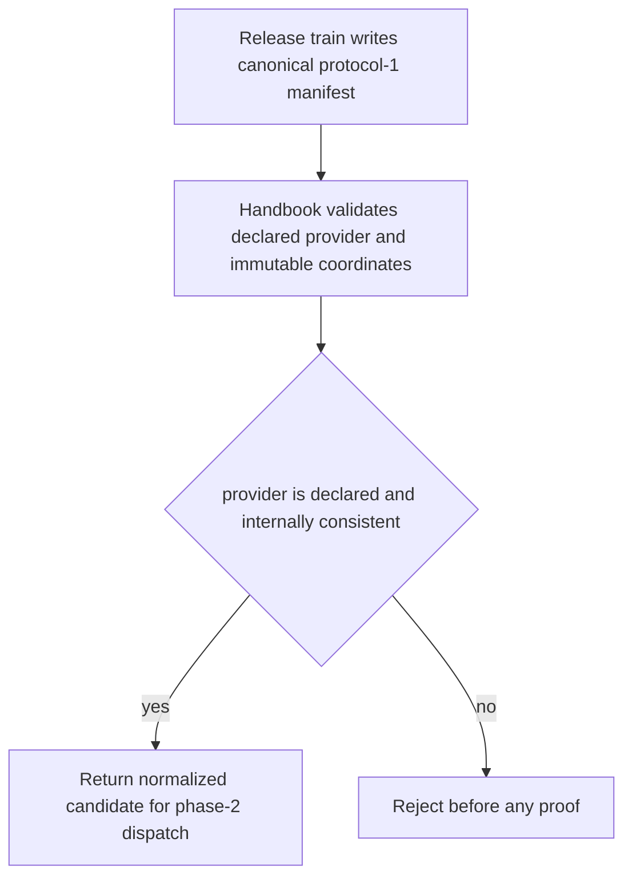
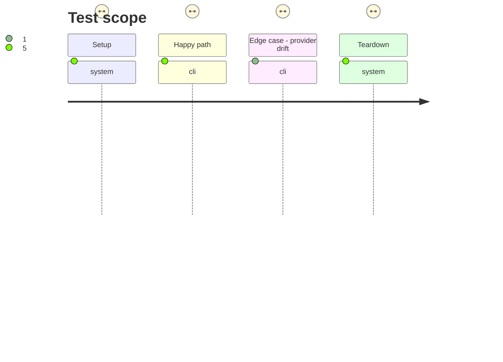

# Instruction: Generalize the declared-provider protocol parser

## Architecture projection

> Tree of the final files. ✅ create · ✏️ modify · ❌ delete

```txt
tools/
├── release-train-protocol.mjs ✏️ validates a finite declared-provider registry, including schema-adrenaline, while retaining exact protocol-1 candidate and consumer checks
└── assert-release-train-protocol-1.mjs ✏️ locks acceptance and rejection boundaries for both declared providers
```

## User Journey



## Test Scope



## Tasks to do

### `1)` Make provider validation explicit and strict

> Accept schema-adrenaline as a known protocol-1 provider without loosening any candidate constraint.

1. Replace the PbtA-only candidate assumption with an internal, finite provider definition containing the canonical repository, release-asset naming convention, and proof identity for PbtA and Adrenaline.
2. Preserve exact root, candidate, and consumer fields; require HTTPS GitHub release URLs, matching prerelease/final tags and version, lowercase SHA-256, SHA-512 SRI, and the complete provider commit supplied by the selected release-train candidate.
3. Reject unknown providers and every cross-provider or mutable coordinate before selecting a proof.

### `2)` Cover protocol boundaries

> Make both support and rejection observable before the candidate pin is adopted.

1. Extend parser fixtures for a valid Adrenaline manifest alongside the existing PbtA fixture.
2. Assert that provider mismatch, malformed Adrenaline URL/tag/version, forged digest or commit, and a mismatched Handbook ref fail with no stale evidence.

## Test acceptance criteria

| Task | Acceptance criteria |
| --- | --- |
| 1 | Protocol-1 accepts only the declared PbtA and Adrenaline release-asset coordinate forms, each internally consistent with its tags, version, SHA-256, SRI, and full candidate commit. |
| 1 | Unknown providers and cross-provider URL or archive-name substitutions are rejected before dispatch. |
| 2 | Valid Adrenaline and PbtA parser fixtures pass; malformed fixtures are rejected before any proof is selected. |
