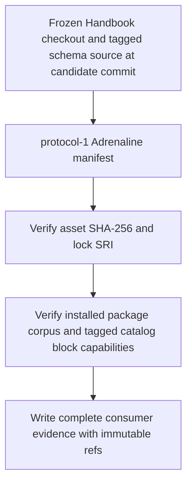
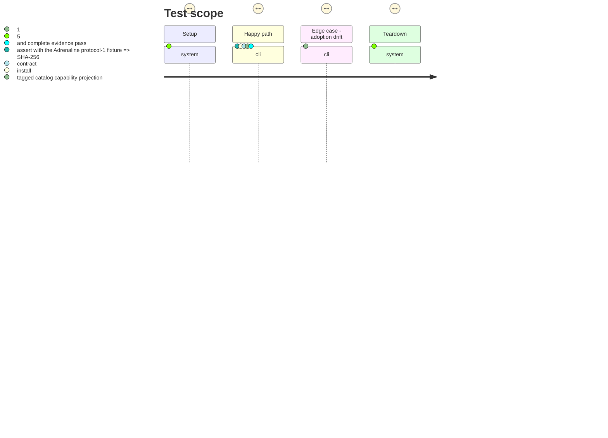

# Instruction: Pin and prove the Adrenaline candidate adoption

## Architecture projection

> Tree of the final files. ✅ create · ✏️ modify · ❌ delete

```txt
package.json ✏️ pins schema-adrenaline to the v2.5.0-rc.2 published archive and exposes the targeted release-train regression
pnpm-lock.yaml ✏️ records that canonical archive URL and its published SHA-512 SRI without a signed redirect
tools/
├── prove-schema-adrenaline-candidate.mjs ✅ verifies the active pin, lock resolution, installed package, and tagged source-catalog capability projection
├── release-train-assert.mjs ✏️ dispatches only a normalized declared-provider candidate to its matching consumer proof
├── release-train-schema-adrenaline-assert.mjs ✏️ downloads and SHA-256 verifies the candidate, invokes the Adrenaline proof, and writes complete protocol-1 evidence
├── assert-release-train-schema-adrenaline.mjs ✅ exercises the real common command against the v2.5.0 candidate and rejection paths
├── assert-release-train-schema-pbta.mjs ✏️ preserves PbtA end-to-end coverage through the generalized dispatcher
├── assert-adrenaline-source.mjs ✏️ requires a schema-adrenaline checkout whose resolved revision equals the candidate commit
└── assertAdrenalineSource.harness.mts ✏️ verifies the published catalog requires the exact Adrenaline block capabilities before source-witness round trips
README.md ✏️ documents the provider-neutral protocol-1 interface and Adrenaline evidence without implying a local game-mode fallback
```

## User Journey



## Test Scope



## Tasks to do

### `1)` Adopt the immutable published archive

> Make the requested release asset the only Adrenaline dependency accepted by the frozen Handbook graph.

1. Change the dependency to `https://github.com/RebelliousSmile/schema-adrenaline/releases/download/v2.5.0-rc.2/schema-adrenaline-2.5.0.tgz` and regenerate the pnpm lock entry with its canonical release URL and SHA-512 SRI.
2. Verify a frozen install resolves version `2.5.0`; verify the downloaded bytes against SHA-256 `62033e75384f17ee21e4e5e76d231b84c25b3fdcb0d5de74ecdbc89c94be95cc`.
3. Retain the existing public-release and redirect rejection checks so a temporary storage URL cannot become the pin.

### `2)` Build the consumer-owned Adrenaline proof

> Prove the committed adoption using published data, never an inferred local Adrenaline mode.

1. Add a candidate proof parallel to the PbtA and Mist proofs: compare manifest coordinates with `package.json`, the pnpm resolution/SRI, and the installed package before invoking any deeper check.
2. Reuse installed-archive contract corpus and renderer assertions. Separately require `SCHEMA_ADRENALINE_ROOT` to be a checkout of the canonical provider: resolve `candidate.stagingTag` to its commit and require it to equal `candidate.providerCommit`; extend the source assertion to read its published catalog/pack requirements and prove that only declared `block:adrenaline-*` capabilities activate the Handbook blocks. Missing or undeclared capabilities must reject/degrade rather than fall back locally.
3. Exclude source-root visual diagnostics from the release-train path. Have the provider assertion download and SHA-256 check the release asset, invoke the archive and tagged-catalog proofs, and emit the common protocol-1 evidence fields: candidate, immutable Handbook consumer ref, lock URL/SRI, and named proof checks.

### `3)` Prove the release-train invocation and document it

> Give the central train a stable, reproducible Adrenaline path.

1. Add the targeted regression command and a disposable canonical Adrenaline manifest using the ticket’s URL, SHA-256, tag, and provider commit; exercise the real public dispatcher.
2. Assert evidence has the complete candidate and consumer provenance and assert every coordinate/pin/capability mismatch removes stale evidence without mutating committed inputs; retain the existing PbtA end-to-end regression through the same dispatcher.
3. Update the README from PbtA-specific wording to the declared-provider protocol and describe the Adrenaline adoption checks, canonical pin, and no-fallback boundary.

## Test acceptance criteria

| Task | Acceptance criteria |
| --- | --- |
| 1 | `package.json`, `pnpm-lock.yaml`, the frozen install, and the downloaded archive all identify the v2.5.0 Adrenaline asset; the lock stores its canonical URL and SHA-512 SRI. |
| 1 | The downloaded archive matches the ticket’s SHA-256 and an expiring release-asset redirect is absent from the lockfile. |
| 2 | An Adrenaline protocol-1 proof verifies the exact active pin and installed version, then passes the published corpus and Handbook rendering/projection checks. |
| 2 | The release-train proof consumes the frozen consumer checkout, published archive, and a separately materialized canonical schema-adrenaline checkout whose candidate tag resolves to `candidate.providerCommit`; it never relies on an ambient sibling checkout. |
| 2 | Adrenaline block activation is proved against the tagged source catalog’s published `block:*` requirements; a missing or foreign declaration cannot select a consumer-local semantic fallback. |
| 2 | Successful evidence names the complete candidate coordinates, lock SRI, matching consumer commit, and individual proof checks. |
| 3 | The documented common command passes for the candidate and all URL, hash, SRI, version, installed-package, capability, and consumer-ref drifts fail with no stale evidence or committed-input mutation. |
