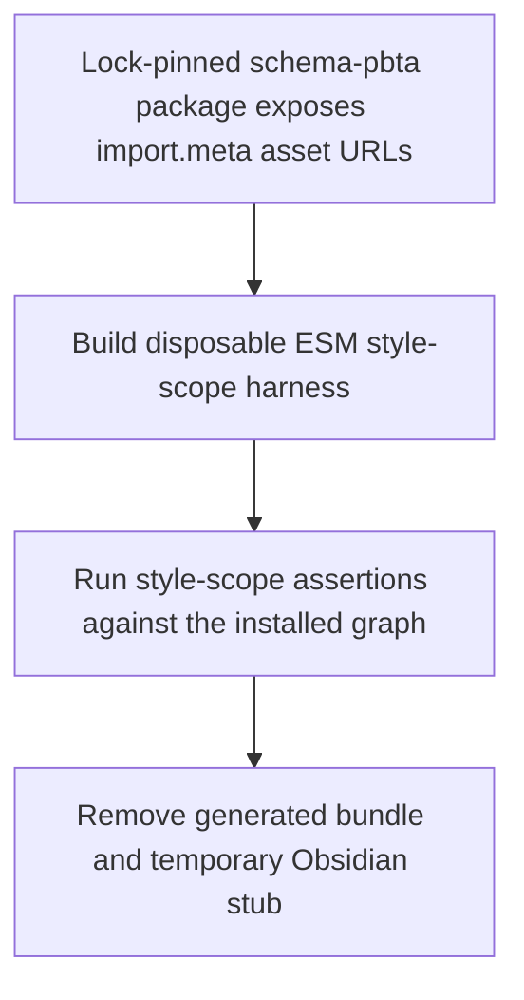
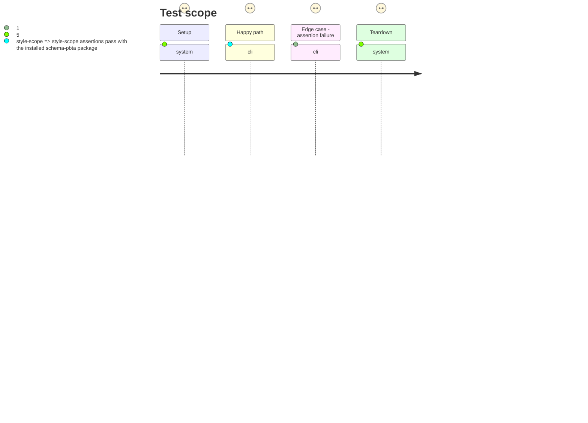

# Instruction: Make the style-scope assertion ESM-safe

## Architecture projection

> Tree of the final files. ✅ create · ✏️ modify · ❌ delete

```txt
tools/
└── assert-style-scope.mjs ✏️ runs its generated assertion harness as a disposable ESM bundle, preserving external PostCSS resolution and always removing generated artifacts
```

## User Journey



## Test Scope



## Tasks to do

### `1)` Run the generated harness in its native module format

> Preserve ESM-only dependency semantics while keeping the assertion self-cleaning.

1. Build the style-scope harness as a disposable `.mjs` file under `tools/`, so Node preserves `import.meta.url` semantics and resolves intentionally externalized PostCSS dependencies from the installed project graph.
2. Keep the temporary Obsidian stub isolated under the system temporary directory; run the generated harness and capture its exit status without bypassing cleanup.
3. Remove both generated artifacts on success and failure, then return the harness status after cleanup.

### `2)` Lock the regression into the core validation path

> Demonstrate that the frozen candidate graph and the whole Handbook check complete without a CJS conversion error.

1. Run the targeted style-scope assertion with the lock-pinned packages installed.
2. Run the core `pnpm check` sequence and verify it reaches its existing successful completion with no residual `tools/.assert-style-scope.mjs` file.

## Test acceptance criteria

| Task | Acceptance criteria |
| --- | --- |
| 1 | `assert:style-scope` evaluates installed dependencies that use `import.meta.url` without an invalid URL or ESM/CJS loader failure. |
| 1 | Both successful and failing harness runs remove the generated ESM bundle and the temporary Obsidian stub before returning. |
| 2 | The frozen dependency graph passes the targeted assertion and `pnpm check`; no generated `tools/.assert-style-scope.mjs` artifact remains afterward. |
