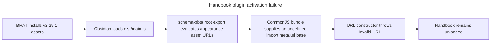

# Handbook v2.29.1 plugin load failure

Handbook updates successfully through BRAT, but Obsidian 1.13.7 cannot activate
the plugin. The failure also reproduces in an isolated empty vault.

## Action path

## Five whys

1. Obsidian reports that `obsidian-handbook` cannot be loaded because plugin
   activation throws before `onload()` completes.
2. Activation throws because the published bundle constructs a URL with an
   invalid base.
3. The base is invalid because esbuild converts `import.meta` to an empty object
   in the CommonJS Obsidian bundle, leaving its `url` undefined.
4. The expression is present because `schema-pbta` 8.4.2 exports
   `PBTA_MONSTERHEARTS_APPEARANCE_ASSET_URLS` from its package root.
5. Importing any ordinary `schema-pbta` root symbol therefore evaluates a
   browser-oriented asset module that contains top-level
   `new URL(..., import.meta.url)` expressions.

## Hypotheses

- [x] Corrupt or incomplete BRAT download — invalidated (confidence 10/10).
  The installed `main.js` and `styles.css` SHA-256 hashes equal the GitHub
  release asset digests, and the manifest declares 2.29.1.
- [x] Unsupported Obsidian version — invalidated (confidence 10/10). The failure
  reproduces on Obsidian 1.13.7 while the manifest requires 1.12.7.
- [x] Invalid persisted schema data — invalidated (confidence 10/10). The same
  failure reproduces in a newly created isolated vault without schema data.
- [x] Browser-only schema asset export breaks the CommonJS bundle — validated
  (confidence 10/10). CDP reports `TypeError: Failed to construct 'URL': Invalid
  URL` at the bundled expressions originating in
  `schema-pbta/dist/presentation/monsterhearts-appearance-assets.js`.

## Root cause

`schema-pbta` 8.4.2 exposes a top-level `import.meta.url` asset module through
its root export; Handbook bundles that ESM package as CommonJS, turns
`import.meta` into an object without `url`, and crashes during module evaluation.

## Next steps

1. In `schema-pbta`, remove the browser asset module from the root export and
   expose it through an explicit opt-in subpath instead.
2. Add a CommonJS consumer regression proof that importing the package root does
   not evaluate browser-only assets.
3. Release the corrected schema package.
4. Pin that release in Handbook, rebuild, run the real Obsidian load journey,
   and publish a Handbook patch release.

## Release-train balance audit

The Adrenaline report broadens the incident from one package defect to a release
train assurance defect. The Adrenaline package itself currently passes its
esbuild execution proof; the Handbook revision that adopted it already carried
the broken `schema-pbta` root export, so an Adrenaline-triggered train could
publish a Handbook build that crashes before either provider is used.

### Fresh possible sources

1. Provider root exports execute environment-specific browser asset code.
2. Consumer proofs validate contracts but never load the final host bundle.
3. Promotion proves candidate bytes but does not converge consumer pins from
   prerelease URLs to canonical final-release URLs.
4. Consumer identity is not required to agree with its release tag.
5. Final provider tags and release assets are not required to retain the
   candidate commit, canonical filename, and canonical URL together.
6. Daily checks validate protocol fixtures or parser shape without running every
   real committed release-train manifest.
7. The participant matrix can be green while a host-specific E2E job is disabled.

### Most likely systemic causes

- **Host-runtime proof is missing (10/10).** `pnpm check` passes for Handbook
  2.29.1, including every release-train assertion, while the isolated Obsidian
  journey fails to load the generated `main.js`. Both Handbook E2E jobs are
  explicitly disabled in `.github/workflows/ci.yml`.
- **Promotion has no final convergence gate (9/10).** Current consumers remain
  pinned to candidate URLs after final releases exist; Lantern's `v0.16.0` tag
  still declares package version `0.15.2`; and the Adrenaline final release uses
  `candidate.tgz` rather than the canonical package filename.

### Validation instrumentation

- `tools/e2e/layout-regions-cdp.py`, immediately after the plugin-load wait:
  a temporary `app.plugins.loadPlugin("obsidian-handbook")` diagnostic logged
  the rejected promise and exact stack. It confirmed that the final Obsidian
  runtime fails before `onload()` and refuted persisted vault state. The
  temporary instrumentation was removed after capture.
- `tools/release-train-schema-pbta-assert.mjs` and
  `tools/prove-schema-pbta-candidate.mjs`, inspected through their emitted proof
  list: the evidence ends at contract, projection, theme, and installer checks.
  It contains no built-plugin or Obsidian-load check, confirming the assurance
  boundary rather than a flaky runtime journey.

### Participant matrix

| Participant | Current result | Release-train imbalance |
| --- | --- | --- |
| `schema-pbta` | Candidate/final archives are byte-identical | Root export is unsafe for Handbook CommonJS; active consumer proof did not detect it |
| `schema-adrenaline` | Full local check and esbuild execution proof pass | Final release asset is named `candidate.tgz`; consumers remain pinned to `v2.5.0-rc.2` |
| `schema-in-the-mist` | Candidate/final archives are byte-identical; latest GitHub CI passes | Handbook pins the candidate URL while Lantern still pins final `v1.3.4` |
| Lantern | Full local check passes | Tag `v0.16.0` still declares `0.15.2`; no GitHub Release; canonical pin assertion is not part of `npm run check` |
| Handbook | Core check and publication workflow pass | Real Obsidian load fails; E2E CI jobs are disabled; pin assertion permits prerelease URLs |

## Systemic root cause

The train certifies immutable provider bytes and source-level consumer contracts,
but it does not certify the runnable release artifacts of each host or require
post-promotion convergence on canonical final versions. A provider can therefore
pass both consumer proofs while making Handbook unloadable, and all participants
can remain green with divergent tags, versions, and candidate pins.
