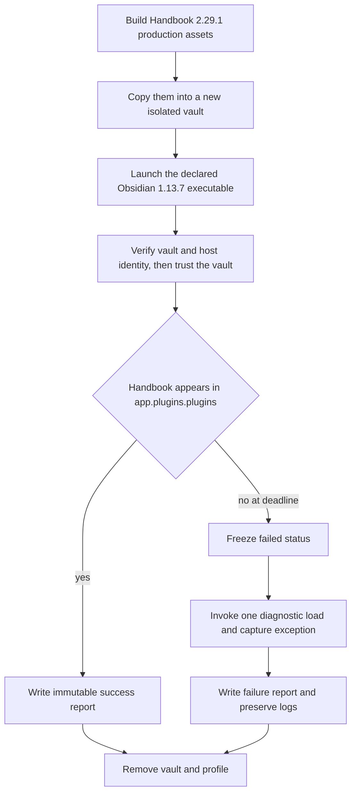
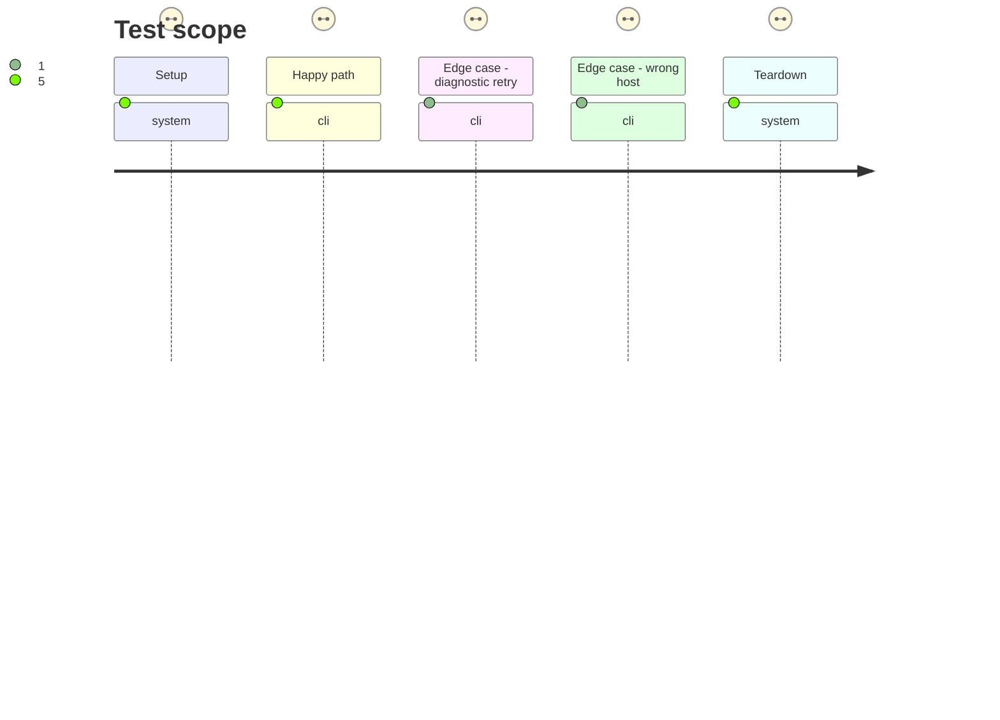

# Instruction: Reproduce the activation failure with a deterministic host harness

## Architecture projection

> Tree of the final files. ✅ create · ✏️ modify · ❌ delete

```txt
.
├── package.json ✏️ exposes focused live and driver-self-test commands without adding them to the desktop-free core check
└── tools/
    └── e2e/
        ├── README.md ✏️ documents the production artifact, pinned-host, report, and expected-red incident workflows
        ├── plugin-load-cdp.py ✅ owns CDP targeting, trust, version verification, irreversible load status, and exception reporting
        └── plugin-load-journey.sh ✅ installs selected assets into an isolated vault and manages the Obsidian process and cleanup
```

## User Journey



## Test Scope



## Tasks to do

### `1)` Isolate the production plugin load

> Exercise the same `main.js`, `manifest.json`, and `styles.css` that GitHub Releases and BRAT install.

1. Create a shell journey that validates its Obsidian executable and selected plugin directory, creates isolated vault/profile/output directories, and refuses an occupied CDP port.
2. Copy the three release assets, enable only `obsidian-handbook`, register the disposable vault in the isolated profile, and launch Obsidian in its own process group.
3. Always terminate the process group and remove vault/profile state; retain only the explicit output directory with its log and report.

### `2)` Make activation state and diagnostics unambiguous

> Distinguish initial activation from a diagnostic retry and never turn a failure green.

1. Connect only to the CDP page whose vault root matches the disposable vault, require a renderer-observable Obsidian identity equal to 1.13.7, fail closed when that identity is absent or different, and handle the trust prompt.
2. Wait a bounded interval for `app.plugins.plugins['obsidian-handbook']`; on success record plugin/manifest identity and SHA-256 for all installed assets.
3. On deadline, freeze failure before one awaited diagnostic `loadPlugin` call; serialize its name, message, stack, enabled/loaded ids, and resulting state even if that call resolves.
4. Add a driver self-test for status freezing and report serialization that does not require a running desktop host.

### `3)` Capture the incident as the first live assertion

> Prove the gate detects the failure it was created to prevent.

1. Run the production build while the v2.29.1 dependency graph is still pinned.
2. Run the live journey with the local Obsidian 1.13.7 AppImage and assert the expected nonzero result and `TypeError: Failed to construct 'URL': Invalid URL` diagnostic.
3. Document this expected-red command separately from the ordinary success command so future corrected builds are not expected to fail.

## Test acceptance criteria

| Task | Acceptance criteria |
| --- | --- |
| 1 | The harness installs only the selected production assets in a newly created vault and leaves no vault, profile, or child Obsidian process after either outcome. |
| 2 | Initial activation success is based on `app.plugins.plugins['obsidian-handbook']`, and a missed deadline remains failed regardless of the diagnostic retry result. |
| 2 | The report identifies the renderer-observed Obsidian runtime as 1.13.7, the manifest/plugin identity, all three asset hashes, and the enabled/loaded plugin state; absent or different runtime identity is rejected. |
| 3 | The unchanged v2.29.1 production graph is rejected with the actual `Invalid URL` exception and stack rather than only a timeout. |
