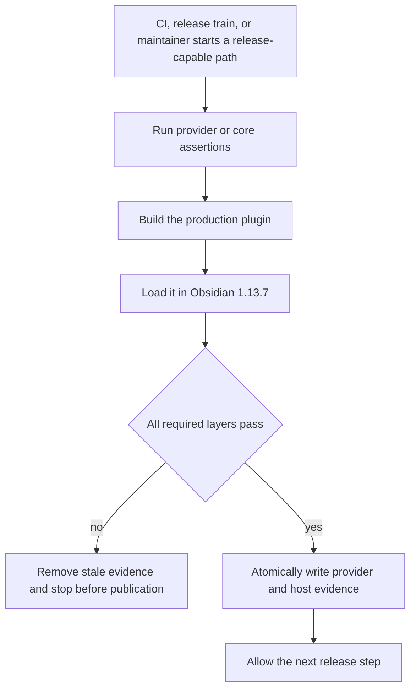
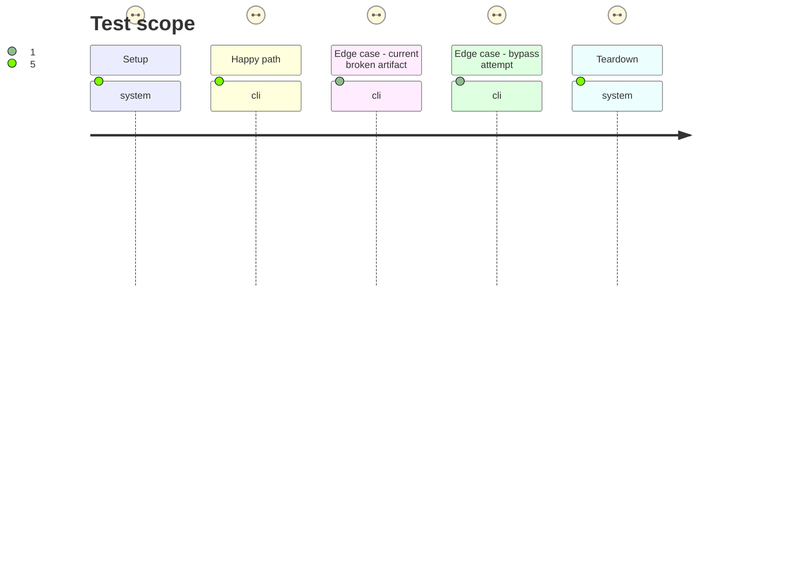

# Instruction: Install fail-closed candidate and publication gates

## Architecture projection

> Tree of the final files. ✅ create · ✏️ modify · ❌ delete

```txt
.
├── .github/
│   └── workflows/
│       ├── ci.yml ✏️ provisions pinned Obsidian 1.13.7 and runs an enabled focused load job
│       └── release.yml ✏️ blocks release creation and replacement on the same focused load proof
├── README.md ✏️ defines host-artifact checks in protocol-1 evidence
├── package.json ✏️ registers the structural gate assertion
└── tools/
    ├── assert-host-artifact-gates.mjs ✅ locks mandatory ordering and rejects skipped or tolerated gates
    ├── assert-release-train-schema-adrenaline.mjs ✏️ tests provider/host composition without live evidence substitution
    ├── assert-release-train-schema-pbta.mjs ✏️ tests provider/host composition without active-candidate hard-coding
    ├── prove-handbook-host-artifact.mjs ✅ builds, runs the focused host journey, and returns its exact artifact identity
    ├── release-train-assert.mjs ✏️ owns cleanup, provider dispatch, host proof, and final atomic evidence write
    ├── release-train-schema-adrenaline-assert.mjs ✏️ returns validated provider evidence data without persisting success
    └── release-train-schema-pbta-assert.mjs ✏️ returns validated provider evidence data without persisting success
```

## User Journey



## Test Scope



## Tasks to do

### `1)` Make evidence atomic across provider and host layers

> A provider contract proof alone must never certify an unloadable Handbook artifact.

1. Refactor PbtA and Adrenaline assertion modules to return validated provider payloads rather than writing passed evidence themselves.
2. Add a host-artifact proof that runs the production build and phase-1 journey with no environment hook capable of replacing the public live command.
3. Let the common runner delete stale evidence first, execute provider then host proofs, merge `production-build` and `obsidian-plugin-load` identities, and rename one temporary evidence file only after success.
4. Parse the host report into evidence, then remove its temporary report directory on success or failure; diagnostics needed by CI remain in command output and the atomic evidence retains only proved identities and hashes.
5. Expose dependency injection only through imported orchestration functions used by deterministic tests; keep the CLI hard-wired to real proofs.

### `2)` Prevent gate removal or tolerance

> Make the invariant visible to the ordinary core check without requiring a desktop host there.

1. Add a structural assertion covering the protocol runner, enabled Linux CI job, and release workflow ordering.
2. Reject missing host commands, disabled jobs, `continue-on-error`, or conditions that let publication proceed after a skipped/failed host step.
3. Refactor existing release-train regressions away from active rc coordinates and assert passed host checks, missing-host rejection, and stale-evidence cleanup with deterministic proof doubles.

### `3)` Put the real host in CI and publication

> Make the current broken bundle turn the new release paths red before any provider correction lands.

1. Provision the pinned Obsidian 1.13.7 AppImage plus Xvfb and websocket support in an enabled focused Linux CI job, and reject the downloaded binary unless its SHA-256 equals a committed expected digest.
2. Provision and checksum the same host in the release workflow; validate core checks and tag identity first, then run the focused proof immediately before every `gh release create` or upload path.
3. Keep broader layout, print, request-URL, and Windows journeys outside this narrow mandatory gate.
4. Document that provider orchestrators must provision the same host when invoking Handbook's public candidate proof.

## Test acceptance criteria

| Task | Acceptance criteria |
| --- | --- |
| 1 | Passed PbtA or Adrenaline evidence includes `production-build`, `obsidian-plugin-load`, Obsidian 1.13.7, and the tested asset hashes; any failure leaves no passed or stale evidence. |
| 2 | `pnpm check` rejects any release-capable path that removes, skips, reorders, or tolerates the host gate, while test doubles cannot be selected through the public CLI. |
| 3 | The current v2.29.1 artifact makes the live train/release proof fail with its actual activation exception before evidence or GitHub assets can be written. |
| 3 | The focused CI job is enabled and accepts only the pinned URL and committed SHA-256 for Obsidian 1.13.7; unrelated desktop journeys remain separate diagnostics. |
