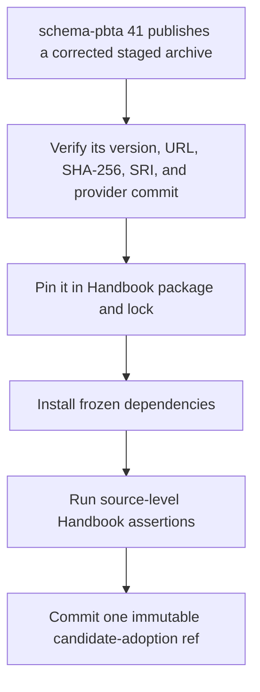
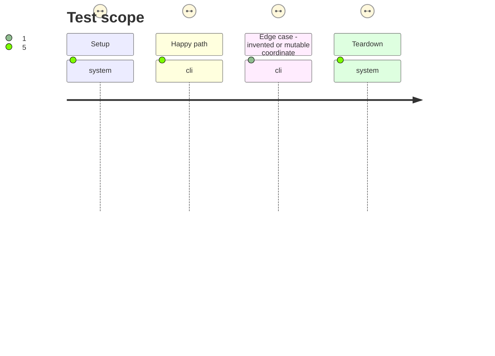

# Instruction: Commit the corrected staged provider candidate

## Architecture projection

> Tree of the final files. ✅ create · ✏️ modify · ❌ delete

```txt
.
├── package.json ✏️ pins the exact corrected schema-pbta staged archive selected by the provider train
└── pnpm-lock.yaml ✏️ records that candidate URL and its published SHA-512 SRI for an immutable Handbook commit
```

## User Journey



## Test Scope



## Tasks to do

### `1)` Wait for authoritative candidate coordinates

> Never guess the release that resolves the incident.

1. Require schema-pbta #41 to publish a staged final-version archive after its root-import CommonJS and Lantern Vite fixtures pass.
2. Read the release-train manifest and verify canonical repository, staging/final tags, archive version, full provider commit, SHA-256, and SHA-512 SRI.
3. Stop without edits if those immutable inputs do not yet exist or disagree.

### `2)` Materialize the candidate in one Handbook commit

> Create the immutable consumer ref required by protocol 1 before asking the train to certify it.

1. Replace only the schema-pbta dependency with the exact staged URL and regenerate `pnpm-lock.yaml` without changing unrelated dependencies.
2. Run a frozen install and the provider, contract, projection, theme, installer, and core assertions that are valid before live candidate evidence.
3. Confirm package, lock, and installed package agree on URL, version, and SRI; commit them with this phase marked done.

## Test acceptance criteria

| Task | Acceptance criteria |
| --- | --- |
| 1 | Every adopted candidate coordinate comes from the published schema-pbta #41 manifest and asset; no predicted version, tag, digest, or commit is used. |
| 2 | The phase commit pins exactly one staged schema-pbta archive, reproduces with a frozen install, and exposes an immutable Handbook SHA suitable for the protocol manifest. |
| 2 | Source-level Handbook checks pass on the candidate graph without claiming that host evidence has already passed. |
