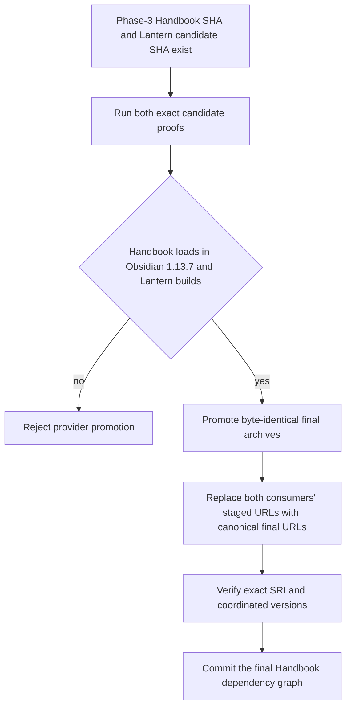
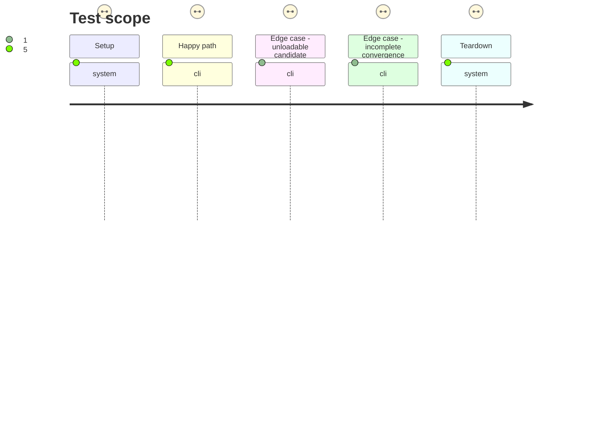

# Instruction: Prove the candidate and converge canonical final pins

## Architecture projection

> Tree of the final files. ✅ create · ✏️ modify · ❌ delete

```txt
.
├── package.json ✏️ replaces all staged schema pins with their promoted canonical final GitHub release URLs
├── pnpm-lock.yaml ✏️ retains the exact published SRI for each final provider archive
└── tools/
    └── assert-consumer-schema-pins.mjs ✏️ covers PbtA, Adrenaline, and Mist final URL/SRI rules plus explicit coordinated-version matching
```

## User Journey



## Test Scope



## Tasks to do

### `1)` Prove the immutable candidate commit in both hosts

> Cross the assurance boundary that v2.29.1 missed before any final promotion.

1. Run Handbook's public `release-train:assert` against the protocol manifest naming the phase-3 commit and provisioned Obsidian 1.13.7 host.
2. Require passed evidence to include provider assertions, `production-build`, `obsidian-plugin-load`, artifact hashes, and exact candidate coordinates.
3. Require Lantern's matching immutable candidate proof and reject promotion if either consumer evidence is absent or names different bytes/refs.

### `2)` Converge the three providers after promotion

> Ship stable identities, not staging channels.

1. Require schema-pbta #41, schema-adrenaline #36, and schema-in-the-mist #25 to publish canonical final archives byte-identical to their proved candidates.
2. Tighten the consumer-pin assertion to validate all three providers in Handbook and Lantern, reject prerelease/query/fragment/alternate-name URLs, verify each consumer lockfile's exact SRI, and verify Handbook's installed versions.
3. Provide an explicit coordinated mode that requires both consumers to name the same promoted versions for this train without forbidding later independent final-version adoption.
4. Replace all Handbook staged URLs with canonical final URLs, retain exact SRI, run frozen installation, full checks, coordinated pin assertion, and the now-green real Obsidian load.

## Test acceptance criteria

| Task | Acceptance criteria |
| --- | --- |
| 1 | The phase-3 Handbook commit produces passed protocol evidence naming `production-build`, `obsidian-plugin-load`, Obsidian 1.13.7, exact candidate coordinates, and production asset hashes. |
| 1 | No provider is promoted unless both immutable consumer refs prove the same candidate bytes. |
| 2 | Handbook and Lantern converge on canonical final URLs and published SRI for PbtA, Adrenaline, and Mist; candidate and final SHA-256 values are identical. |
| 2 | A frozen install, full check, coordinated pin assertion, and real Obsidian load pass on the final Handbook graph. |
