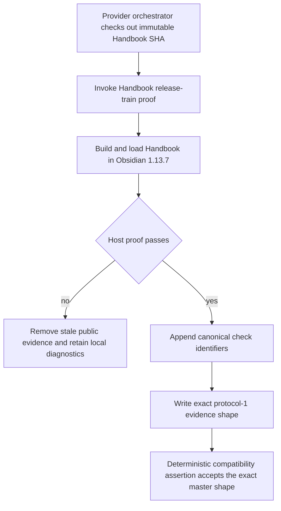
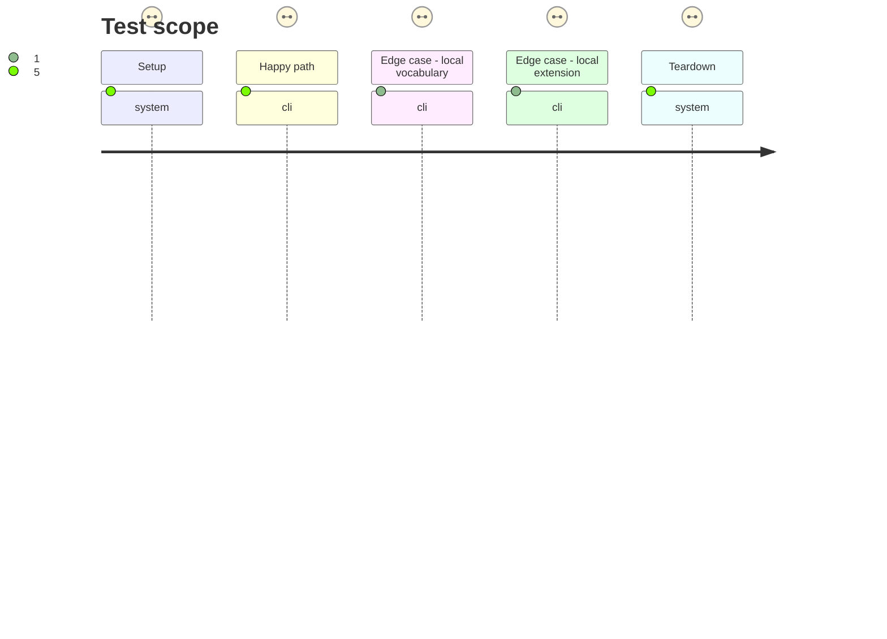

# Instruction: Conform Handbook evidence to the master release-train contract

## Architecture projection

> Tree of the final files. ✅ create · ✏️ modify · ❌ delete

```txt
.
├── README.md ✏️ documents the provider-owned protocol vocabulary and separates local host diagnostics from public evidence
└── tools/
    ├── assert-host-artifact-gates.mjs ✏️ locks the canonical Handbook check identifiers and closed evidence shape
    ├── assert-release-train-schema-adrenaline.mjs ✏️ expects the shared canonical host checks without a consumer-local evidence extension
    ├── assert-release-train-schema-pbta.mjs ✏️ proves exact compatibility with the schema-pbta evidence contract
    ├── prove-handbook-host-artifact.mjs ✏️ returns the canonical build and Obsidian-load check identifiers
    └── release-train-assert.mjs ✏️ writes only the six protocol-1 evidence keys accepted by the master parser
```

## User Journey



## Test Scope



## Tasks to do

### `1)` Adopt the provider-owned evidence vocabulary

> Handbook owns execution of its proof, while schema-pbta owns the protocol consumed by the train.

1. Replace the local `production-build` and `obsidian-plugin-load` identifiers with `commonjs-plugin-build` and `obsidian-1.13.7-plugin-load` on every supported provider path.
2. Preserve Obsidian version, plugin identity, asset hashes, trust state, and activation diagnostics in the disposable local host report rather than extending public protocol evidence.
3. Document the ownership boundary and canonical identifiers beside the public command.

### `2)` Make protocol compatibility deterministic

> Detect vocabulary or shape drift before an external train spends a desktop-host run.

1. Change the atomic writer to emit exactly `protocol`, `status`, `candidate`, `consumer`, `lock`, and `journey`, with unique canonical host checks merged into `journey.checks`.
2. Update PbtA and Adrenaline orchestration regressions to reject local aliases, duplicate checks, `hostArtifact`, missing host checks, and stale evidence after failure.
3. Extend the structural gate assertion so `pnpm check` fails if the public runner stops using the canonical names or reintroduces consumer-local evidence fields.
4. Keep deterministic shape and vocabulary coverage in Handbook, then reserve authoritative `parseReleaseTrainEvidence` acceptance for the real provider-owned train in phase 5 rather than copying its parser locally.

## Test acceptance criteria

| Task | Acceptance criteria |
| --- | --- |
| 1 | Every successful Handbook candidate proof names `commonjs-plugin-build` and `obsidian-1.13.7-plugin-load`; the local host report still records Obsidian 1.13.7, plugin identity, hashes, trust state, and activation diagnostics. |
| 2 | Public evidence has exactly the six keys declared by `schema-pbta/tools/release-train-config.ts`, contains unique canonical checks, and the regression fixture rejects any vocabulary or shape deviation. |
| 2 | Local aliases, an extra `hostArtifact` key, a missing host check, or any proof failure leave no passed or stale public evidence. |
