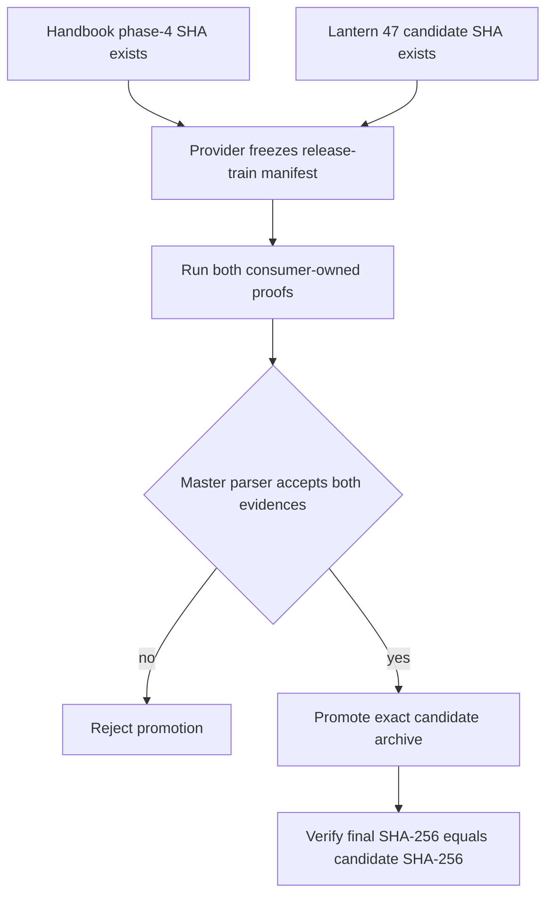
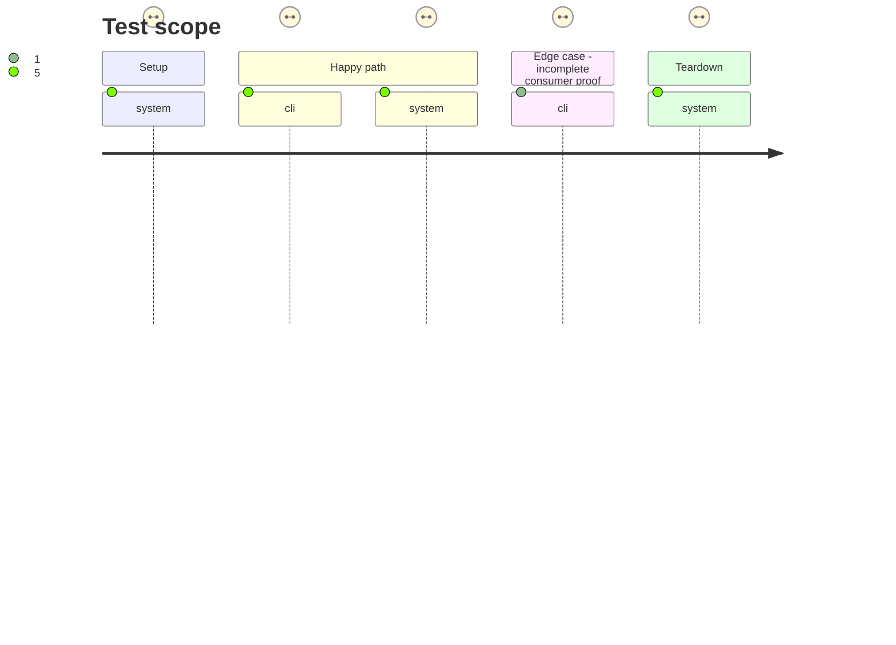

# Instruction: Prove both immutable consumers and promote schema-pbta

## Architecture projection

> Tree of the final files. ✅ create · ✏️ modify · ❌ delete

```txt
External release-train state
├── lantern
│   └── immutable schema-pbta v8.4.3 candidate-adoption commit ✅ supplied by Lantern #47
└── schema-pbta
    ├── release-train/schema-pbta-v8.4.3.json ✅ binds the exact candidate and both immutable consumer refs
    ├── release-train.provenance.json ✅ records accepted Lantern and Handbook protocol-1 evidence
    └── GitHub Release v8.4.3 ✅ promotes the proved candidate bytes unchanged
```

## User Journey



## Test Scope



## Tasks to do

### `1)` Freeze both candidate consumers

> The provider orchestrates immutable external commits; it does not implement consumer changes.

1. Require Lantern #47 to commit its browser-subpath adoption, v8.4.3 candidate pins, four-asset proof, and canonical protocol evidence.
2. Supply the clean Handbook phase-4 commit and Lantern #47 commit to schema-pbta #41 with their canonical repositories and proof interfaces.
3. Require the committed provider manifest to copy the published candidate URL, SHA-256, SRI, tags, version, and provider commit exactly.

### `2)` Run the master train and promote unchanged bytes

> Promotion is an outcome of both accepted consumer proofs, never a rebuild.

1. Run the schema-pbta-owned train with the pinned Obsidian 1.13.7 host and require both evidence files to pass the master parser.
2. Verify Handbook evidence contains `commonjs-plugin-build` and `obsidian-1.13.7-plugin-load`, while Lantern evidence contains `vite-build` and `monsterhearts-four-assets`.
3. Let schema-pbta #41 promote the downloaded candidate archive, then verify final URL, target commit, SHA-256, and SRI against the staged candidate.

## Test acceptance criteria

| Task | Acceptance criteria |
| --- | --- |
| 1 | The committed schema-pbta v8.4.3 train manifest names the exact staged candidate, the clean Handbook phase-4 SHA, and the immutable Lantern #47 adoption SHA. |
| 2 | The provider-owned parser accepts both evidence files with their role-specific canonical checks and exact candidate coordinates. |
| 2 | schema-pbta v8.4.3 final is published only after both proofs pass, and its archive SHA-256 and SRI equal the candidate values. |
| 2 | Failed or incomplete consumer evidence prevents promotion and leaves no false completed-train provenance. |
