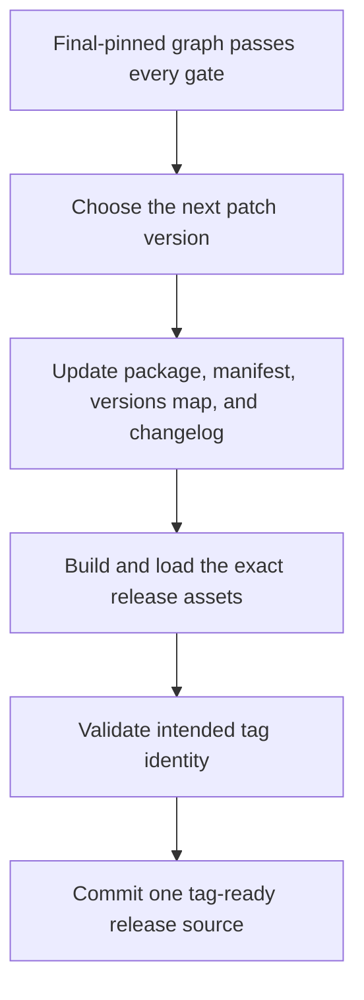
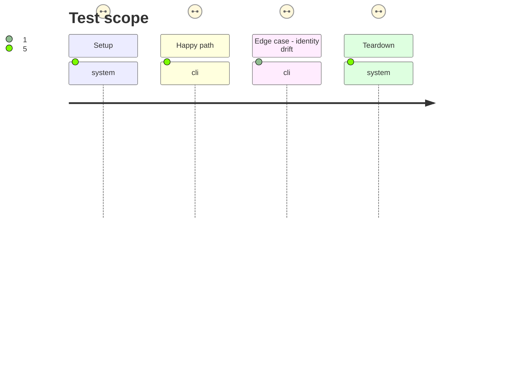

# Instruction: Prepare one coherent Handbook patch

## Architecture projection

> Tree of the final files. ✅ create · ✏️ modify · ❌ delete

```txt
.
├── CHANGELOG.md ✏️ documents the activation correction, host gate, and canonical provider convergence under the patch version
├── manifest.json ✏️ declares the corrective patch version delivered to Obsidian
├── package.json ✏️ declares the same patch version on the final provider graph
└── versions.json ✏️ maps the patch to its minimum supported Obsidian version
```

## User Journey



## Test Scope



## Tasks to do

### `1)` Create the patch identity

> Align every source Obsidian, BRAT, GitHub, and maintainers use to identify the release.

1. Select the next patch only after phase 4 is committed and use the repository version workflow to update package, manifest, and versions map together.
2. Add the newest changelog entry describing the unloadable-bundle fix, mandatory host-artifact proof, and final provider pins.
3. Verify the declared minimum app version remains consistent with the tested 1.13.7 host.

### `2)` Produce a tag-ready commit

> Validate locally before any public tag can trigger or identify a release.

1. Run a frozen install, full core check, final/coordinated pin assertions, production build, and focused Obsidian load.
2. Run release-version validation both without a tag and with the intended `v<patch>` value.
3. Mark the phase done and commit the versioned sources; leave the tree clean for the public release phase.

## Test acceptance criteria

| Task | Acceptance criteria |
| --- | --- |
| 1 | `package.json`, `manifest.json`, `versions.json`, and the newest changelog entry identify one patch and minimum app version. |
| 2 | The tag-ready commit passes frozen installation, full checks, canonical/coordinated pin validation, production build, and Obsidian 1.13.7 activation. |
| 2 | `RELEASE_TAG=v<patch>` agrees with the shipped manifest before the public tag is created. |
