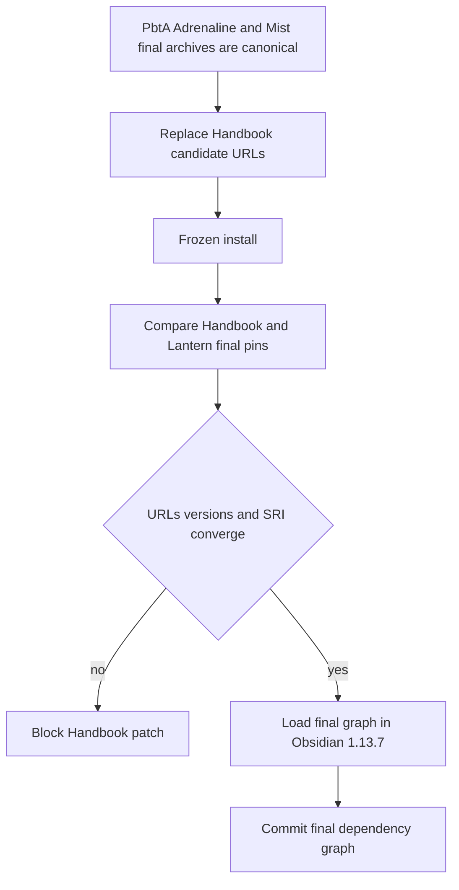
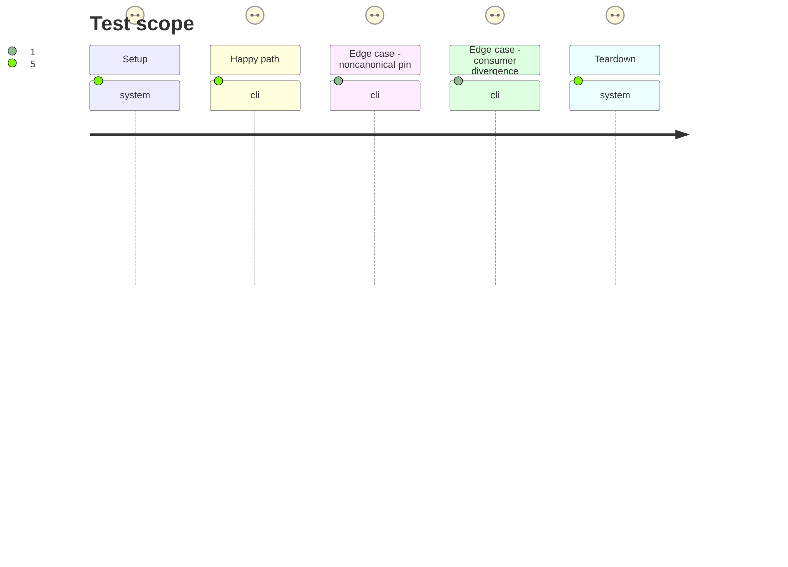

# Instruction: Converge Handbook on canonical final provider pins

## Architecture projection

> Tree of the final files. ✅ create · ✏️ modify · ❌ delete

```txt
.
├── package.json ✏️ replaces every staged schema pin with its promoted canonical final GitHub release URL
├── pnpm-lock.yaml ✏️ retains canonical final URLs and exact published SRI without signed redirects
└── tools/
    └── assert-consumer-schema-pins.mjs ✏️ validates PbtA Adrenaline and Mist final URL SRI and coordinated consumer versions
```

## User Journey



## Test Scope



## Tasks to do

### `1)` Enforce final provider identities

> Candidate success does not complete the train until consumers leave staging channels.

1. Require schema-pbta #41, schema-adrenaline #36, and schema-in-the-mist #25 to expose canonical final archive filenames byte-identical to their proved candidates.
2. Extend the consumer-pin assertion across all three providers, rejecting prerelease, query, fragment, alternate filename, signed redirect, SRI mismatch, and installed-version mismatch.
3. Add an explicit coordinated mode comparing Handbook with Lantern #46 for this convergence event while allowing later independent final upgrades.

### `2)` Commit the final Handbook dependency graph

> Make the tag-ready patch depend only on stable provider identities.

1. Replace all Handbook staged URLs with canonical final URLs and preserve the exact published SRI in the lockfile.
2. Run a frozen install, full checks, coordinated pin assertion, production build, and real Obsidian 1.13.7 load.
3. Commit the final graph only after Lantern #46 records the matching final provider versions and immutable consumer ref.

## Test acceptance criteria

| Task | Acceptance criteria |
| --- | --- |
| 1 | PbtA, Adrenaline, and Mist candidate/final archives are byte-identical and expose canonical final URLs with published SRI. |
| 1 | The pin assertion rejects prerelease or mutable URLs, alternate filenames, wrong SRI, installed-version drift, and coordinated consumer divergence. |
| 2 | Handbook and Lantern converge on the same promoted versions for this train, and the final consumer refs are immutable and auditable. |
| 2 | A frozen install, full check, coordinated pin assertion, production build, and Obsidian 1.13.7 activation pass on the committed final Handbook graph. |
