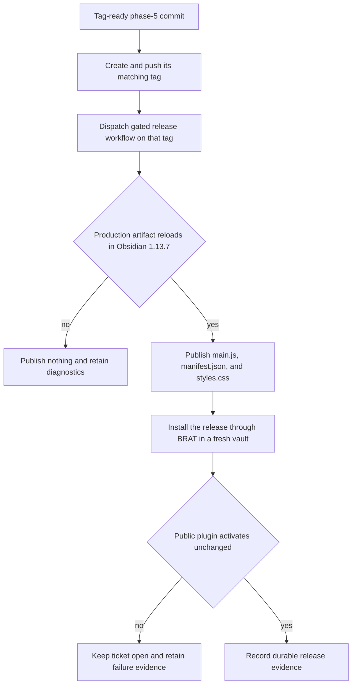
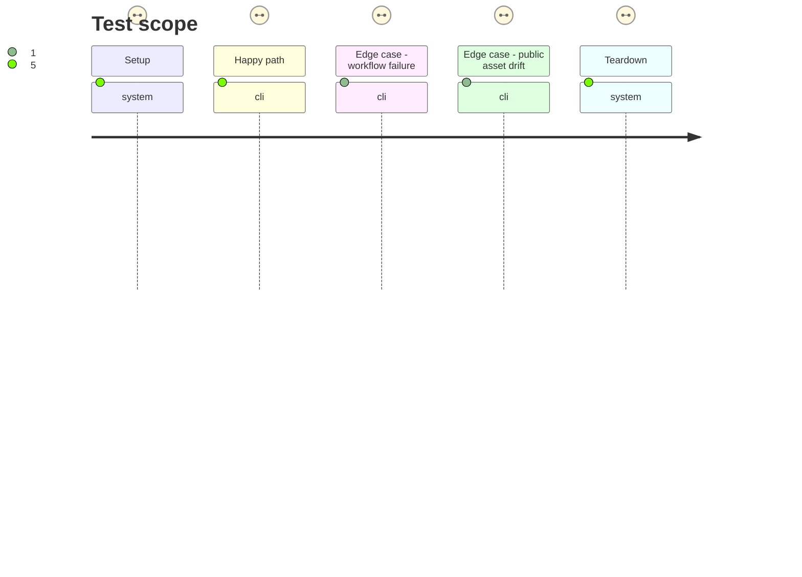

# Instruction: Publish and verify the public BRAT release

## Architecture projection

> Tree of the final files. ✅ create · ✏️ modify · ❌ delete

```txt
aidd_docs/
└── tasks/
    └── 2026_09/
        └── 2026_09_25_handbook_plugin_load_failure/
            └── release-evidence.json ✅ records public tag, release URL, asset hashes, workflow run, installed version, and BRAT activation
```

## User Journey



## Test Scope



## Tasks to do

### `1)` Publish only the phase-5 commit

> Keep source identity, tag identity, workflow checkout, and uploaded bytes aligned.

1. Create and push the matching `v<patch>` tag on the phase-5 commit, then dispatch the release workflow explicitly on that tag.
2. Require the workflow's frozen install, core checks, version assertion, production build, and Obsidian load to pass before release creation or asset replacement.
3. Verify the public release exposes exactly `main.js`, `manifest.json`, and `styles.css` from the host-proved build and compare their SHA-256 values.

### `2)` Prove the BRAT user path and persist evidence

> Validate the public delivery mechanism rather than a locally copied plugin.

1. Add the canonical repository to BRAT in a fresh disposable Obsidian 1.13.7 vault, install the patch, and restart or reload normally without editing downloaded files.
2. Confirm the installed manifest version and hashes match the GitHub release and `app.plugins.plugins['obsidian-handbook']` exists.
3. Write `release-evidence.json` with tag, release URL, workflow run URL, commit, asset hashes, installed version, Obsidian version, and activation result; keep #63 open on any mismatch.

## Test acceptance criteria

| Task | Acceptance criteria |
| --- | --- |
| 1 | The public tag names the phase-5 commit, the gated workflow succeeds on that tag, and no release asset is written after a failed gate. |
| 1 | Public `main.js`, `manifest.json`, and `styles.css` hashes equal the workflow artifacts that passed the Obsidian host proof. |
| 2 | BRAT installs those unchanged assets in a fresh Obsidian 1.13.7 vault and Handbook activates with the declared patch version. |
| 2 | `release-evidence.json` records the public provenance and successful activation without placeholders. |
