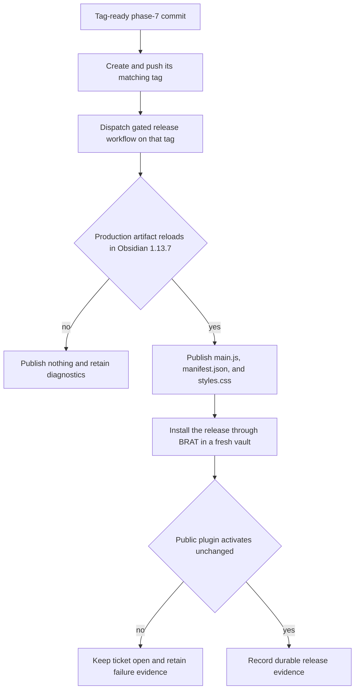
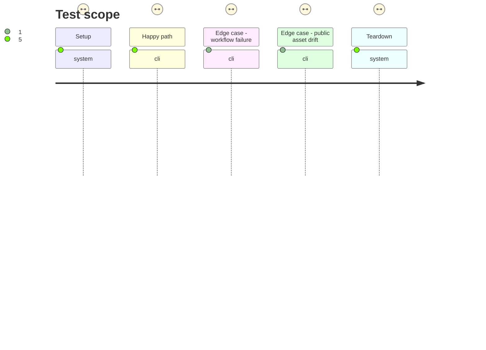

# Instruction: Publish and verify the public BRAT release

## Architecture projection

> Tree of the final files. ✅ create · ✏️ modify · ❌ delete

```txt
.
├── aidd_docs/
│   └── tasks/
│       └── 2026_09/
│           └── 2026_09_25_handbook_plugin_load_failure/
│               └── release-evidence.json ✅ records public tag release URL asset hashes workflow run installed version and BRAT activation
├── package.json ✏️ exposes the pinned BRAT public-release journey
└── tools/
    └── e2e/
        ├── README.md ✏️ documents BRAT prerequisites immutable inputs reports and cleanup
        ├── brat-release-cdp.py ✅ drives BRAT AddBetaPlugin and verifies downloaded Handbook activation and identity
        ├── brat-release-journey.sh ✅ provisions pinned BRAT in an isolated vault and owns process and filesystem cleanup
        └── fixtures/
            └── brat-release.json ✅ pins the BRAT release assets and SHA-256 digests used by the acceptance journey
```

## User Journey



## Test Scope



## Tasks to do

### `1)` Publish only the phase-7 commit

> Keep source identity, tag identity, workflow checkout, and uploaded bytes aligned.

1. Create and push the matching `v<patch>` tag on the phase-7 commit, then dispatch the release workflow explicitly on that tag.
2. Require the workflow's frozen install, core checks, version assertion, production build, and Obsidian load to pass before release creation or asset replacement.
3. Download `release-artifact-provenance.json` from the successful tagged workflow, then require the public release to expose exactly `main.js`, `manifest.json`, and `styles.css` with the recorded SHA-256 values.

### `2)` Prove the BRAT user path and persist evidence

> Validate the public delivery mechanism rather than a locally copied plugin.

1. Pin a published BRAT release and its installable asset hashes, install only those checked bytes into a fresh disposable Obsidian 1.13.7 vault, and enable BRAT.
2. Drive BRAT's registered `AddBetaPlugin` command and modal through CDP to add `RebelliousSmile/obsidian-handbook`, select the explicit just-published patch tag rather than an implicit latest release, and install it without copying or editing Handbook files directly.
3. Restart or reload through the ordinary Obsidian plugin path, then confirm the installed manifest version and hashes match the GitHub release and `app.plugins.plugins['obsidian-handbook']` exists.
4. Always terminate Obsidian and remove the disposable vault/profile; retain only the explicit BRAT report and logs.
5. Write `release-evidence.json` with tag, release URL, workflow run URL, commit, asset hashes, installed version, Obsidian version, BRAT version, and activation result; keep #63 open on any mismatch.

## Test acceptance criteria

| Task | Acceptance criteria |
| --- | --- |
| 1 | The public tag names the phase-7 commit, the gated workflow succeeds on that tag, and no release asset is written after a failed gate. |
| 1 | Public `main.js`, `manifest.json`, and `styles.css` hashes equal the workflow artifacts that passed the Obsidian host proof. |
| 2 | The checksum-pinned BRAT release installs the explicitly selected Handbook patch tag through `AddBetaPlugin` in a fresh Obsidian 1.13.7 vault; no journey step relies on latest or writes Handbook's plugin files directly. |
| 2 | BRAT-installed `main.js`, `manifest.json`, and `styles.css` hashes equal the public release assets, and Handbook activates with the declared patch version. |
| 2 | The process, vault, and profile are cleaned on success or failure, while the explicit report survives with BRAT version and failure diagnostics. |
| 2 | `release-evidence.json` records the public provenance and successful activation without placeholders. |
