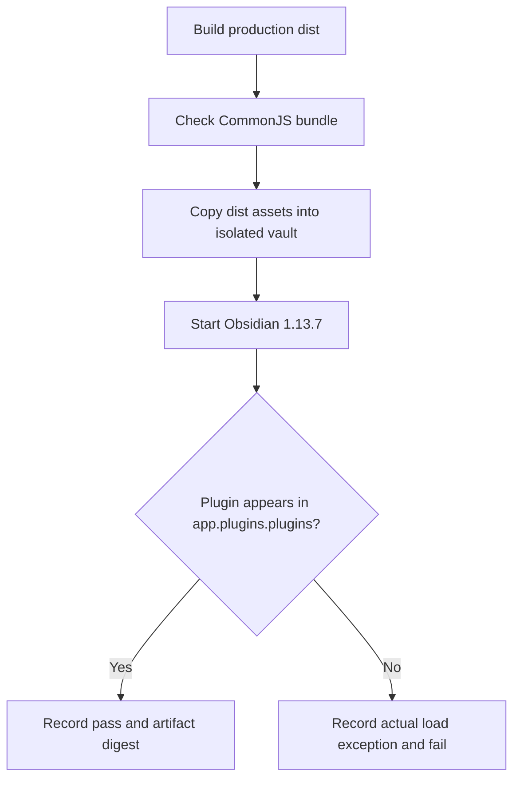
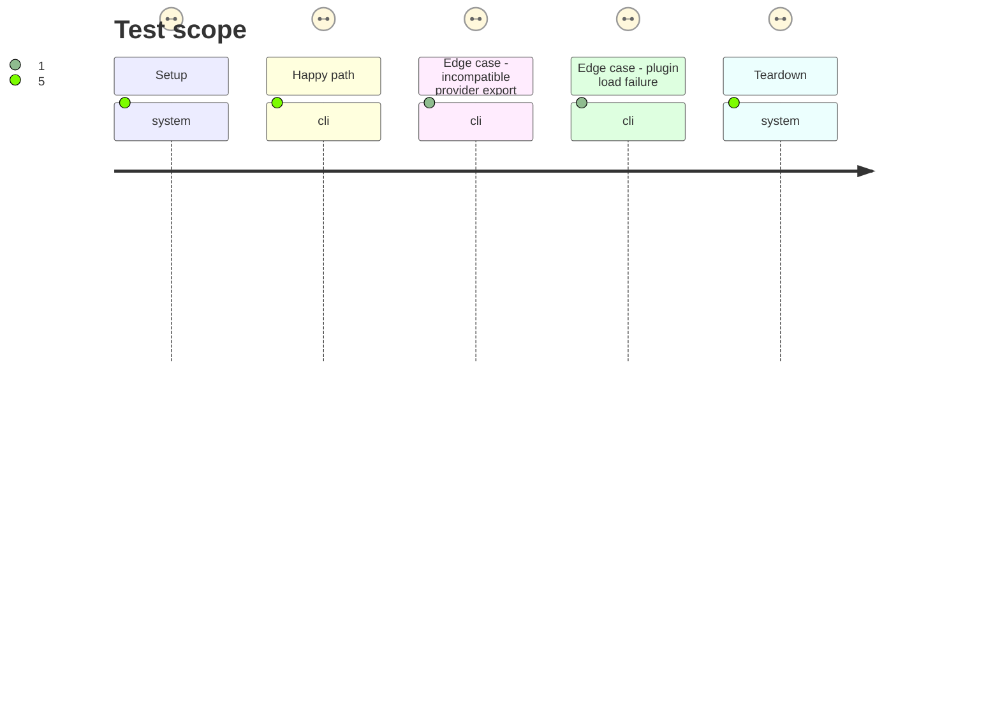

# Instruction: Guard and diagnose the production bundle

## Architecture projection

> Tree of the final files. ✅ create · ✏️ modify · ❌ delete

```txt
.
├── esbuild.config.mjs ✏️ reject incompatible provider code in the CommonJS production bundle while retaining the current workaround until final provider adoption
├── package.json ✏️ expose the bundle and host-load checks as scripts
├── tools/
│   ├── assert-plugin-bundle.mjs ✅ inspect the production output for forbidden browser-only module assumptions
│   └── e2e/
│       ├── plugin-load-journey.sh ✅ create a disposable vault and profile, install exact dist assets, start pinned Obsidian, and preserve diagnostics
│       ├── plugin-load-cdp.py ✅ observe plugin registration and capture load exceptions over CDP
│       └── README.md ✏️ document prerequisites, invocation, and retained failure evidence
```

## User Journey



## Test Scope



## Tasks to do

### `1)` Add a CommonJS bundle guard

> Catch provider root exports that cannot execute in Obsidian's plugin loader.

1. Inspect the actual production output and imported provider modules; identify the `new URL(..., import.meta.url)` source and any browser-only module side effect.
2. Identify the provider-owned correction needed for its safe root entry point; keep the existing workaround until a corrected final archive is adopted.
3. Reject unresolved `import.meta.url` and equivalent browser-only startup assumptions in the production CommonJS artifact; include a failing fixture for the reported pattern and a passing loadable fixture to verify the guard itself.

### `2)` Add an isolated Obsidian load smoke

> Verify the artifact Obsidian loads, not a source or test harness bundle.

1. Provision a fixed Obsidian 1.13.7 executable and fresh vault/profile; default to installing `dist/main.js`, `dist/manifest.json`, and `dist/styles.css` exactly as released, with an explicit fixture input used only to test the smoke harness.
2. Start the vault with the installed plugin disabled, identify the CDP page by vault path, subscribe to `Runtime.exceptionThrown` and console/log events, then enable Handbook through Obsidian's plugin manager and wait for `app.plugins.plugins['obsidian-handbook']`.
3. On failure capture the real load exception from the subscribed CDP events and Obsidian log, plus loaded/enabled plugin state and bundle digest; return nonzero and retain diagnostics.
4. Stop Obsidian and remove the disposable state on every exit.

## Test acceptance criteria

| Task | Acceptance criteria |
| --- | --- |
| 1 | A CommonJS bundle containing the reported provider `import.meta.url` startup pattern fails before release with a source-specific diagnostic. |
| 1 | A corrected production bundle passes the guard without a Handbook-only semantic fallback. |
| 2 | The smoke harness reports a controlled loadable plugin in `app.plugins.plugins`; its normal invocation always loads the exact production `dist/main.js`. |
| 2 | A deliberately broken bundle fails with its actual plugin-load exception visible in CI artifacts/logs. |
| 2 | The temporary vault, profile, and Obsidian process are cleaned on pass and failure. |
